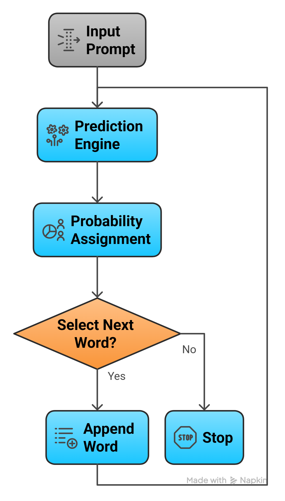
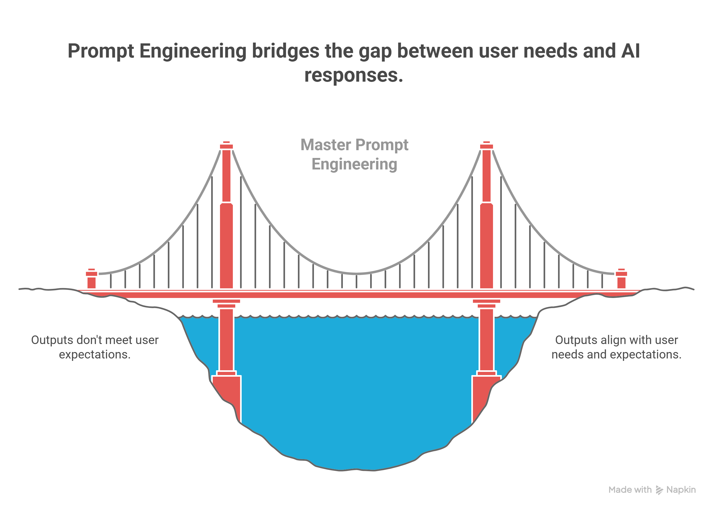
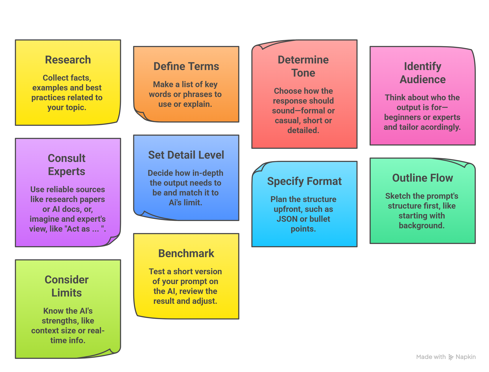

# Phase 1: Foundations 🏗️

**Welcome to the beginning of your Prompt Engineering journey.**  
In this phase, you will understand what LLMs really are, how they think, what a prompt actually is, and why preparation before writing any prompt saves you hours of frustration.

---

## 📋 Table of Contents

- [What is an LLM?](#what-is-an-llm)
- [How It Works](#how-it-works)
- [Training and Strengths](#training-and-strengths)
- [What is a Prompt?](#what-is-a-prompt)
- [What is Prompt Engineering?](#what-is-prompt-engineering)
- [Why It Matters?](#why-it-matters)
- [Example: AI in Healthcare](#example-ai-in-healthcare)
- [Pre-Prompt Preparation](#pre-prompt-preparation)

**[← Back to Main README](../../README.md)**  **[Next → Phase 2](../02_Phase-2-Core-Prompt-Engineering-Skills/README.md)**

---

## What is an LLM?

An LLM, or Large Language Model, is a type of AI system designed to understand and generate human-like text.

---

## How It Works

  <!-- Left: Text -->
  

    <ul>
      <li><strong>Prediction Engine:</strong> It takes a sequence of words (like a sentence) and predicts the most likely words to follow. For example, if you input "The sky is," it might predict "blue" as the next word based on common patterns.</li>
      <li><strong>Probability Assignment:</strong> The model calculates probabilities for possible next words or sequences, then picks one by sampling from those options.</li>
      <li><strong>Repetition Until Done:</strong> This process repeats—adding words one by one—until it reaches a stopping point, like the end of a response.</li>
    </ul>
  

  
  <!-- Right: Image -->
  

    
  

---

## Training and Strengths

* LLMs learn by studying huge collections of text data, called *corpuses*.

* This makes them strong in areas matching their training data. For instance, if trained on code from GitHub, it excels at generating programming sequences.

* A downside: It can produce statements that sound believable but aren't true, as they're based on patterns, not real-world facts.

**To Grasp the concept in detail watch:**

* [Large Language Models explained briefly – 3Blue1Brown](https://www.youtube.com/watch?v=LPZh9BOjkQs)
* [Transformers, the tech behind LLMs](https://www.youtube.com/watch?v=wjZofJX0v4M&list=TLPQMDQwMzIwMjYuRIwFsXRJSw&index=2) *(Recommended only if you want technical details)*

---

## What is a Prompt?

A prompt is the text you give to an AI model, like a question or instruction, before it generates a response. It's also called context, and it helps steer the AI toward relevant output based on what it has learned.

---

## What is Prompt Engineering?

  

    
  

  

    <ul>
      <li><strong>Prompt:</strong> The input you provide to an AI, such as a question or task.</li>
      <li><strong>Prompt Engineering:</strong> The skill of crafting better inputs to get more accurate, useful responses from AI models like GPT-3 or GPT-4.</li>
    </ul>
    
It involves making prompts clear, specific, and tailored to improve the AI's performance and relevance.

  

---

## Why It Matters?

Prompt engineering helps:

* Boost the quality and fit of AI outputs.
* Direct models to handle tasks better.
* Address model limits or biases.
* Adapt responses for different needs or users.

---

## Example: AI in Healthcare

Simple prompts yield basic answers, while refined ones add depth and specifics.

**Basic Prompt:**  
`"List 3 applications of AI in healthcare."`

**Response Summary:** Covers medical imaging, predictive analytics, and personalized medicine with short explanations.

**Improved Prompt:**  
`"Explain how AI is revolutionizing healthcare, with 3 specific examples."`

**Response Summary:** Details diagnostics (e.g., Google's DeepMind for eye diseases), predictive tools (e.g., Mount Sinai for sepsis), and personalized treatments (e.g., Tempus for cancer), showing real-world impact.

**Role-Playing Prompt:**  
`"You are a doctor. Describe 3 ways AI has improved your daily work in the hospital."`

**Response Summary:** From a clinical workflow perspective, AI has introduced measurable efficiency gains and improved decision quality in several domains. Three high-impact areas:

- **Clinical Decision Support:** AI helps detect patterns, suggests diagnoses, and provides early alerts for patient deterioration.
- **Medical Imaging & Diagnostics:** Speeds up scan interpretation, flags critical findings, and improves accuracy.
- **Administrative Automation:** Reduces paperwork through automated notes, coding, and workflow optimization.

---

## Pre-Prompt Preparation: What to Do Before Writing Prompts

  

    
Before creating a prompt for an AI model, take time to prepare. This makes your prompts more effective, cuts down on trial-and-error, and leads to better results. Follow this step-by-step checklist to get ready.

  

  

    
  

**Great work!** You now know exactly what an LLM is, how it thinks, what a prompt really is, and why careful preparation before writing any prompt saves you hours of frustration.  

With these basics solid, you can finally move from “what is prompting” to “how to prompt well.”  

**[Next → Phase 2: Core Prompt Engineering Skills](../02_Phase-2-Core-Prompt-Engineering-Skills/README.md)**

---

*Phase 1 of "All You Need to Know About Prompt Engineering" — Portfolio Project by Mirza (BS AI)*
