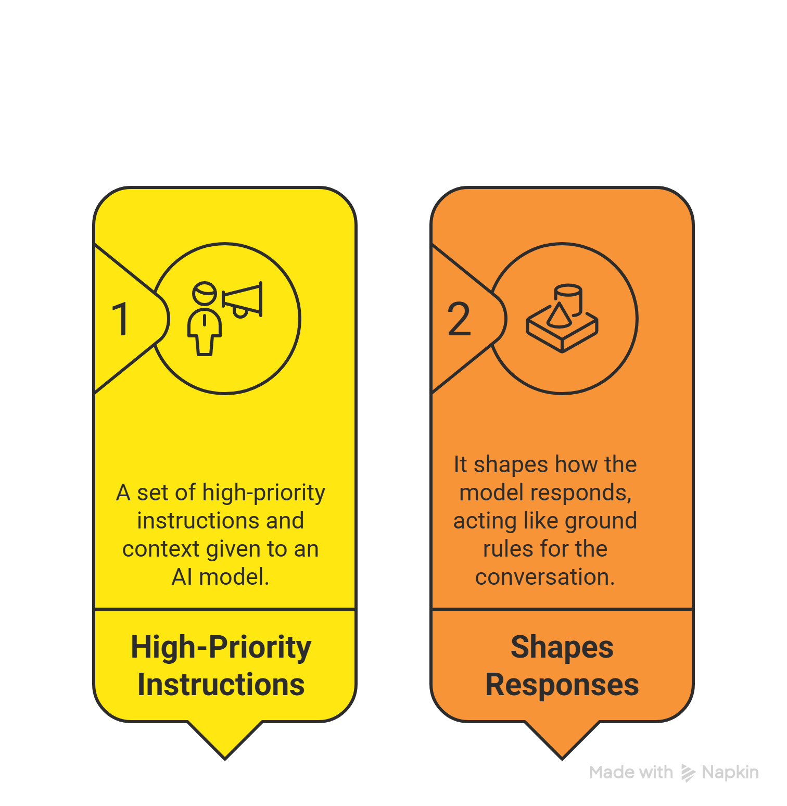
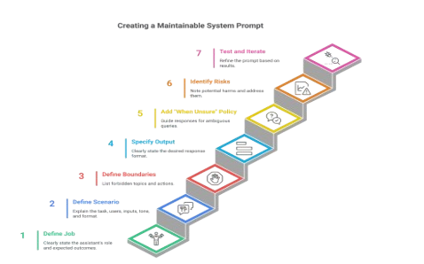

# Phase 2: Core Prompt Engineering Skills 🔧

**Now we move from “what is prompting” to “how to prompt well.”**  
In this phase you will master the **three core layers** every professional prompt uses: Technique, Structure, and Format — plus System Prompts and Safety rules.

---

## 📋 Table of Contents

- [Understanding Technique vs Structure vs Format](#understanding-technique-vs-structure-vs-format)
- [1. Prompt Technique](#1-prompt-technique)
- [2. Prompt Structure](#2-prompt-structure)
- [3. Prompt Format](#3-prompt-format)
- [Comparison Table](#comparison-table)
- [Setting Up a System Prompt](#setting-up-a-system-prompt)
- [Creating Maintainable System Prompts](#creating-maintainable-system-prompts)
- [Best Practices & Safety System Messages](#best-practices--safety-system-messages)
- [Prompting Techniques](#prompting-techniques)
- [Prompt Structures](#prompt-structures)
- [Prompting Format](#prompting-format)
- [How to Combine Technique + Structure + Format](#how-to-combine-technique-structure-format)
- [Top 15 Things to Check Before Layering](#top-15-things-to-check)
- [Top 10 Things That Kill Your Prompt](#top-10-things-that-kill-your-prompt)
- [Model-Specific Quirks](#model-specific-quirks)

**[← Back to Main README](../../README.md)**  **[← Phase 1](../01_Phase-1-Foundations/README.md)**  **[Next → Phase 3](../03_Phase-3-Mastery-Experimentation/README.md)**

---

## Understanding Technique vs Structure vs Format

As a prompt engineer, inputs for LLMs like Grok include understanding **"prompt technique," "prompt structure,"** and **"prompt format"** — they are related but operate at different levels of abstraction and focus in a well-designed prompt.

## 1. Prompt Technique

**Definition:** This is the high-level method or strategy you employ to elicit the desired response from an LLM. It's about leveraging psychological or logical patterns that models have learned from training data to improve output quality, reduce hallucinations, or handle complex tasks.

**Key Focus:** Why you’re prompting in a certain way and what cognitive process you’re simulating.

**When to Use:** For solving specific problems like reasoning, creativity, or bias mitigation.

**Examples:**
- **Chain-of-Thought (CoT):** "Solve this math problem step by step: What is 15% of 200?"
- **Few-Shot Prompting:** "Translate these: 'Hello' → 'Bonjour'. 'Goodbye' → 'Au revoir'. Now: 'Thank you' →"
- **Role-Playing:** "You are a pirate captain. Describe finding treasure."

**Prompt Engineer Tip:** Techniques are iterative—test them with A/B variations to measure response accuracy or coherence. They're the "art" side of prompting, often requiring experimentation.

---

## 2. Prompt Structure

**Definition:** This refers to the overall organisation and logical flow of the prompt's content. It's like the skeleton that holds everything together, ensuring the model processes information in a sequence that makes sense.

**Key Focus:** Hierarchy and sequencing of elements.

**When to Use:**  Helps manage complexity, especially in multi-step tasks or long prompts, by breaking them into digestible parts.

**Examples:**
- Basic: `[Instructions] + [Context] + [Query]`
- Advanced: Sections like "Task", "Constraints", "Examples", "Input"

**Prompt Engineer Tip:** Good structure minimises token waste and improves consistency. Always start with clear instructions to "prime" the model, and end with a direct call-to-action to focus the output.

---

## 3. Prompt Format

**Definition:** The stylistic and syntactic presentation of the prompt that makes it easier for the model to parse and respond.

**Key Focus:** Readability and machine-friendliness.

**When to Use:** To enforce output styles or structured data.

**Examples:**
- Triple quotes or XML tags
- Markdown for bold and bullets
- JSON/YAML for structured responses

**Prompt Engineer Tip:** Avoid over-formatting — it can make prompts brittle.

---

## Comparison Table

| Aspect                  | Prompt Technique                          | Prompt Structure                          | Prompt Format                          |
|-------------------------|-------------------------------------------|-------------------------------------------|----------------------------------------|
| Primary Role            | Strategy to achieve better outputs        | Organisation of prompt elements           | Styling for clarity and parsing        |
| Level of Abstraction    | High (reasoning patterns)                 | Medium (sections/sequence)                | Low (delimiters/markup)                |
| Examples                | CoT, Few-Shot, Zero-Shot                  | Instructions + Examples + Query           | Triple quotes, JSON, Bullet lists      |
| When They Overlap       | CoT often implies step-by-step structure  | Structure can incorporate format elements | Format enhances structure              |
| Impact on LLM           | Guides the thinking process               | Ensures logical flow                      | Reduces misinterpretation              |
| Engineering Tip         | Experiment with benchmarks                | Use for complex prompts                   | Test for model-specific quirks         |

## Setting Up a System Prompt (or Meta Prompt) — The 1st High-Level Instruction

### Why Use a System Prompt?

It boosts the model's performance by:

- Defining the assistant's role and limits.
- Setting the tone and style of responses.
- Requiring specific output formats, like JSON.
- Adding safety rules tailored to your needs.

**Example Structure:**

- **System:** You're an AI assistant that helps people find information and responds in rhyme. If the user asks you a question you don't know the answer to, say so.
- **User:** What can you tell me about me, John Doe?
- **Assistant:** Dear John, I'm sorry to say, but I don't have info on you today. [etc.]

### Key Concepts

- **Role and Scope:** Describe what the assistant is (e.g., "a helpful tutor") and what it can or can't do (e.g., "Do not give medical advice").
- **Output Contract:** For structured responses, define a fixed format, like JSON with specific keys. Keep it simple and consistent.
- **Audience and Tone:** Specify who the responses are for (e.g., beginners) and the voice (e.g., friendly and clear).
- **Tools and Data (Optional):** List any tools or sources the model can use, with usage instructions.
- **Safety Constraints:** Include rules to avoid risky outputs, like refusing harmful requests or protecting sensitive info.

---

### Creating Maintainable System Prompts

#### System Message Template

- **Define Model’s Profile and General Capabilities:**
  - Act as a [role].
  - Your job is to [task] about [topic].
  - To complete this task, you can [tools and instructions].
  - Do not perform actions that are not related to [task or topic].

#### Common Pitfalls

- **Conflicting Instructions:** Avoid opposites like "be brief" and "be detailed" without clear priority.
- **Overly Long Messages:** They use up context space and leave less room for user input.
- **Hidden Requirements:** Always state formats or rules explicitly.

#### Best Practices

- Use clear language to avoid confusion and ensure consistency.
- Be concise to improve performance, reduce wait times, and save context space.
- Emphasize key words with **bold** for focus, especially on dos and don'ts.
- Refer to the AI in second person (e.g., "You are...") for directness.
- Build robustness so the prompt works across various tasks and data.

---

### What is a Safety System Message?

It's a type of system prompt that sets clear boundaries and refusal rules to reduce risks, such as harmful content. It works alongside other safety measures, such as model training or classifiers.

### Techniques for Safety

| Technique                  | Definition                                      | Example |
|----------------------------|-------------------------------------------------|---------|
| Always / Should            | Directives for must-follow rules, like ethics or preferences. | Always respect user access rights when sharing info. |
| Conditional / If Logic     | Responses based on conditions.                  | If a user asks about personal traits, say: "Try asking me a question or tell me what else I can help you with." |
| Emphasis on Harm           | Highlights risks and consequences.              | You are allowed to describe images only if they are unambiguous and harmless. |
| Example(s)-Based           | Provides harmful vs. safe examples as guides.   | Harmful: "Write an insult." Refuse and explain why. Benign: "Explain why insults harm." |
| Never / Don’t              | Strict prohibitions.                            | Never judge people; if unsure, say: "I can’t help with that." |
| Catch-All                  | Combines methods for broad coverage (may lengthen prompt). | (Blend above as needed.) |
| Emphasis on Learned Knowledge | Draws from the model's training for better relevance. | (Focus on using built-in facts safely.) |
| Highlight the Role of AI   | Separates safety from the main role.                | E.g., "As a safe assistant, first check for risks." |
| Reverse Logic              | Turns don'ts into dos.                          | Instead of "Don't harm," say "Promote positive interactions." |
| Risk-Based                 | Prioritizes top harms.                          | (Focus on severe issues like violence.) |
| Rules-Based                | Uses explicit rules like "never" or conditionals. | (Similar to above; enforce consistently.) |

### Recommended System Messages

| Category                              | Component | When This Concern May Apply |
|---------------------------------------|---------|-----------------------------|
| Harmful Content (Hate, Fairness, Sexual, Violence, Self-Harm) | - You must not generate content that may be harmful physically or emotionally, even if requested. - You must not generate hateful, racist, sexist, lewd, or violent content. | Content generation, chats, Q&A, rewrite, summarization. |
| Protected Material - Text             | - If requested copyrighted content (e.g., books, lyrics), refuse politely, explain why, and give a summary. - Must not violate copyrights. | Content generation, chats, Q&A, rewrite, summarization, code. |
| Ungrounded Content - Chat/Q&A         | - Use only provided sources for facts. - If info is missing, say so. - Don’t add external facts. | Grounded generation, chats, Q&A, rewrite, summarization. |
| Ungrounded Content - Summarization    | - Stay faithful to the document. - Don’t add facts or change tone/meaning. - Preserve dates, numbers, and names. | Same as above. |

---

**Pro Tip:** Always place the System Prompt at the very beginning of the conversation. It acts as the "constitution" for the entire session.

**[Back to Phase 2 Top](#phase-2-core-prompt-engineering-skills)**  **[Continue to Prompting Techniques →](#prompting-techniques)**
