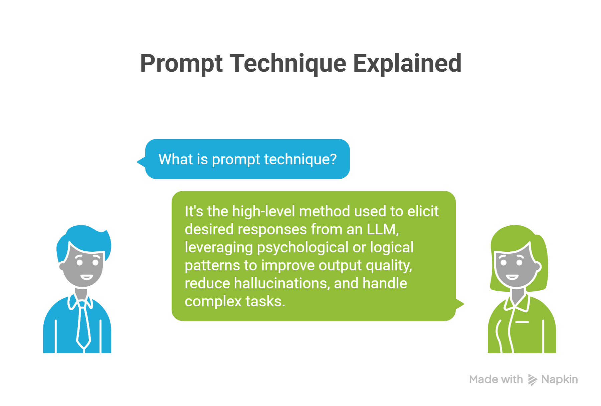
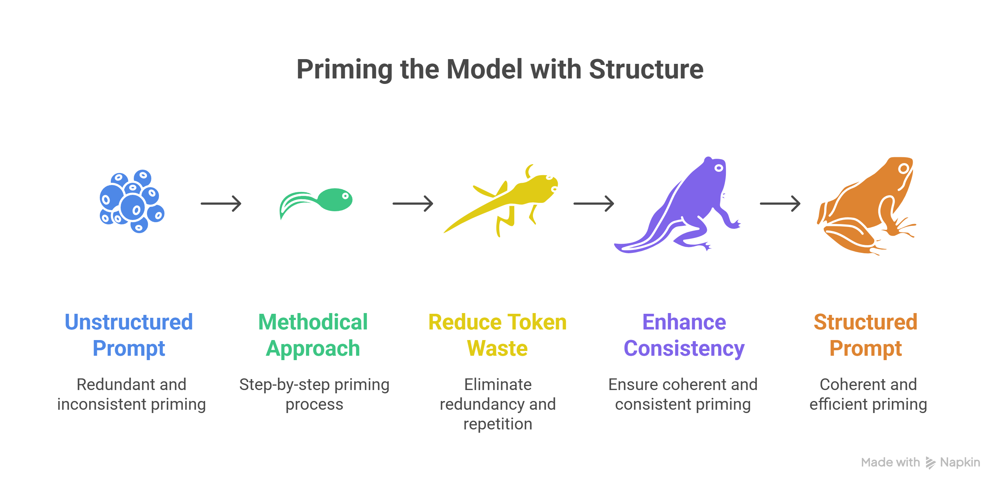
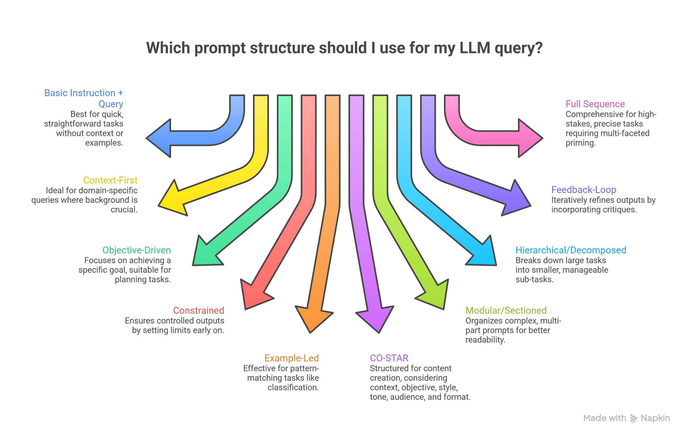
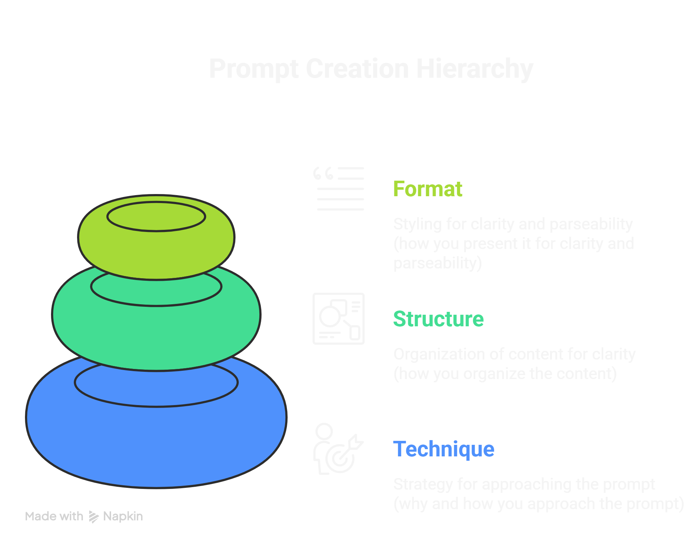
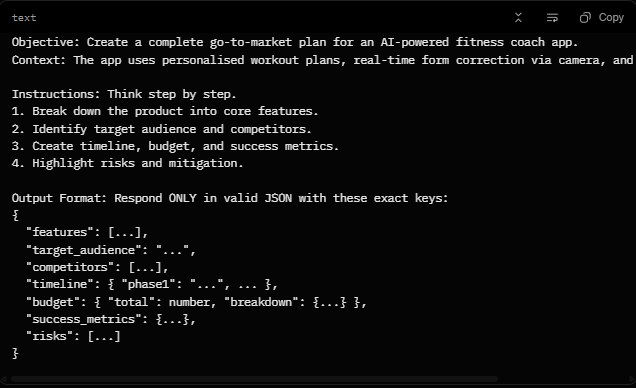
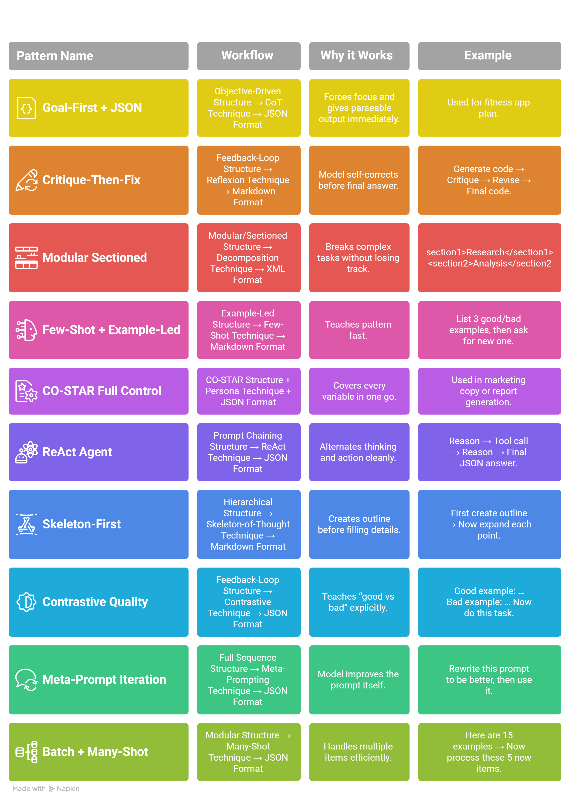

# Phase 2: Core Prompt Engineering Skills 🔧


**Now we move from “what is prompting” to “how to prompt well.”**  
In this phase you will master the **three core layers** every professional prompt uses: Technique, Structure, and Format — plus System Prompts and Safety rules.

---

## 📋 Table of Contents

- [Understanding Technique vs Structure vs Format](#understanding-technique-vs-structure-vs-format)
- [1. Prompt Technique](#1-prompt-technique)
- [2. Prompt Structure](#2-prompt-structure)
- [3. Prompt Format](#3-prompt-format)
- [Comparison Table](#comparison-table)
- [Setting Up a System Prompt](#setting-up-a-system-prompt)
- [Creating Maintainable System Prompts](#creating-maintainable-system-prompts)
- [Best Practices & Safety System Messages](#best-practices--safety-system-messages)
- [Prompting Techniques](#prompting-techniques)
- [Prompt Structures](#prompt-structures)
- [Prompting Format](#prompting-format)
- [How to Combine Technique + Structure + Format](#how-to-combine-technique-structure-format)
- [Top 15 Things to Check Before Layering](#top-15-things-to-check)
- [Top 10 Things That Kill Your Prompt](#top-10-things-that-kill-your-prompt)
- [Model-Specific Quirks](#model-specific-quirks)

**[← Back to Main README](../../README.md)**  **[← Phase 1](../01_Phase-1-Foundations/README.md)**  **[Next → Phase 3](../03_Phase-3-Mastery-Experimentation/README.md)**

---

## Understanding Technique vs Structure vs Format

As a prompt engineer, inputs for LLMs like Grok include understanding **"prompt technique," "prompt structure,"** and **"prompt format"** — they are related but operate at different levels of abstraction and focus in a well-designed prompt.


## 1. Prompt Technique

**Definition:** This is the high-level method or strategy you employ to elicit the desired response from an LLM. It's about leveraging psychological or logical patterns that models have learned from training data to improve output quality, reduce hallucinations, or handle complex tasks.

**Key Focus:** Why you’re prompting in a certain way and what cognitive process you’re simulating.

**When to Use:** For solving specific problems like reasoning, creativity, or bias mitigation.

**Examples:**
- **Chain-of-Thought (CoT):** "Solve this math problem step by step: What is 15% of 200?"
- **Few-Shot Prompting:** "Translate these: 'Hello' → 'Bonjour'. 'Goodbye' → 'Au revoir'. Now: 'Thank you' →"
- **Role-Playing:** "You are a pirate captain. Describe finding treasure."

**Prompt Engineer Tip:** Techniques are iterative—test them with A/B variations to measure response accuracy or coherence. They're the "art" side of prompting, often requiring experimentation.


---

## 2. Prompt Structure

**Definition:** This refers to the overall organisation and logical flow of the prompt's content. It's like the skeleton that holds everything together, ensuring the model processes information in a sequence that makes sense.

**Key Focus:** Hierarchy and sequencing of elements.

**When to Use:**  Helps manage complexity, especially in multi-step tasks or long prompts, by breaking them into digestible parts.

**Examples:**
- Basic: `[Instructions] + [Context] + [Query]`
- Advanced: Sections like "Task", "Constraints", "Examples", "Input"

**Prompt Engineer Tip:** Good structure minimises token waste and improves consistency. Always start with clear instructions to "prime" the model, and end with a direct call-to-action to focus the output.


---

## 3. Prompt Format

**Definition:** The stylistic and syntactic presentation of the prompt that makes it easier for the model to parse and respond.

**Key Focus:** Readability and machine-friendliness.

**When to Use:** To enforce output styles or structured data.

**Examples:**
- Triple quotes or XML tags
- Markdown for bold and bullets
- JSON/YAML for structured responses

**Prompt Engineer Tip:** Avoid over-formatting — it can make prompts brittle.

---

## Comparison Table

| Aspect                  | Prompt Technique                          | Prompt Structure                          | Prompt Format                          |
|-------------------------|-------------------------------------------|-------------------------------------------|----------------------------------------|
| Primary Role            | Strategy to achieve better outputs        | Organisation of prompt elements           | Styling for clarity and parsing        |
| Level of Abstraction    | High (reasoning patterns)                 | Medium (sections/sequence)                | Low (delimiters/markup)                |
| Examples                | CoT, Few-Shot, Zero-Shot                  | Instructions + Examples + Query           | Triple quotes, JSON, Bullet lists      |
| When They Overlap       | CoT often implies step-by-step structure  | Structure can incorporate format elements | Format enhances structure              |
| Impact on LLM           | Guides the thinking process               | Ensures logical flow                      | Reduces misinterpretation              |
| Engineering Tip         | Experiment with benchmarks                | Use for complex prompts                   | Test for model-specific quirks         |


## Setting Up a System Prompt (or Meta Prompt) — The 1st High-Level Instruction


### Why Use a System Prompt?

It boosts the model's performance by:

- Defining the assistant's role and limits.
- Setting the tone and style of responses.
- Requiring specific output formats, like JSON.
- Adding safety rules tailored to your needs.

**Example Structure:**

- **System:** You're an AI assistant that helps people find information and responds in rhyme. If the user asks you a question you don't know the answer to, say so.
- **User:** What can you tell me about me, John Doe?
- **Assistant:** Dear John, I'm sorry to say, but I don't have info on you today. [etc.]

### Key Concepts

- **Role and Scope:** Describe what the assistant is (e.g., "a helpful tutor") and what it can or can't do (e.g., "Do not give medical advice").
- **Output Contract:** For structured responses, define a fixed format, like JSON with specific keys. Keep it simple and consistent.
- **Audience and Tone:** Specify who the responses are for (e.g., beginners) and the voice (e.g., friendly and clear).
- **Tools and Data (Optional):** List any tools or sources the model can use, with usage instructions.
- **Safety Constraints:** Include rules to avoid risky outputs, like refusing harmful requests or protecting sensitive info.

---

### Creating Maintainable System Prompts


#### System Message Template

- **Define Model’s Profile and General Capabilities:**
  - Act as a [role].
  - Your job is to [task] about [topic].
  - To complete this task, you can [tools and instructions].
  - Do not perform actions that are not related to [task or topic].

#### Common Pitfalls

- **Conflicting Instructions:** Avoid opposites like "be brief" and "be detailed" without clear priority.
- **Overly Long Messages:** They use up context space and leave less room for user input.
- **Hidden Requirements:** Always state formats or rules explicitly.

#### Best Practices

- Use clear language to avoid confusion and ensure consistency.
- Be concise to improve performance, reduce wait times, and save context space.
- Emphasize key words with **bold** for focus, especially on dos and don'ts.
- Refer to the AI in second person (e.g., "You are...") for directness.
- Build robustness so the prompt works across various tasks and data.

---

### What is a Safety System Message?

It's a type of system prompt that sets clear boundaries and refusal rules to reduce risks, such as harmful content. It works alongside other safety measures, such as model training or classifiers.

### Techniques for Safety

| Technique                  | Definition                                      | Example |
|----------------------------|-------------------------------------------------|---------|
| Always / Should            | Directives for must-follow rules, like ethics or preferences. | Always respect user access rights when sharing info. |
| Conditional / If Logic     | Responses based on conditions.                  | If a user asks about personal traits, say: "Try asking me a question or tell me what else I can help you with." |
| Emphasis on Harm           | Highlights risks and consequences.              | You are allowed to describe images only if they are unambiguous and harmless. |
| Example(s)-Based           | Provides harmful vs. safe examples as guides.   | Harmful: "Write an insult." Refuse and explain why.<br>Benign: "Explain why insults harm." |
| Never / Don’t              | Strict prohibitions.                            | Never judge people; if unsure, say: "I can’t help with that." |
| Catch-All                  | Combines methods for broad coverage (may lengthen prompt). | (Blend above as needed.) |
| Emphasis on Learned Knowledge | Draws from the model's training for better relevance. | (Focus on using built-in facts safely.) |
| Highlight the Role of AI   | Separates safety from the main role.                | E.g., "As a safe assistant, first check for risks." |
| Reverse Logic              | Turns don'ts into dos.                          | Instead of "Don't harm," say "Promote positive interactions." |
| Risk-Based                 | Prioritizes top harms.                          | (Focus on severe issues like violence.) |
| Rules-Based                | Uses explicit rules like "never" or conditionals. | (Similar to above; enforce consistently.) |

### Recommended System Messages

| Category                              | Component | When This Concern May Apply |
|---------------------------------------|---------|-----------------------------|
| Harmful Content (Hate, Fairness, Sexual, Violence, Self-Harm) | - You must not generate content that may be harmful physically or emotionally, even if requested.<br>- You must not generate hateful, racist, sexist, lewd, or violent content. | Content generation, chats, Q&A, rewrite, summarization. |
| Protected Material - Text             | - If requested copyrighted content (e.g., books, lyrics), refuse politely, explain why, and give a summary.<br>- Must not violate copyrights. | Content generation, chats, Q&A, rewrite, summarization, code. |
| Ungrounded Content - Chat/Q&A         | - Use only provided sources for facts.<br>- If info is missing, say so.<br>- Don’t add external facts. | Grounded generation, chats, Q&A, rewrite, summarization. |
| Ungrounded Content - Summarization    | - Stay faithful to the document.<br>- Don’t add facts or change tone/meaning.<br>- Preserve dates, numbers, and names. | Same as above. |

---

**Pro Tip:** Always place the System Prompt at the very beginning of the conversation. It acts as the "constitution" for the entire session.

**[Back to Phase 2 Top](#phase-2-core-prompt-engineering-skills)**  **[Continue to Prompting Techniques →](#prompting-techniques)**

## Prompting Techniques



Prompt Technique is the high-level method or strategy you employ to elicit the desired response from an LLM. It leverages psychological or logical patterns the model has learned during training.

---

### 1. Basic Reasoning Techniques

| Technique                  | Description with Example                                                                 | Best Use Case                                      | Type of Problem Best For                          | Worst Case (When Not to Use)                          | Models It Works Well On          | Why It Works Well There |
|----------------------------|------------------------------------------------------------------------------------------|----------------------------------------------------|---------------------------------------------------|-------------------------------------------------------|----------------------------------|-------------------------|
| Chain-of-Thought (CoT)     | Guides the model to think step-by-step before answering. Example: "Solve 2+34 step-by-step: First, multiply 34=12, then add 2=14." | When you need logical reasoning or to break down complex problems. Use for math or puzzles; avoid for simple facts. | Logical, multi-step reasoning like math, coding, or decision-making. | Simple queries or creative tasks where steps add unnecessary length. | Text-to-Text models like GPT or Grok. | These models are trained on sequential data, so mimicking human reasoning reduces errors in logic-heavy tasks. |

---

### 2. Advanced Reasoning & Exploration

| Technique                  | Description with Example                                                                 | Best Use Case                                      | Type of Problem Best For                          | Worst Case (When Not to Use)                          | Models It Works Well On                  | Why It Works Well There |
|----------------------------|------------------------------------------------------------------------------------------|----------------------------------------------------|---------------------------------------------------|-------------------------------------------------------|------------------------------------------|-------------------------|
| Tree-of-Thought (ToT)      | Explores multiple reasoning paths like a tree, evaluating branches to find the best. Example: "Brainstorm 3 ways to solve traffic: Option 1: More roads (pros/cons)... Pick the best." | When finding optimal solutions among options. Use for planning; skip for linear problems. | Optimisation, planning, or creative problem-solving with alternatives. | Straightforward tasks without branches, as it overcomplicates. | Advanced LLMs like Grok or GPT-4 with strong reasoning. | They handle branching logic and self-evaluation well due to large context windows and training on diverse scenarios. |
| Step-Back Prompting        | Ask the model a generic, high-level question about relevant concepts or facts before delving into reasoning. Example: "What is the core principle of gravity? Now apply this to the apple falling." | Simplifying complex issues. Use for high-level thinking; avoid basics. | Abstract or conceptual problems, like strategy. | Concrete, detail-oriented tasks where abstraction confuses. | Reasoning-focused LLMs like GPT-4 or Grok. | Encourages meta-thinking, leveraging their ability to generalise from training. |
| Plan-and-Solve             | First plan steps, then execute. Example: "Plan: Step 1 research, Step 2 analyse. Now solve." | Structured problem-solving. Use for multi-phase tasks; avoid singles. | Complex projects like research or strategy. | Basic calculations where planning is redundant. | Planning strong LLMs like GPT-4. | Mimics human planning, reducing errors in sequenced tasks. |
| Least-to-Most Prompting    | Break into sub-problems, solve the easy first. Example: "First, define terms. Then solve the equation." | Scaling complexity. Use for tough problems; avoid easy ones. | Hierarchical tasks like coding or analysis. | Flat, non-decomposable queries. | Decomposition-strong models like GPT-4. | Trained on breakdowns, helps in managing complexity step-by-step. |
| Decomposition Prompting    | Breaks the problem into parts explicitly. Example: "Decompose: Part1 math, Part2 logic. Solve each." | Divide and conquer. Use for large problems; avoid small. | Modular tasks like software design. | Indivisible queries. | Modular LLMs like the GPT series. | Reduces overload by processing subsets. |
| Graph-of-Thought (GoT)     | Models reasoning as a graph with nodes and edges. Example: "Node1: Idea A -> Node2: Connected B. Explore paths." | Non-linear exploration. Use for interconnected ideas; avoid linear. | Knowledge graphs or complex relations. | Simple sequences where the graph overcomplicates. | Advanced reasoning models like Grok. | Handles relational data from graph-like training examples. |
| Skeleton-of-Thought (SoT)  | Creates an outline or skeleton first, then fills in details. Example: "Outline a business plan: 1. Intro, 2. Market... Now expand each." | Structuring responses. Use for organised content; avoid short answers. | Essay writing, planning, or reports needing structure. | Quick facts or unstructured creativity, as outline adds overhead. | Long-form generation models like Grok or GPT-4. | Handles hierarchical content well due to training on outlined texts. |

---

### 3. Example-Driven & In-Context Learning

| Technique              | Description with Example                                                                 | Best Use Case                                      | Type of Problem Best For                          | Worst Case (When Not to Use)                          | Models It Works Well On                  | Why It Works Well There |
|------------------------|------------------------------------------------------------------------------------------|----------------------------------------------------|---------------------------------------------------|-------------------------------------------------------|------------------------------------------|-------------------------|
| Few-Shot Prompting     | Provides 1-5 examples to teach the pattern. Example: "Apple -> Fruit. Dog -> Animal. Car -> ?" | Demonstrating patterns quickly. Use when examples clarify; avoid if no good examples exist. | Classification, translation, or pattern-matching with limited data. | Novel tasks without patterns or when examples might bias the model. | Most LLMs, especially smaller ones like GPT-3. | In-context learning allows them to adapt without fine-tuning. |
| Many-Shot Prompting    | Uses many (10+) examples for deeper learning. Example: "List 20 Q&A pairs before asking a similar one." | Building a complex understanding. Use for nuanced tasks; limit if the context window is small. | Detailed tasks like style imitation or data extraction need lots of context. | Short contexts or simple queries as it wastes tokens and risk overload. | Large-context models like Grok or Claude. | Big models manage long inputs without forgetting. |
| Zero-Shot Prompting    | No examples, just direct instruction. Example: "Classify this text as positive or negative: 'I love it!'" | Quick, general queries. Use for built-in knowledge; avoid ambiguous tasks. | Basic tasks like summarisation or fact recall. | Complex or domain-specific problems needing guidance. | All LLMs, but best on fine-tuned ones like instruction-tuned GPT. | Relies on pre-trained knowledge. |
| Active-Prompt          | Dynamically selects or generates examples. Example: "Pick relevant examples from these, then answer." | Adaptive learning. Use for personalised tasks; skip generics. | Few-shot with selection for relevance. | When examples are fixed or none are available. | Adaptive LLMs like GPT-4. | Improves by choosing the best fits from in-context learning. |

---

### 4. Self-Correction & Evaluation

| Technique                  | Description with Example                                                                 | Best Use Case                                      | Type of Problem Best For                          | Worst Case (When Not to Use)                          | Models It Works Well On                  | Why It Works Well There |
|----------------------------|------------------------------------------------------------------------------------------|----------------------------------------------------|---------------------------------------------------|-------------------------------------------------------|------------------------------------------|-------------------------|
| Self-Consistency           | Generate multiple answers and vote on the best. Example: "Solve 3 ways, pick the majority." | Improving reliability. Use for uncertain tasks; avoid deterministic ones. | Math or ambiguous reasoning where variance helps. | Time-sensitive or simple facts are inefficient. | Ensemble-capable LLMs like the GPT series. | Averages out noise from training. |
| Reflexion                  | The model reflects on its own output and improves. Example: "Generate answer, then critique and revise." | Self-improvement loops. Use for accuracy boosts; skip quick responses. | Iterative tasks like debugging or writing. | Time-constrained or simple queries, as loops take time. | Iterative-capable models like Grok. | Supports self-correction from reflection patterns. |
| Contrastive Prompting      | Provides good and bad examples to highlight differences. Example: "Good summary: Concise. Bad: Too long. Now summarise this." | Teaching quality standards. Use for quality control; avoid without contrasts. | Evaluation, classification, or style enforcement. | Tasks without clear good/bad, as it confuses. | Discriminative models like GPT series. | Improves by contrasting. |
| Generated Knowledge        | Prompt to generate facts first, then use them. Example: "List facts about Rome, then summarise history." | Building a knowledge base. Use for recall-heavy tasks; not for real-time data. | Synthesis or explanation from internal knowledge. | Factual accuracy needs an external search, risks hallucinations. | Knowledge-rich models like Grok. | Leverages vast pre-training. |

---

### 5. Role, Creative & Interactive Techniques

| Technique                          | Description with Example                                                                 | Best Use Case                                      | Type of Problem Best For                          | Worst Case (When Not to Use)                          | Models It Works Well On                  | Why It Works Well There |
|------------------------------------|------------------------------------------------------------------------------------------|----------------------------------------------------|---------------------------------------------------|-------------------------------------------------------|------------------------------------------|-------------------------|
| Persona-Based (Role-Playing)       | Assigns a role to the model. Example: "As a chef, suggest a recipe for pasta."           | Personalising responses. Use for creative or styled outputs; skip for neutral facts. | Storytelling, advice, or simulations like teaching. | Factual queries where the role adds bias or fluff. | Multimodal or creative models like Grok. | Enhances engagement by tapping into role-play training data. |
| Emotion Prompting                  | Adds emotional language to influence output. Example: "I'm excited about this! Suggest fun vacation ideas." | Boosting creativity or empathy. Use for motivational content; skip factual needs. | Persuasive writing, storytelling, or user engagement. | Technical or neutral tasks where emotion biases facts. | Sentiment-aware models like Grok. | Trained on emotional texts. |
| Analogical Prompting               | Uses analogies to explain or solve. Example: "Like water flowing, explain electricity." | Simplifying concepts. Use for education; skip experts. | Teaching or intuitive understanding. | Literal tasks where analogies mislead. | Analogical models like GPT-4. | Draws from vast analogy examples in data. |
| ReAct (Reason + Act)               | Alternates reasoning and actions (like tool calls). Example: "Reason: I need data. Act: Search the web. Reason: Analyse results..." | Interactive tasks with tools. Use for dynamic problems; avoid static ones. | Agent-like tasks involving searches or calculations. | Pure reasoning without external needs, as it loops unnecessarily. | Agent-capable models like Grok with tools. | Built for integration with functions. |
| Interview Methods (Self-Ask, RaR, SimToM) | The model asks clarifying questions back before giving a finalize output. Example: "To help, what is your budget? Based on that..." | Gathering info iteratively. Use for vague queries; not for one-shot answers. | User interactions needing clarification, like consulting. | Clear, self-contained questions where questions annoy. | Conversational models like Grok. | Supports dialogue flow. |
| Directional Stimulus Prompting     | Adds hints or directions to guide. Example: "Think like Einstein: Solve this physics problem." | Steering creativity. Use for inspired outputs; skip strict facts. | Brainstorming or innovative solutions. | Precise tasks where hints bias incorrectly. | Creative LLMs like Grok. | Amplifies associations from training on diverse stimuli. |

---

### 6. Structured & Framework Techniques

| Technique                  | Description with Example                                                                 | Best Use Case                                      | Type of Problem Best For                          | Worst Case (When Not to Use)                          | Models It Works Well On                  | Why It Works Well There |
|----------------------------|------------------------------------------------------------------------------------------|----------------------------------------------------|---------------------------------------------------|-------------------------------------------------------|------------------------------------------|-------------------------|
| Co-STAR Framework          | Structured prompt: Context, Objective, Style, Tone, Audience, Response format. Example: "Context: Sci-fi. Objective: Write a story. Style: Descriptive..." | Organised prompting. Use for controlled outputs; skip casual chats. | Content creation with specific formats like reports. | Free-form creative tasks where structure stifles. | Structured LLMs like those for APIs or Grok. | Enforces clarity. |
| Prompt Chaining            | Sequences multiple prompts in a chain. Example: "First summarise the text, then translate the summary." | Building on outputs. Use for workflows; avoid independents. | Multi-stage processes like analysis, then generation. | Standalone tasks, as chaining adds complexity. | Conversational models like ChatGPT. | Maintains context across steps. |
| Batch Prompting            | Group multiple queries into one prompt. Example: "Answer these: 1. What is X? 2. What is Y?" | Efficiency in bulk. Use for related questions; avoid unrelated. | Data processing or FAQs in batches. | Single queries or when separation is needed for clarity. | High-capacity models like Claude or Grok. | Handles parallelism well. |

---

### 7. Optimization & Automation Techniques

| Technique                          | Description with Example                                                                 | Best Use Case                                      | Type of Problem Best For                          | Worst Case (When Not to Use)                          | Models It Works Well On                  | Why It Works Well There |
|------------------------------------|------------------------------------------------------------------------------------------|----------------------------------------------------|---------------------------------------------------|-------------------------------------------------------|------------------------------------------|-------------------------|
| Automatic Prompt Engineer (APE)    | Uses the model to generate or refine prompts. Example: "Generate a better prompt for summarising articles." | Optimising prompts meta-way. Use for iteration; avoid simple setups. | Prompt refinement or automation in pipelines. | One-off queries where manual crafting is faster. | Self-reflective LLMs like GPT-4 or Grok. | Capable of meta-reasoning. |
| Meta-Prompting: System 2 Attention (S2A) | Prompts about creating prompts. Example: "Design a prompt for teaching history." | Higher-level design. Use for tool building; avoid direct answers. | Prompt engineering itself or templates. | End-user queries are not about prompts. | Meta-capable LLMs like Grok. | Leverages self-awareness. |
| Rephrase and Respond (RaR)         | Rephrase the query first, then answer. Example: "Rephrase: User wants X. Now respond." | Clarifying intent. Use for ambiguous queries; avoid clear ones. | Misunderstood or vague questions. | Straightforward asks, as rephrasing adds noise. | Clarification: strong models like Grok. | Improves by refining input. |

---

**Excellent progress!**  
You now have a comprehensive overview of all major prompting techniques, grouped by category with clear comparison tables.

**[Back to Phase 2 Top](#phase-2-core-prompt-engineering-skills)**  **[Continue to Prompt Structures →](#prompt-structures)**

## Prompt Structures



Good structures prevent overwhelming the model with unstructured walls of text, especially in long prompts. They work best on **instruction-tuned models** (e.g., Grok, GPT-4, Claude) that handle hierarchy well.

However, they may underperform on smaller or raw models (e.g., base GPT-3) with limited reasoning or context capacity — in those cases, simpler structures are often better to avoid overload.

**General Rule:** Match structure to prompt length/task type. Test variations to see what minimises hallucinations.

<br clear="left"/>

### Prompt Structure Comparison Table

| Structure Name              | Sequence of Elements                                      | Description with Example                                                                 | Best Use Case & When to Use                                      | When Not to Use                                      | Models It Works Well On                  | Why It Works Well There |
|-----------------------------|-----------------------------------------------------------|------------------------------------------------------------------------------------------|------------------------------------------------------------------|------------------------------------------------------|------------------------------------------|-------------------------|
| Basic Instruction + Query   | Instructions > Query                                      | Simple: Start with what to do, then the input.<br>Example: "Summarise this article: [text]." | Quick, straightforward tasks like fact checks or translations. Use when no context/examples needed. | Complex tasks requiring reasoning or constraints, as it lacks depth. | All LLMs, especially smaller ones like GPT-3.5. | Minimalist; doesn't tax limited context. |
| Context-First               | Context > Instructions > Query                            | Provide background first.<br>Example: "You're analysing sales data from 2023. Calculate growth: [data]." | When background is key (e.g., domain-specific). Use to set the scene without overwhelming. | General knowledge queries where context adds noise. | Knowledge-rich models like Grok or Claude. | Leverages pre-trained knowledge. |
| Objective-Driven            | Objective > Context > Instructions > Query                | Lead with a goal.<br>Example: "Goal: Optimize code for speed. Context: Python script. Instructions: Refactor. Query: [code]." | Goal-oriented tasks like planning. Use to focus on the result. | Creative/open-ended, where rigid goals stifle. | Reasoning models like GPT-4 or Grok. | Aligns with instruction-tuning. |
| Constrained                 | Instructions > Constraints > Query > Output Format        | Add limits early.<br>Example: "Generate ideas. Constraints: Under 100 words, no jargon. Query: Brainstorm apps. Output: Bullet list." | Controlled outputs (e.g., concise responses). Use to enforce rules. | Free-form creativity where constraints limit ideas. | API-tuned models like Grok (with tools). | Handles boundaries well. |
| Example-Led                 | Instructions > Examples > Query                           | Show patterns.<br>Example: "Classify sentiment. Examples: 'Great!' > Positive. 'Bad.' > Negative. Query: 'Okay.'" | Pattern-matching like classification. Use when they clarify. | Novel tasks without good examples, as it biases. | In-context learners like the GPT series. | Excels at few-shot adaptation. |
| CO-STAR (or similar frameworks) | Context > Objective > Style > Tone > Audience > Response Format | Structured for content.<br>Example: "Context: Sci-fi world. Objective: Write a chapter. Style: Descriptive. Tone: Mysterious. Audience: Teens. Format: Paragraphs." | Content creation (e.g., writing/marketing). Use for tailored outputs. | Technical/logical tasks where style overcomplicates. | Creative models like Grok or DALL-E integrated. | Supports nuanced generation. |
| Modular/Sectioned           | [Section1: Instructions] > [Section2: Context] > ...     | Divided sections.<br>Example: "Instructions: Debug code. Context: Error log. Examples: [fix1]. Query: [buggy code]. Format: Steps." | Complex, multi-part prompts (e.g., debugging). Use for organisation in long inputs. | Short queries, as sections add token overhead. | Large-context models like Claude or Grok. | Manages big windows without losing flow. |
| Hierarchical/Decomposed     | Main Task > Sub-Tasks > Query > Integration               | Break down.<br>Example: "Main: Design app. Sub1: UI. Sub2: Backend. Query: Specs. Integrate: Combine." | Hierarchical problems (e.g., architecture). Use for scalability. | Flat/simple tasks without layers. | Decomposition models like GPT-4. | Trained on breakdowns, reduces errors in parts. |
| Feedback-Loop               | Instructions > Query > Negative Examples/Comments > Desired Adjustments | Include critiques.<br>Example: "Generate story. Query: [plot]. Negative: Avoid clichés like 'happily ever after'. Adjust: Make ending twisty." | Iterative refinement. Use to avoid common pitfalls. | First-pass generation without known issues. | Reflective models like Grok. | Encourages self-correction. |
| Full Sequence               | Context > Objective > Constraints > Output Format > Examples > Negative Comments | Comprehensive.<br>Example: "Context: Medical report. Objective: Summarise. Constraints: HIPAA compliant. Format: Bullets. Examples: [good summary]. Negative: Don't speculate." | High-stakes/precise tasks (e.g., legal). Use for control. | Casual queries where a full setup is overkill. | Advanced LLMs like GPT-4 or Grok. | Handles multi-faceted priming due to strong reasoning. |

---

### Which Prompt Structure Should I Use?



**Quick Decision Guide:**
- Simple & fast task → **Basic Instruction + Query**
- Need background → **Context-First**
- Goal-oriented → **Objective-Driven**
- Need strict control → **Constrained**
- Need examples → **Example-Led**
- Creative/content work → **CO-STAR**
- Complex/long prompt → **Modular/Sectioned** or **Full Sequence**

---

**Pro Tip:** Always test your chosen structure with a short version first. If the model performs well, scale it up. If it feels bloated, simplify.

**[Back to Phase 2 Top](#phase-2-core-prompt-engineering-skills)**  **[Continue to Prompting Format →](#prompting-format)**

## Prompting Format


Format is the stylistic and syntactic presentation of the prompt. It makes the prompt easier for the model to parse and respond to. Think of it as the "punctuation" that reduces ambiguity.

---

### Prompt Format Comparison Table

| Format Type              | Description with Example                                                                 | Best Use Case                                      | Type of Problem Best For                          | Worst Case (When Not to Use)                          | Models It Works Well On                  | Why It Works Well There |
|--------------------------|------------------------------------------------------------------------------------------|----------------------------------------------------|---------------------------------------------------|-------------------------------------------------------|------------------------------------------|-------------------------|
| Triple Quotes            | Uses `"""` or `'''` to enclose text blocks.<br>Example: `""" Input: Hello. Translate to French."""` | Enclosing multi-line inputs or examples without escaping. Use for clean separation in long prompts. | Natural language tasks like translation or summarization needing quoted content. | Short, single-line prompts where it adds unnecessary bulk. | Most LLMs like Grok or GPT series. | Clean separation of blocks. |
| Markdown                 | Uses `#` for headings, `**bold**`, `-` bullets, etc.<br>Example: `Task: Summarise. - Point 1: Key fact.` | Improving readability with visual cues. Use for structured responses or prompts with lists/headings. | Organising complex instructions, like step-by-step guides. | Code-heavy prompts where markup interferes with syntax. | Conversational models like ChatGPT or Grok. | Excellent visual hierarchy. |
| JSON                     | Structured key-value pairs.<br>Example: `{"task": "classify", "input": "text here", "format": "output as label"}` | Machine-friendly outputs or inputs. Use for precise, parseable data. | API-like interactions or data extraction. | Creative/free-form tasks where rigidity stifles output. | API-tuned models like Grok with tools or GPT-4. | Perfect for parseable output. |
| XML                      | Tag-based like `<tag>content</tag>`.<br>Example: `<instructions>Summarize</instructions> <context>Article text</context>` | Tagging elements for clear separation. Use for modular, extensible prompts. | Complex, nested structures like configs or multi-part queries. | Simple queries where tags add overhead and complexity. | Structured LLMs like Claude, GPT series. | Great for hierarchical data. |
| YAML                     | Indent-based `key: value`.<br>Example: `task: generate code`<br>`language: Python`<br>`style: minimalist` | Human-readable configs. Use for settings or hierarchical data without quotes. | Prompting with parameters, like style/tone specs. | Tasks needing strict validation, as YAML can be whitespace-sensitive. | Config-friendly models like Claude or Grok. | Clean and readable. |
| Code Blocks              | Uses ```` ``` language` | For including code snippets clearly. | When showing or requesting code. | Non-code contexts. | All LLMs. | Syntax highlighting support. |
| Delimiters (Brackets/Parentheses) | Uses `[]` or `()` for sections.<br>Example: `[Instructions] Do this. [Input] Data here.` | Simple separation without markup. Use for quick grouping. | Basic structuring in short prompts. | Long/complex prompts where nesting gets messy. | All LLMs, especially smaller ones like GPT-3. | Lightweight and flexible. |
| Hashtags/Headings        | Uses `# Heading` or `## Sub`.<br>Example: `# Task`<br>`Describe.`<br>`## Details`<br>`Info here.` | Sectioning like documents. Use for logical flow. | Document-style prompts, e.g., reports. | Code or data where `#` might be seen as comments. | Text models like Grok trained on docs. | Familiar document structure. |
| Pipe/Separators          | Uses `|` or `---` for divisions.<br>Example: `Input | Output format | Examples.` | Tabular or divided content. Use for visual splits. | Prompting with tables or segments. | Comparison or multi-column problems. | Models sensitive to special chars. | Table-capable models like GPT-4. |
| HTML-Like Tags           | Simple, bold or custom.<br>Example: `<query>What is AI?</query> <response_format>Short answer</response_format>` | Lightweight tagging. Use for emphasis or sections. | Web-style prompts needing basic styling. | Strict JSON/XML needs where HTML confuses. | Web-trained models like Grok. | Simple emphasis. |

---

### How to Combine Technique + Structure + Format in One Real Prompt



Think of the three layers like building a sandwich:

- **Technique** = the filling (the smart strategy)
- **Structure** = the bread (the logical order)
- **Format** = the wrapping (how it looks and gets parsed)

**Which Technique layers best with which Structure & Format?** (and which combinations waste tokens or drop accuracy)

| Technique Category                  | Best Structure                          | Best Format          | Token Risk / Accuracy Warning                          | How to spot it logically in real world |
|-------------------------------------|-----------------------------------------|----------------------|--------------------------------------------------------|----------------------------------------|
| Basic Reasoning (CoT, Step-Back)    | Objective-Driven or Full Sequence       | JSON or Markdown     | Low risk – very compatible                             | When you need clear thinking + structured output |
| Advanced Reasoning (ToT, GoT)       | Hierarchical/Decomposed                 | JSON or XML          | Medium – can explode tokens if branches are many       | When problem has multiple paths; test with short version first |
| Example-Driven (Few/Many-Shot)      | Example-Led                             | Markdown or JSON     | Low – works perfectly                                  | When pattern-matching is needed |
| Self-Correction (Reflexion, Self-Consistency) | Feedback-Loop or Modular              | JSON                 | Medium – adds length but greatly reduces hallucinations | When accuracy > speed |
| Role/Creative (Persona, Emotion)    | CO-STAR                                 | Markdown             | Low – enhances creativity without extra tokens         | When tone/style matters |
| Structured (Co-STAR, Prompt Chaining) | Modular/Sectioned or CO-STAR          | JSON/YAML            | Very low – designed for each other                     | When output must be machine-readable |
| Optimization (APE, Meta-Prompting)  | Full Sequence                           | JSON                 | High if overused – can waste tokens on meta-thinking   | When you are iterating prompts, not final output |

<br clear="right"/>

---

**[Back to Phase 2 Top](#phase-2-core-prompt-engineering-skills)**  **[Continue to Next Section →](#top-15-things-to-check-before-layering)**

## Top 15 Things to Check Before Layering Technique + Structure + Format

Before combining layers, run through this checklist. It prevents most common failures.

| #  | Thing to Check                        | Example                                      | Why It’s Important |
|----|---------------------------------------|----------------------------------------------|--------------------|
| 1  | Problem type (reasoning vs creative)  | Is it math or storytelling?                  | Wrong technique wastes tokens |
| 2  | Desired output format                 | JSON, bullet list, or paragraph?             | Prevents post-processing work |
| 3  | Context window limit                  | 8k vs 128k tokens?                           | Avoids truncation |
| 4  | Model’s strength                      | Grok vs small model?                         | Some models choke on complex layers |
| 5  | Token budget                          | How many tokens can I spend?                 | Keeps cost low |
| 6  | Need for parseability                 | Will output go into code/dashboard?          | JSON vs Markdown decision |
| 7  | Risk of hallucination                 | High-stakes fact or creative idea?           | Add self-correction layer |
| 8  | Need for iteration                    | One-shot or multi-turn?                      | Choose chaining or feedback-loop |
| 9  | Audience/tone requirement             | Professional, friendly, pirate?              | Persona + CO-STAR |
| 10 | Number of steps required              | 1 step or 10 steps?                          | Choose hierarchical vs basic |
| 11 | Examples already available            | Do I have 3 good examples?                   | Decide few-shot vs zero-shot |
| 12 | Output must be machine-readable       | Yes/No                                       | Forces JSON/XML |
| 13 | Speed vs quality trade-off            | Need answer in <5 sec?                       | Avoid heavy techniques |
| 14 | Previous prompt performance           | Did last version work?                       | Learn from A/B testing |
| 15 | Safety / constraint needs             | Must not give medical advice?                | Add safety system message first |

---

## Top 10 Things That Kill Your Prompt (Even When It Looks Great at First Glance)

| #  | Pitfall (Looks Good, Actually Deadly)                          | Why It Wastes Tokens / Hallucinates / Confuses AI                          | How to Avoid |
|----|----------------------------------------------------------------|-----------------------------------------------------------------------------|--------------|
| 1  | Over-layering (using 3 heavy techniques at once)               | Model gets confused by too many instructions → hallucinations or refusal   | Limit to one main technique + one structure + one format |
| 2  | Contradictory instructions (e.g. “be brief” + “be detailed”)   | Model tries to satisfy both → verbose + incomplete output                  | Use only one instruction per goal; put conflicts in Constraints |
| 3  | Using a complex structure on a simple task                     | Wastes 100–200 tokens on unnecessary sections                              | Match structure complexity to task size (Basic for simple tasks) |
| 4  | Heavy Format on creative tasks (JSON for storytelling)         | Model becomes robotic and loses creativity                                 | Use Markdown for creative, JSON only for parseable output |
| 5  | Too many negative examples                                     | Model focuses on what NOT to do and forgets the main task                  | Limit to 1–2 strongest negative examples |
| 6  | Long Context + Many-Shot on small-context model                | Prompt gets truncated → model forgets earlier instructions                 | Check model’s context window first |
| 7  | Mixing Role-Playing with strict JSON                           | Model wants to write naturally but is forced into JSON → broken output     | Use Persona with Markdown; reserve JSON for non-creative tasks |
| 8  | Adding Meta-Prompting or APE unnecessarily                     | Model spends tokens rewriting the prompt instead of solving the task       | Use only when you are iterating the prompt itself |
| 9  | No clear “Output ONLY in this format” rule                     | Model adds extra explanations and ruins parsing                            | Always end with “Respond ONLY with…” |
| 10 | Ignoring model-specific quirks (e.g. Grok loves markdown but hates nested XML) | Prompt works on one model, fails on another                                | Test on your actual target model before finalising |

---

## Top 5 Checkpoints That Tell You Your Layering Is Up to Mark (or Needs Improvement)

1. The prompt is **under 400 tokens** and still complete.  
2. You can read the prompt **once** and instantly understand what the model should do.  
3. The model’s **first response** is already in the exact format you asked for (no extra explanation).  
4. When you change only one variable (e.g. temperature), the output **stays consistent**.  
5. You can hand the prompt to a colleague and they get the **same high-quality result** without extra explanation.

---

## How to Identify Which Problems Can Be Resolved by Layering (Pro/Senior Method – Step by Step)

1. Write the raw task in **one sentence**.
2. Ask: “What is the **core difficulty**?” (reasoning, creativity, structure, parseability, accuracy, etc.)
3. Match difficulty to the **Technique** column.
4. Ask: “How complex is the input/output?” → choose **Structure**.
5. Ask: “How will I use the output?” → choose **Format**.
6. Test with a **minimal version** (remove one layer) and compare results.
7. If output is messy → add Format; if illogical → add Technique; if disorganised → add Structure.

---

**Pro Tip:** Save your best layered prompts in a personal library with notes on which Technique + Structure + Format combination worked best.

**[Back to Phase 2 Top](#phase-2-core-prompt-engineering-skills)**  **[Continue to Layering Template →](#ready-to-paste-layering-template)**

## Ready-to-Paste “Layering Template” (Copy & Reuse for ANY Task)



This template turns any vague idea into a layered, professional prompt in under 2 minutes.

### Step-by-Step Guide

1. Write the raw task in **1 sentence** → put it in **OBJECTIVE**.
2. Decide the core difficulty (reasoning? creativity? structure? accuracy?) → pick the matching **TECHNIQUE** from the master list.
3. Ask “How complex is this?” → choose the **STRUCTURE** (simple = Basic Instruction, complex = Full Sequence or Modular).
4. Ask “How will I use the output?” → choose the **FORMAT** (parseable = JSON, readable = Markdown).
5. Fill the **INSTRUCTIONS** as numbered steps (makes the technique actually happen).
6. Add **CONSTRAINTS** and **NEGATIVE EXAMPLES** (this is where most people skip and regret it).
7. Test once with a short version. If it works, scale up. If not, remove one layer and test again.
8. Save the final prompt in your personal library with the layers noted (e.g., “CoT + Full Sequence + JSON”).

---

## 10 Top Patterns Senior Developers Use to Layer Them



### Universal Strategy: “T-S-F Alignment Loop” (Technique → Structure → Format)

**Core Idea:**  
Always choose in this order:  
**Technique first** (what cognitive process do I need?)  
→ **Structure second** (how should the model organise its thinking?)  
→ **Format last** (how should the final answer look and be used?)

### Powerful Result-Driven Workflow (4 steps)

1. **Define Success** – What does “perfect output” look like? (accuracy, structure, parseability, tone)
2. **Match Layers** – Use the compatibility chart to pick one from each column.
3. **Write the Prompt Skeleton** – Use the template above.
4. **Run the 5-Checkpoint Test**:
   - Under 400 tokens?
   - One-read understandable?
   - Model follows format on first try?
   - Consistent when temperature changes?
   - Works when handed to someone else?

This loop is what separates **beginners** (who throw everything in randomly) from **seniors** (who get reliable, production-grade results every time).

---

**Congratulations!**  
You have now completed the core of Phase 2. You understand how to deliberately layer **Technique + Structure + Format**, use System Prompts effectively, and avoid the most common prompting mistakes.

You are no longer guessing — you are **engineering** prompts like a professional.

**[← Back to Phase 2 Top](#phase-2-core-prompt-engineering-skills)**  

## Model Specific Quirks (Tools and Real-Time Knowledge Fetching)

Every model has unique **“quirks”** — especially around tool use (how it calls external functions like search or code execution) and real-time knowledge (whether it can pull fresh data natively or needs explicit prompting).  

These quirks force you to adapt your prompting style, or you’ll waste tokens, get weak results, or trigger hallucinations.

### How a Model’s Specific Quirks Change Prompting Approaches

- **Grok (xAI):** Proactive tool use (decides itself when to search or run code). Native real-time knowledge via X and web.  
  → Prompt casually and trust it. Say “use tools if needed” — no heavy guidance. Short, natural language works best.

- **GPT-4o / o-series (OpenAI):** Explicit function-calling only. Real-time browsing is optional and must be enabled.  
  → Be very structured. List every tool, define exact parameters, and tell it when to call tools. Use JSON schemas.

- **Claude (Anthropic):** Conservative tool use — rarely takes initiative, strong at following detailed instructions.  
  → Give clear safety rules and step-by-step guidance. Explicitly say “use tools only if data is missing”.

- **Llama 3.1/4 (open-weight):** Depends on the inference engine (Ollama/vLLM/llama.cpp). No native real-time unless you add tools.  
  → You must add tool-calling code yourself and remind it in every prompt. Real-time knowledge requires external RAG or search tools.

**General Rule:**  
Ignore the quirk → you waste tokens, get refusals, or hallucinations. **Match your prompting style to the model’s default behavior.**

### What Happens If We Ignore These Quirks

- **Grok:** You over-specify tools → wastes tokens and makes it less creative.
- **GPT:** You don’t define tools clearly → model invents fake function calls or refuses.
- **Claude:** You give vague instructions → conservative refusals or overly safe answers.
- **Llama (local):** No tool guidance → no real-time knowledge, more hallucinations.

**Result in all cases:** Higher cost, lower quality, more hallucinations, and broken production apps.

---

### How Prompt Techniques / Structure / Format Should Be Altered for 100% AI Use

To get maximum performance, adapt the three layers (Technique + Structure + Format) to each model’s quirks.

| Technique Category                  | Best Structure (adapted)          | Best Format (adapted) | How to Alter for 100% AI Use (Model-Specific) |
|-------------------------------------|-----------------------------------|-----------------------|-----------------------------------------------|
| Basic Reasoning (CoT, Step-Back)    | Objective-Driven or Full Sequence | JSON or Markdown      | Grok: Keep short & natural.<br>GPT/Claude: Add “think step by step before any tool call”.<br>Llama: Explicitly say “reason first, then call tool if needed”. |
| Advanced Reasoning (ToT, GoT)       | Hierarchical/Decomposed           | JSON or XML           | Grok: Allow free branching.<br>GPT: Add explicit “use tool only after evaluating all branches”.<br>Claude: Add safety clause “stay within provided context”. |
| Example-Driven (Few/Many-Shot)      | Example-Led                       | Markdown or JSON      | All models: Place examples before any tool instruction.<br>Grok: 2–3 examples max.<br>GPT: Use JSON examples for function-calling pattern. |
| Self-Correction (Reflexion, Self-Consistency) | Feedback-Loop or Modular     | JSON                  | Grok: “Reflect, then decide if tool is needed”.<br>GPT/Claude: “After tool result, critique and revise before final answer”. Add “cite sources or say I don’t know”. |
| Role/Creative (Persona, Emotion)    | CO-STAR                           | Markdown              | Grok: Persona works extremely well with natural tone.<br>GPT/Claude: Add “stay in character but use tools if real-time data is required”. |
| Structured (Co-STAR, Prompt Chaining) | Modular/Sectioned or CO-STAR    | JSON/YAML             | GPT: Perfect for function calling — define tools in system prompt.<br>Grok: Keep chaining short.<br>Llama: Explicitly list available tools in every chain step. |
| Optimization (APE, Meta-Prompting)  | Full Sequence                     | JSON                  | Use only on Grok/Claude (strong meta-reasoning). GPT: Avoid unless very large context. Always add “do not call tools during meta-reasoning”. |

---

### Quick Rules for 100% AI Use (Apply to Every Prompt)

- One main technique only — **never stack 3 heavy ones**.
- Start with a **system prompt** for permanent quirks (e.g., “You are Grok. Use tools autonomously when needed.”).
- End every prompt with a clear output instruction + tool rule: “Respond ONLY in [format]. Use tools only if data is missing or user requests real-time info.”
- Match model quirk:  
  - **Grok** → trust & brevity  
  - **GPT** → explicit schemas  
  - **Claude** → safety + step-by-step  
  - **Llama** → you define everything

---

### Senior Tuning Workflow

| Approach                        | Why it works                              | How it works                                      | How to implement (step-by-step)                          | When to use it |
|---------------------------------|-------------------------------------------|---------------------------------------------------|----------------------------------------------------------|----------------|
| Pre-Prompt Audit (30 seconds)   | Prevents 80% of failures upfront          | Checks quirks + sets budget + picks layers        | 1. Identify model<br>2. Set token budget (≤70%)<br>3. Choose 1 technique + 1 structure + 1 format | Every single prompt |
| Layered Prompt Construction     | Uses full model capability safely         | System prompt + T-S-F template + tool clause      | Start with system → add T-S-F user prompt → add “use tools only when needed” | All production prompts |
| Live Monitoring & Auto-Correction | Catches problems while running          | Check tokens/parse/hallucination after every reply | After reply: log metrics → if bad → auto-summarize or edit previous message | Real-time chatbots |
| Post-Response Review (A/B or rubric) | Continuous improvement                 | Score on 10 metrics → compress or switch model    | Run rubric → if quality drops → edit prompt or change model | Weekly review or after 50+ runs |

---

**Excellent!** You’ve now mastered the difference between techniques, structures, and formats, plus how to layer them with powerful system prompts and safety rules. You can already write clearer, more reliable prompts than most beginners.  

The next step is turning all this knowledge into a repeatable system — it’s time to enter the prompt crafting handbook and start experimenting like a pro.

**[← Back to Phase 2 Top](#phase-2-core-prompt-engineering-skills)**  **[Next → Phase 3: Mastery & Experimentation](../03_Phase-3-Mastery-Experimentation/README.md)**

*Phase 2 of "All You Need to Know About Prompt Engineering" — Portfolio Project by Mirza (BS AI)*
