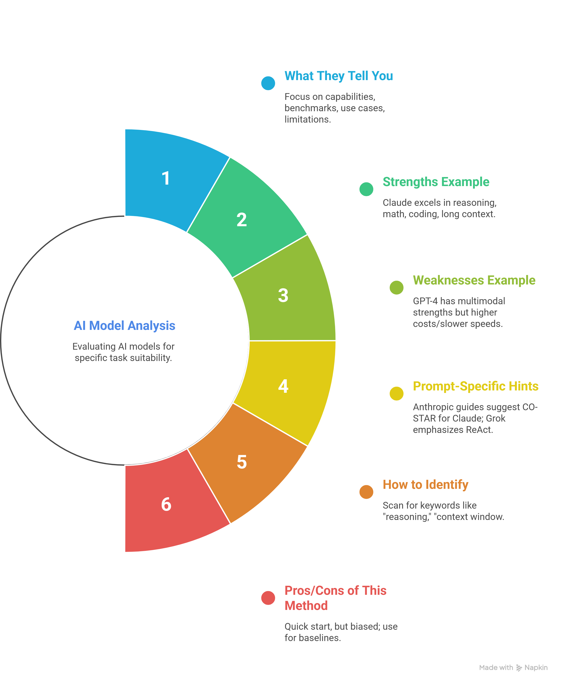
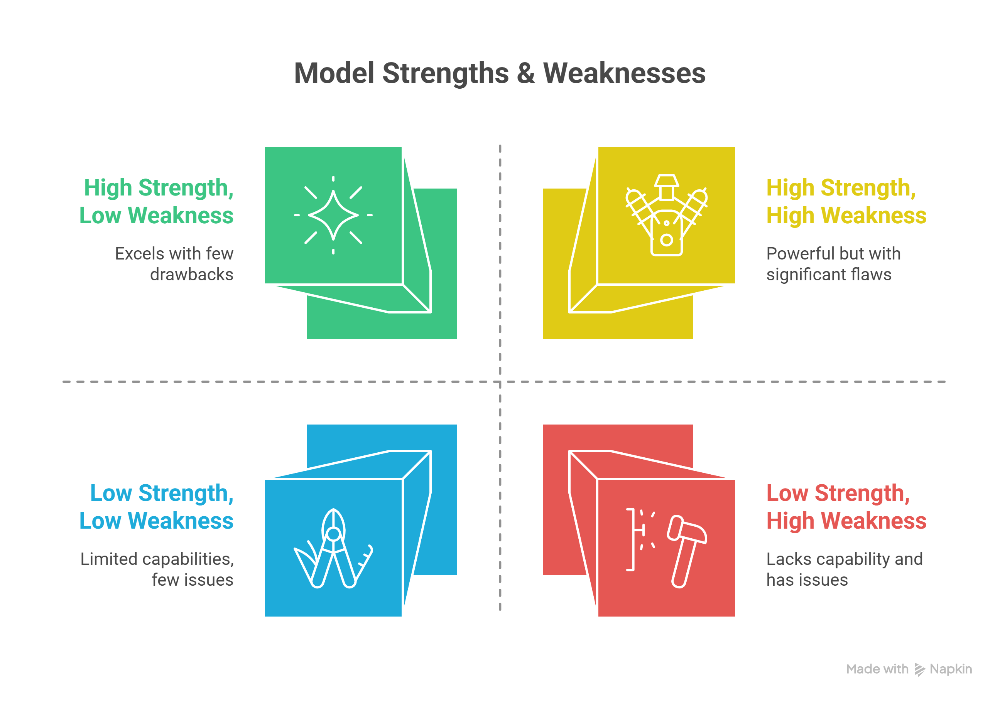
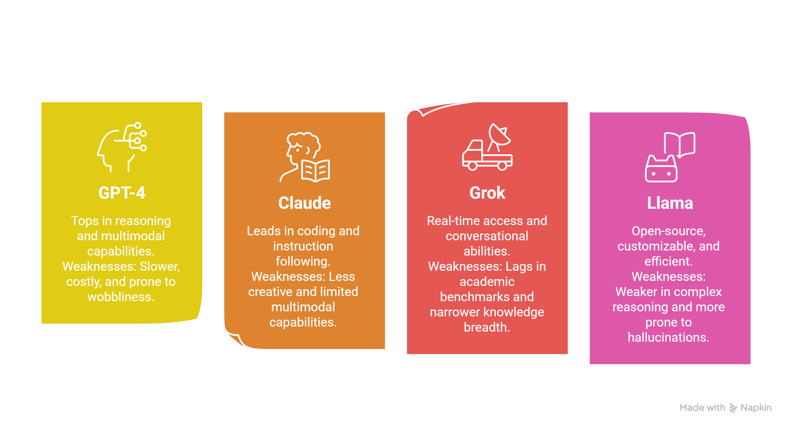
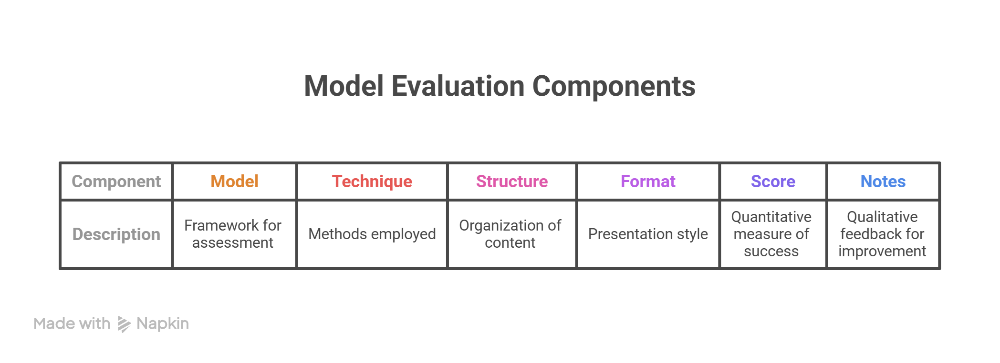
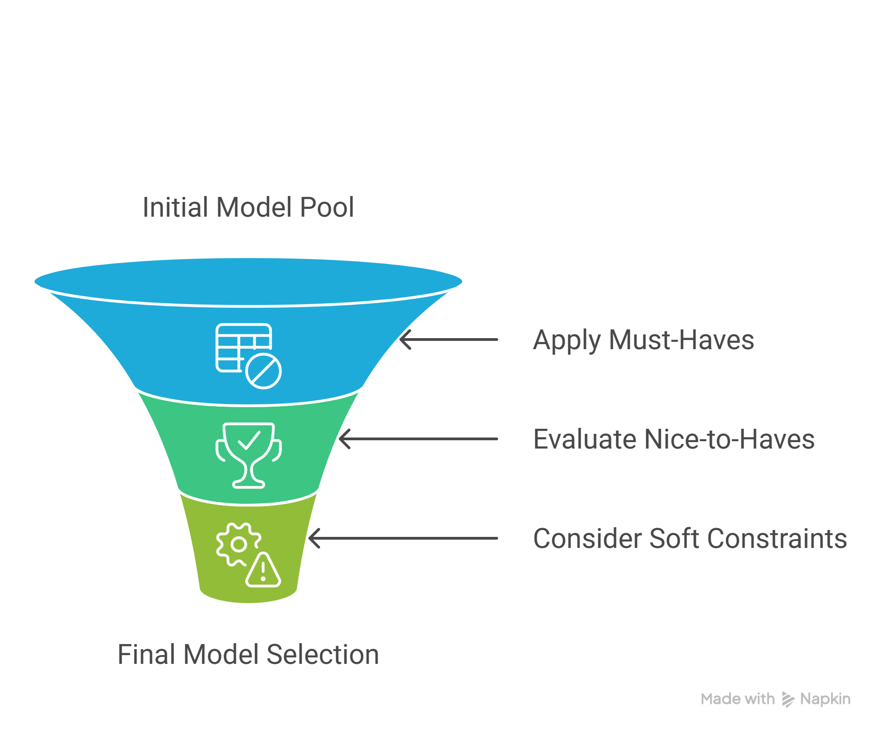
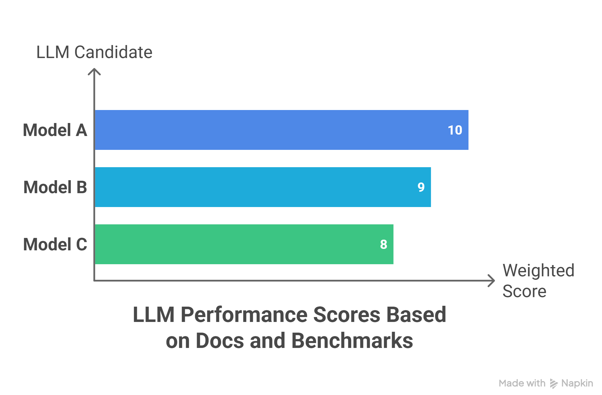

# Chapter 1: Learning about the Model’s Strengths and Weaknesses

**[← Back to Phase 3](../README.md)**  **[Continue to Chapter 2 →](../Chapter-2-Advanced-Prompting-Strategies/README.md)**

---

To master prompt engineering, dedicate 20–30% of your time to understanding each AI model’s **strengths (sweet spots)** and **weaknesses**. This knowledge helps you pick the right model and adapt your prompts accordingly.

---

### 1. Start with Official Docs and Model Cards

Begin here for quick, reliable basics from the creators.


     
* **Where to Find:** Check provider sites like OpenAI's Models page, Anthropic's Models Overview, Meta's Llama docs, or xAI's Grok page.

* **What to Look For:** Focus on "capabilities," "benchmarks," "use cases," and "limitations."

**Strengths Example:** Claude docs note "excels in advanced reasoning, math, coding" and "long context (up to 1M tokens in beta)" — great for Chain-of-Thought or Tree-of-Thought, and modular structures in complex tasks.

**Weaknesses Example:** GPT-4 docs mention "multimodal" strengths but note higher costs/slower speeds — weak for real-time tasks.

**Prompt-Specific Hints:** Grok's site emphasizes "real-time info" via tools, so ReAct techniques shine here. Claude works well with CO-STAR formats.

* **How to Identify:** Scan for keywords like "reasoning," "context window," "instruction following," and "hallucinations." Cross-reference with your tasks.

* **Pros/Cons:** Quick start, but biased (providers hype strengths). Use for baselines.

<br clear="left"/>

---

### 2. Explore Benchmarks and Comparisons

Get objective data from third-party sources.

* **Where:** Hugging Face Open LLM Leaderboard, LMSYS Chatbot Arena, arXiv papers, or comparison blogs (Ideas2IT, LeewayHertz, Medium).



* **What They Reveal:** Scores on tasks and how models compare.




**Prompt-Specific Insights:**
- GPT excels in heuristic/CoT prompts for extraction tasks
- Llama benefits from Few-Shot to reduce errors
- Claude's consistent outputs suit strict JSON formats

* **How to Identify:** Filter by your task (e.g., coding). Look for "prompt engineering" mentions.

* **Pros/Cons:** Objective data, but benchmarks may not perfectly match your specific use case (e.g., vibe-coding).

---

### 3. Do Hands-On Experiments (The Gold Standard)

Test yourself — this is the best way to learn real performance.

* **How:** Use OpenAI Playground, Anthropic Console, or Grok interface. Run the same prompt on different models.

**Example Test:** For a vibe-coding task ("Generate minimalist frontend code"), try CoT + Modular Structure + Markdown format on each model. Rate: Does it match the vibe? Any hallucinations? Speed? Token usage?

* **Identify Sweet Spots:**  
  - Claude consistently follows formats → strong for Constrained structures.  
  - Grok integrates real-time data → ideal for ReAct in automation.

* **Track Weaknesses:** Note failures — e.g., Llama might hallucinate in zero-shot but improves with more examples.

* **Tools:** LangChain, Promptfoo, or a simple spreadsheet.



* **Pros/Cons:** Reveals real traits (e.g., GPT-4’s multimodal for UI ideation), but time-intensive. Aim for 5–10 tests per model weekly.

---

### 4. Tap into Communities and Research

Learn from others’ experiences.

* **Where:** Reddit (r/PromptEngineering, r/MachineLearning), Discord servers, arXiv papers.

**Examples:** Users report Claude’s "adaptive thinking" boosts Step-Back techniques; Grok’s X-data training makes it weak for non-real-time historical tasks.

* **How to Identify:** Search "model X vs Y for technique Z" (e.g., "Claude vs GPT for ToT prompting"). Communities often share tuned prompt templates.

* **Pros/Cons:** Practical tips, but anecdotal — always validate with your own tests.

---

### 5. Keep Monitoring Updates

Models change fast, so stay current.

* **How:** Follow blogs or newsletters like The Batch. Re-test every few months.

**Example:** New versions (GPT-5 or Claude 4) might fix previous limits like short context.

* **Why:** Sweet spots evolve — e.g., Grok updates could boost coding performance.

---

### Tips for Optimizing Model Choice

- **Creative ideas?** → Use GPT-4 (strong multimodal)
- **Logic / debugging?** → Claude (excellent reasoning)
- **Automation / tools?** → Grok (proactive tool use)
- **Local / privacy?** → Llama (highly customizable)

**Avoid Pitfalls:** Never trust marketing hype alone — always test everything yourself.

**Why It Helps:** Reduces guesswork (e.g., step-by-step works better on Claude due to length handling) and dramatically improves complex plans.

---

**Excellent start to Phase 3!**  
You now know how to systematically evaluate models and choose the right one for your task.

---

## Demo: Scanning the Codex Prompting Guide (gpt-5.2-codex) Step-by-Step

Here’s exactly how I scan a real model doc as a prompt engineer specialising in vibe coding and SDLC tasks. I’ll walk you through the full process using the official guide:

**Link:** https://developers.openai.com/cookbook/examples/gpt-5/codex_prompting_guide

This guide is for **gpt-5.2-codex** — OpenAI’s latest agentic coding model (part of the GPT-5 family, tuned specifically for code).

---

### Step 1: Prepare (What I Did)

* Opened the exact URL.
* Focused on sections: Capabilities, Prompting, Techniques, Limitations, Best Practices, and Tables.
* Looked for bias: OpenAI highlights strengths heavily and softens weaknesses with words like “may”, “must be guided”, or “without compaction”.

---

### Step 2: Scan Keywords + Revealed vs Hidden Insights


| Keyword/Category       | What the Doc Says (Direct Quote/Excerpt)                          | Revealed (Explicit Pro/Con)                          | Hidden / Inferred (Read Between Lines) |
|------------------------|-------------------------------------------------------------------|------------------------------------------------------|----------------------------------------|
| Reasoning              | “medium” reasoning effort; “high/xhigh” for hard tasks; uses update_plan tool | Strong structured reasoning via a planning tool      | Excellent for CoT / ToT, but you must force planning steps, or it skips them |
| Context Window         | Supports long-running tasks with compaction (/responses/compact)  | Very good, effective context for hours-long tasks    | Raw context is limited → hidden risk of truncation in very long SDLC prompts |
| Instruction Following  | “Strict adherence to tool use”; “Bias to action”                  | Extremely strong at following complex rules          | Can be rigid — if you don’t give clear tool instructions, it may ignore your vibe/style requests |
| Hallucinations         | “May assume details if not blocked”; “Mitigated by tool use”      | Hallucinations exist, but are reduced by tools       | Still present in creative or underspecified vibe tasks |
| Code-Specific          | “Produces intentional, bold, and surprising UI designs”; “Avoid AI slop” | Best-in-class for frontend + agentic coding          | Great for vibe coding, but you must explicitly constrain to avoid over-design |


---

### Step 3: Cross-Reference to Your Tasks (Vibe Coding + SDLC)


| SDLC Phase / Vibe Task       | What the Model Excels At (from Doc)                  | Recommended Technique + Structure + Format                  | Potential Weakness to Watch For |
|------------------------------|------------------------------------------------------|-------------------------------------------------------------|---------------------------------|
| Ideation & Creativity        | Bold, intentional frontend designs                   | Persona + Directional Stimulus in CO-STAR with Markdown     | May over-design if not constrained |
| Planning                     | Uses the update_plan tool autonomously               | Plan-and-Solve + Hierarchical structure                     | Hates giving upfront plans — must let it act first |
| Development / Code Gen       | End-to-end feature implementation                    | ReAct + Modular structure + YAML for tools                  | Repetition loops if not monitored |
| Debugging & Fixing           | Root-cause fixes + tests                             | Reflexion + Feedback-Loop structure                         | May patch symptoms instead of the root |
| Documentation                | Succinct comments + clear file refs                  | Skeleton-of-Thought + Markdown format                       | Avoids over-commenting (good for clean vibe) |
| Frontend / Vibe Coding       | “Intentional, bold, surprising” UIs                  | Emotion + Contrastive in CO-STAR with fenced code blocks    | Purple/flat bias unless you forbid it |

---

### Quick Rule I Use:
**If the doc heavily emphasises a tool or workflow (like apply_patch, compaction, parallel calls), that’s a strong sweet spot.
If it says “may” or “must be guided”, that’s a hidden weakness to test immediately.**

---
### Step 4: How to Test Your First Draft Prompt Using These Insights

**Create a Baseline Prompt (using doc insights) like below: **

```markdown
You are gpt-5.2-codex acting as an autonomous senior engineer with a minimalist vibe.

Task: Add a dark-mode toggle to the login page with clean, elegant animations.

Rules from the Codex guide:
- Bias to action: implement, do not just plan.
- Use apply_patch for edits.
- Keep UI bold yet minimalist — no purple, no default fonts.
- Update plan after each major step.

```
---

**Run the Test**
* Send it in the Responses API or Codex environment.
* Watch for:
     * Does it use tools correctly? (Revealed strength)
     * Does it maintain “minimalist vibe”? (Test hidden creativity control)
     * Any repetition or assumption? (Hidden hallucination risk)
     * Context management? (If long task, check if compaction is needed)
* Score It (my personal quick rubric)
     * Vibe match: 1–10
     * Tool correctness: 1–10
     * Hallucination-free: 1–10
     * Token efficiency: note length
* Refine Based on Scan
  * If it over-designs → add stronger constraints (from “avoid AI slop”).
  * If it skips planning → explicitly allow update_plan early.
  * If context blows up → add compaction instruction.

---

### Final Takeaways from This Demo Scan
* **Biggest Sweet Spot**: Agentic, long-running, tool-heavy coding with beautiful frontend output. Perfect for vibe coding in development/debugging/frontend phases.
* **Biggest Hidden Weakness**: Needs very disciplined prompting (no vague requests) and active context management (compaction).
* **Best For You**: Use this model when you want full autonomy + strong vibe control in code. Pair with ReAct + Modular structure + Markdown/YAML formats.

This is exactly how I scan every new model doc in under 10 minutes. Now you can do the same with any other guide (Claude, Grok, Llama, etc.).

---

## How to Set Selection Criteria and Do Pre-Experiment Comparisons

As a prompt engineer or vibe coder, choosing the right AI model for tasks such as the software development life cycle (SDLC) or creative coding saves time and money. In 2026, with many options like GPT-5.2 or Claude 4, docs and benchmarks often hype strengths while downplaying weaknesses. A quick pre-filter helps eliminate poor fits before full testing.

### Why This Approach Matters



Docs shout positives (e.g., "top reasoning") but whisper issues (e.g., "needs guidance"). Pre-filtering avoids testing unfit models, like a short-context one for detailed planning. It's triage — not the final choice. Real tests reveal how well a model maintains styles like "minimalist futuristic." Balance docs with testing.

<br clear="right"/>

---

### Setting Selection Criteria for Your Task

Define 8–10 criteria in three layers before reviewing models. Use a one-page note or spreadsheet to stay unbiased.

| Layer                  | What to Define                                      | Examples for Vibe Coding / SDLC Task                          | Why It Matters (Rational) |
|------------------------|-----------------------------------------------------|---------------------------------------------------------------|---------------------------|
| **Must-Haves** (Deal-breakers) | Non-negotiable specs — fail here, and drop the model. | Context window ≥ 128K<br>Strong tool use / agentic (ReAct)<br>Cost ≤ $2 per 1M input tokens<br>Code quality benchmark ≥ 85% on LiveCodeBench | If it fails here, delete the model from consideration immediately. Saves 90% of wasted effort. |
| **Strong Nice-to-Haves** (Weighted 60%) | What gives big wins for your vibe                   | Creative consistency (maintains “minimalist elegant” vibe)<br>Frontend/UI strength (bold yet clean designs)<br>Low hallucination in code + docs<br>Fast inference (<2s for 2K tokens) | These directly impact your daily output quality and “vibe” feel. |
| **Soft Constraints** (Weighted 20%) | Practical extras to avoid future hassles            | Privacy (local or enterprise option)<br>Multimodal support (for wireframing)<br>Ease of integration with your IDE | These prevent later regret (e.g., switching models mid-project). |

---

### Doing a Pre-Experiment Comparison (15–25 Minutes)

Use a simple weighted scorecard based purely on their official docs + public benchmarks (LiveCodeBench, Terminal-Bench, SciCode, LMSYS, etc.). No testing yet.



1. List your 2–4 candidate models (from quick knowledge or one web search: “best LLMs for coding 2026”).
2. For each criterion, score 1–10 based on what the docs + benchmarks actually say (not hype).
3. Multiply by weight, add up.
4. Rank them and select the top 2–3 for real tests.

**Example Scorecard for “Vibe Coding Full Feature Implementation” (Frontend + Backend with minimalist, elegant vibe)**

| Criterion (Weight)                  | GPT-5.2 Codex | Claude 4 Sonnet | Grok-4 | DeepSeek-V3.2 Coder | Notes from Docs/Benchmarks |
|-------------------------------------|---------------|-----------------|--------|---------------------|----------------------------|
| Context window ≥128K (Must)         | 10            | 10              | 9      | 9                   | All pass except older models |
| Agentic/Tool use (Must)             | 10            | 8               | 10     | 9                   | GPT & Grok emphasize tools heavily |
| Creative vibe consistency (60%)     | 9             | 7               | 9      | 6                   | GPT/Claude docs highlight “intentional bold designs” |
| Code quality (LiveCodeBench) (60%)  | 10 (89%)      | 9 (87%)         | 8      | 10 (91%)            | Latest public benchmarks |
| Low hallucination in code (40%)     | 8             | 9               | 7      | 8                   | Claude docs strongest on “refuse unsafe / assume less” |
| Speed & Cost (40%)                  | 7             | 9               | 8      | 10                  | DeepSeek cheapest/fastest |
| **Total Weighted Score**            | **8.7**       | **8.4**         | **8.5**| **8.8**             | — |

**Decision from scorecard:**
- Top 2–3 only go to quick testing (DeepSeek first for cost, then GPT-5.2 Codex for vibe strength).
- Drop anyone below 7.0 immediately.

---

### Final Advice

- Do this for non-simple tasks — it takes under 30 minutes and cuts blind testing.
- Follow with real tests on top picks using one identical prompt.
- Skip for tiny tasks; repeat quarterly for high-stakes ones as models update.

**Pro Tip:** Always test everything yourself. Docs and benchmarks are starting points, not the final truth.

---

**[← Back to Phase 3 Top](#phase-3-mastery--experimentation)**  **[Continue to Next Section →](#next-topic-in-phase-3)**

*Phase 3 of "All You Need to Know About Prompt Engineering" — Portfolio Project by Mirza (BS AI)*


