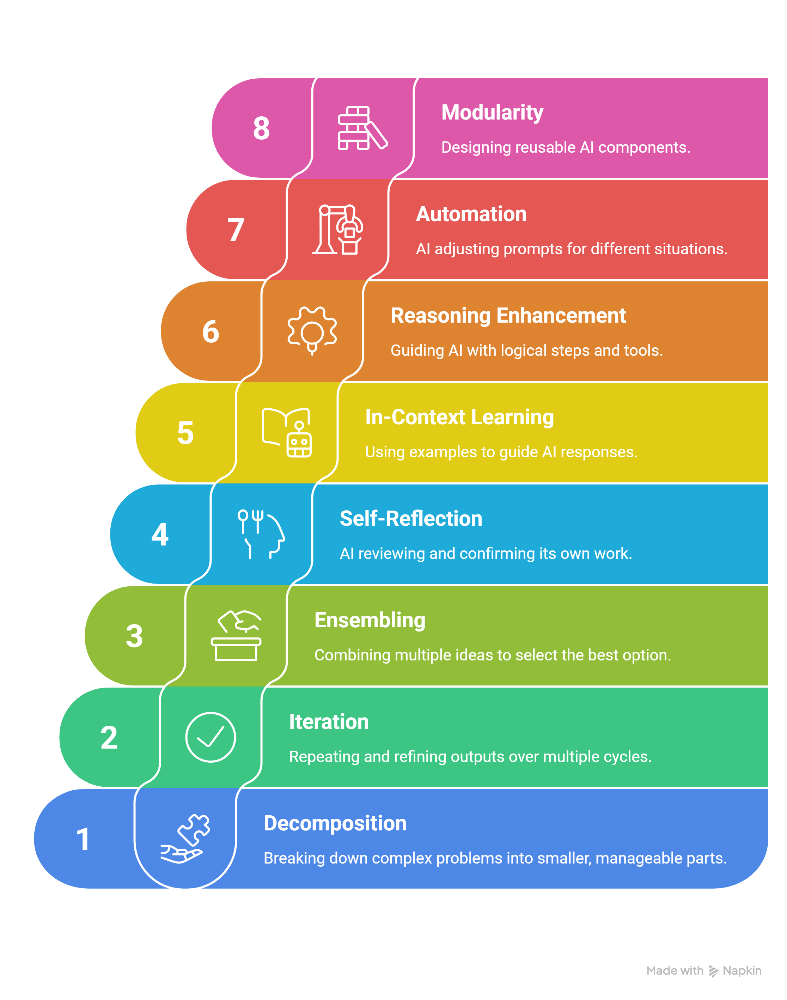
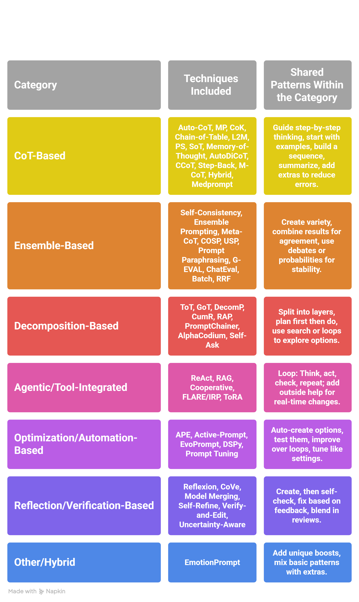
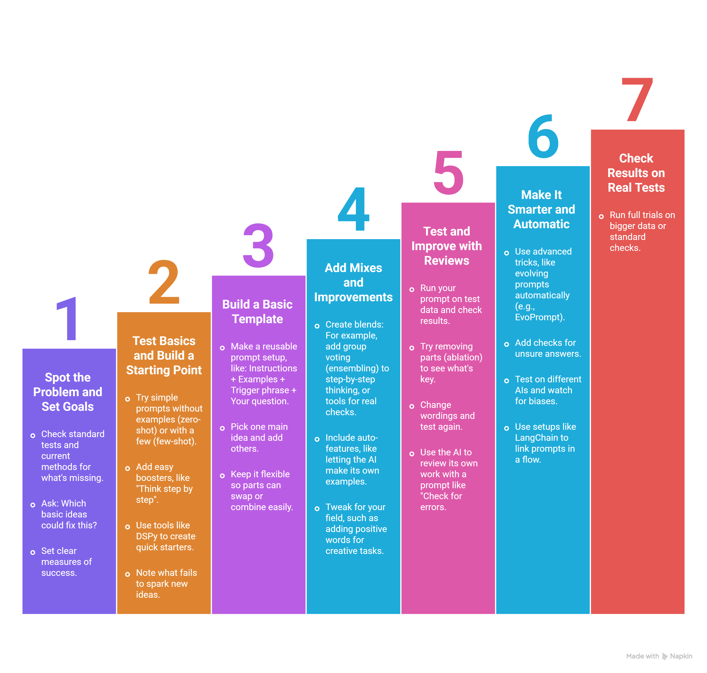

# Chapter 2: Advanced Prompting Strategies

---

## 📋 Table of Contents

### Core Advanced Strategies
- [1. Tree of Thoughts (ToT)](#1-tree-of-thoughts-tot)
- [2. ReAct (Reasoning and Acting)](#2-react-reasoning-and-acting)
- [3. Self-Consistency](#3-self-consistency)
- [4. Automatic Prompt Engineer (APE)](#4-automatic-prompt-engineer-ape)
- [5. Reflexion](#5-reflexion)
- [6. Graph of Thoughts (GoT)](#6-graph-of-thoughts-got)
- [7. Auto-CoT (Automatic Chain-of-Thought)](#7-auto-cot-automatic-chain-of-thought)
- [8. Chain-of-Verification (CoVe)](#8-chain-of-verification-cove)
- [9. Retrieval-Augmented Generation (RAG)](#9-retrieval-augmented-generation-rag)
- [10. Active-Prompt](#10-active-prompt)

### Extended Composite Techniques
- [11. Metacognitive Prompting (MP)](#11-metacognitive-prompting-mp)
- [12. Chain-of-Knowledge (CoK)](#12-chain-of-knowledge-cok)
- [13. Decomposed Prompting (DecomP)](#13-decomposed-prompting-decomp)
- [14. Chain-of-Table](#14-chain-of-table)
- [15. Ensemble Prompting](#15-ensemble-prompting-via-self-consistency-or-multi-prompt)
- [16. Model Merging](#16-model-merging-collaborative-strategy)
- [17. Cooperative Prompting](#17-cooperative-prompting-multi-agent-or-federated)
- [18. Cumulative Reasoning (CumR)](#18-cumulative-reasoning-cumr)
- [19. Least-to-Most Prompting (L2M)](#19-least-to-most-prompting-l2m)
- [20. Plan-and-Solve Prompting (PS)](#20-plan-and-solve-prompting-ps)

### Advanced & Production Techniques
- [21. Self-Refine](#21-self-refine)
- [22. Skeleton-of-Thought (SoT)](#22-skeleton-of-thought-sot)
- [23. Reasoning via Planning (RAP)](#23-reasoning-via-planning-rap)
- [24. Evolutionary Prompting (EvoPrompt)](#24-evolutionary-prompting-evoprompt)
- [25. PromptChainer](#25-promptchainer)
- [26. AlphaCodium](#26-alphacodium)
- [27. DSPy (Declarative Self-Improving Prompts)](#27-dspy-declarative-self-improving-prompts)
- [28. Memory-of-Thought](#28-memory-of-thought)
- [29. Meta-Reasoning over Multiple CoTs (Meta-CoT)](#29-meta-reasoning-over-multiple-cots-meta-cot)
- [30. Consistency-based Self-adaptive Prompting (COSP) and USP](#30-consistency-based-self-adaptive-prompting-cosp-and-universal-self-adaptive-prompting-usp)

### Specialized & Emerging Techniques
- [31. Prompt Paraphrasing with Ensembling](#31-prompt-paraphrasing-with-ensembling)
- [32. Iterative Retrieval Augmentation (FLARE/IRP)](#32-iterative-retrieval-augmentation-eg-flare-iterative-retrieval-prompting-irp)
- [33. Tool-Integrated Reasoning Agent (ToRA)](#33-tool-integrated-reasoning-agent-tora)
- [34. Verify-and-Edit](#34-verify-and-edit)
- [35. Automatic Directed CoT (AutoDiCoT)](#35-automatic-directed-cot-autodicot)
- [36. G-EVAL with AutoCoT](#36-g-eval-with-autocot)
- [37. ChatEval](#37-chateval)
- [38. Self-Ask](#38-self-ask)
- [39. Step-Back Prompting](#39-step-back-prompting)
- [40. EmotionPrompt](#40-emotionprompt)
- [41. Batch Prompting](#41-batch-prompting)
- [42. Contrastive Chain-of-Thought (CCoT)](#42-contrastive-chain-of-thought-ccot)
- [43. Multimodal CoT (M-CoT)](#43-multimodal-cot-m-cot)
- [44. Reciprocal Rank Fusion (RRF) in Prompting](#44-reciprocal-rank-fusion-rrf-in-prompting)
- [45. Prompt Tuning with Soft Prompts](#45-prompt-tuning-with-soft-prompts)
- [46. Hybrid Prompting (Code-as-Prompt)](#46-hybrid-prompting-eg-code-as-prompt)
- [47. Uncertainty-Aware Prompting](#47-uncertainty-aware-prompting)
- [48. Medprompt](#48-medprompt)

  ### Common Patterns & Creation Guide
- [Common Patterns in Prompting Strategies](#common-patterns-in-prompting-strategies)
- [Patterns Followed Individually in Each Strategy](#patterns-followed-individually-in-each-strategy)
- [Patterns Followed Within the Same Category](#patterns-followed-within-the-same-category)
- [Step-by-Step Guide to Creating Your Own Prompting Strategies](#step-by-step-guide-to-creating-your-own-prompting-strategies)

**[← Back to Chapter 1](../Chapter-1-Learning-Model-Strengths-Weaknesses/README.md)**  **[Back to Phase 3](../README.md)**  **[Next → Phase 4](../../04_Phase-4-Prompt-Engineering-in-Developer-Mode/README.md)**

---

## Advanced Prompting Strategies

Based on recent advancements in prompt engineering, here are several **composite or integrated methods** that combine multiple strategies (e.g., few-shot learning, chain-of-thought, ensembling, self-reflection, or tool integration) to achieve top-tier performance with generalist LLMs like GPT-4.

These techniques are particularly valuable for prompt engineers aiming to optimize outputs **without fine-tuning**, often outperforming specialized models.

**Useful Resource:**  
[Awesome-Prompt-Engineering Repository](https://github.com/promptslab/Awesome-Prompt-Engineering)

---

## Core Advanced Strategies

### 1. Tree of Thoughts (ToT)

This method extends Chain-of-Thought by modeling reasoning as a tree structure, where the LLM generates multiple potential "thoughts" (intermediate steps) at each node, evaluates them (e.g., via self-assessment or voting), and prunes less promising paths to explore diverse solutions efficiently. It combines CoT with search algorithms like BFS/DFS and self-evaluation for better handling of planning, creative, or multi-step problems, often improving accuracy by 10-20% over standard CoT.

- **Study:** [arXiv:2305.10601](https://arxiv.org/abs/2305.10601)
- **Implementation:** [Princeton NLP Tree-of-Thought](https://github.com/princeton-nlp/tree-of-thought-llm)

### 2. ReAct (Reasoning and Acting)

ReAct integrates reasoning traces (CoT-style) with action execution, allowing the LLM to alternate between thinking steps and interacting with external tools (e.g., APIs, calculators, or knowledge bases) in a loop. This composite approach enhances performance on tasks requiring real-world interaction or verification, like question-answering or agent-based systems, by reducing hallucinations and enabling dynamic adaptation.

- **Study:** [arXiv:2210.03629](https://arxiv.org/abs/2210.03629)
- **Implementation:** [Hugging Face ReAct Guide](https://huggingface.co/blog/react)

### 3. Self-Consistency

Building on CoT, this technique generates multiple diverse reasoning paths (via varied prompts or temperature sampling) for the same problem, then applies majority voting or ensembling to select the most consistent answer. It combines few-shot examples with probabilistic sampling to boost reliability, especially in arithmetic or logical tasks, achieving up to 15% gains over single-pass CoT.

- **Study:** [arXiv:2203.11171](https://arxiv.org/abs/2203.11171)
- **Guide:** [PromptingGuide.ai - Self-Consistency](https://www.promptingguide.ai/techniques/consistency)

### 4. Automatic Prompt Engineer (APE)

APE uses one LLM to automatically generate, evaluate, and refine prompts for another LLM, combining instruction generation, few-shot selection, and scoring (e.g., via perplexity or task-specific metrics). This meta-approach discovers optimal composite prompts without manual iteration, ideal for zero-shot tasks, and has shown superior performance in instruction induction benchmarks.

- **Study:** [arXiv:2211.01910](https://arxiv.org/abs/2211.01910)
- **Implementation:** [Automatic Prompt Engineer](https://github.com/keirp/automatic_prompt_engineer)

### 5. Reflexion

This method layers self-reflection on top of CoT or ReAct by having the LLM critique its own outputs (e.g., identifying errors or inconsistencies) and refine them in subsequent iterations. It combines verbal reinforcement (rewards for correct reasoning) with memory of past trials, making it effective for sequential decision-making or debugging, with reported 20-30% improvements in programming and knowledge-intensive tasks.

- **Study:** [arXiv:2303.11366](https://arxiv.org/abs/2303.11366)
- **Guide:** [PromptingGuide.ai - Reflexion](https://www.promptingguide.ai/techniques/reflexion)

### 6. Graph of Thoughts (GoT)

GoT represents reasoning as a graph, where nodes are individual thoughts or units of information, and edges connect them via operations like aggregation, refinement, or scoring. It combines CoT with graph-based ensembling and transformation (e.g., merging similar ideas), allowing for non-linear exploration and outperforming ToT in tasks like sorting or set operations by efficiently handling complexity.

- **Study:** [arXiv:2308.09687](https://arxiv.org/abs/2308.09687)
- **Implementation:** [Graph of Thoughts](https://github.com/spcl/graph-of-thoughts)

### 7. Auto-CoT (Automatic Chain-of-Thought)

Similar to Medprompt's self-generated CoT, Auto-CoT automatically constructs diverse CoT demonstrations from a small set of examples using clustering and sampling, then chains them for inference. This avoids manual CoT design errors and combines zero-shot with diversity ensembling, yielding better reasoning performance across math and commonsense benchmarks.

- **Study:** [arXiv:2210.03493](https://arxiv.org/abs/2210.03493)

### 8. Chain-of-Verification (CoVe)

This method combines chain-of-thought (CoT) reasoning with self-verification loops to reduce hallucinations. It generates a baseline response, creates targeted verification questions (e.g., fact-checks), answers them independently, and revises the output for coherence. Composite aspects: CoT + query decomposition + error correction. Excels in researching (factual QA) and evaluation (hallucination mitigation), with up to 10% accuracy gains over standard CoT in multi-hop tasks.

- **Study:** [arXiv:2309.11495](https://arxiv.org/abs/2309.11495)
- **Guide:** [PromptingGuide.ai - CoVe](https://www.promptingguide.ai/techniques/cove)

### 9. Retrieval-Augmented Generation (RAG)

RAG integrates external knowledge retrieval with generative prompting, fetching relevant documents or snippets to augment the input before reasoning. Composite aspects: Few-shot/zero-shot + vector search + CoT-style synthesis. Ideal for scaling ideation to production (e.g., dynamic knowledge integration) and researching (grounded responses), often improving factual accuracy by 15-20% in knowledge-intensive domains.

- **Study:** [arXiv:2005.11401](https://arxiv.org/abs/2005.11401)
- **Implementation:** [Hugging Face RAG](https://huggingface.co/docs/transformers/model_doc/rag)

### 10. Active-Prompt

This technique uses active learning to select uncertain examples from a dataset, annotates them with CoT rationales (human or auto-generated), and incorporates them as dynamic few-shot demonstrations. Composite aspects: Uncertainty scoring + CoT annotation + few-shot adaptation. Valuable for evaluation (optimizing prompts iteratively) and ideation (refining creative outputs), outperforming standard CoT by 5-10% in reasoning benchmarks.

- **Study:** [arXiv:2302.12246](https://arxiv.org/abs/2302.12246)
- **Guide:** [PromptingGuide.ai - Active-Prompt](https://www.promptingguide.ai/techniques/active_prompt)

---

## Extended Composite Techniques

### 11. Metacognitive Prompting (MP)

MP layers self-reflection stages on CoT: understanding the input, preliminary judgment, critical evaluation, final decision, and confidence scoring. Composite aspects: CoT + multi-stage reflection + uncertainty assessment. Supports ideation (structured brainstorming) and evaluation (self-correction), with consistent gains (up to 8%) over CoT in tasks like natural language inference and relation extraction.

- **Study:** [arXiv:2308.05342](https://arxiv.org/abs/2308.05342)
- **Implementation:** [Microsoft Metacognitive Prompting](https://github.com/microsoft/metacognitive-prompting)

### 12. Chain-of-Knowledge (CoK)

CoK decomposes tasks into knowledge-gathering steps, dynamically adapts evidence (internal or retrieved), and consolidates via reasoning chains. Composite aspects: CoT + knowledge adaptation + consensus-building. Effective for researching (evidence synthesis) and scaling (progressive correction), yielding 3-5% improvements over CoT in QA and truthfulness tasks.

- **Study:** [arXiv:2305.13269](https://arxiv.org/abs/2305.13269)
- **Guide:** [arXiv:2402.07927](https://arxiv.org/html/2402.07927v1)

### 13. Decomposed Prompting (DecomP)

This breaks complex problems into sub-tasks, assigns specialized sub-prompts (e.g., few-shot per sub-task), and aggregates results hierarchically. Composite aspects: Task decomposition + prompt specialization + CoT aggregation. Great for ideation to scaling (modular workflows) and evaluation (sub-task verification), with 20-25% gains in commonsense and multi-hop reasoning.

- **Study:** [arXiv:2210.02406](https://arxiv.org/abs/2210.02406)
- **Implementation:** [AllenAI DecomP](https://github.com/allenai/DecomP)

### 14. Chain-of-Table

Chain-of-Table prompts iterative table operations (e.g., sorting, filtering) as reasoning steps, transforming tabular data before final answering. Composite aspects: CoT + programmatic operations (like SQL) + visualization aids. Suited for researching (data analysis) and evaluation (table-based QA), achieving SOTA (3% better) on tabular tasks.

- **Study:** [arXiv:2401.04398](https://arxiv.org/abs/2401.04398)
- **Guide:** [PromptingGuide.ai - Chain-of-Table](https://www.promptingguide.ai/techniques/chain_of_table)

### 15. Ensemble Prompting (via Self-Consistency or Multi-Prompt)

This generates multiple reasoning paths or prompt variations (e.g., via temperature sampling), then ensembles via voting or fusion. Composite aspects: CoT + diversity sampling + majority/consistency aggregation. Enhances evaluation (robustness) and ideation (diverse outputs), with 10-15% gains in mathematical and logical domains.

- **Study:** [arXiv:2203.11171](https://arxiv.org/abs/2203.11171)
- **Guide:** [PromptingGuide.ai - Self-Consistency](https://www.promptingguide.ai/techniques/consistency)

### 16. Model Merging (Collaborative Strategy)

Merging fuses parameters from multiple fine-tuned LLMs (e.g., weight averaging or task vectors) into one model for unified performance. Composite aspects: Parameter integration + conflict resolution (e.g., via Fisher weighting). Useful for scaling (multi-task models) and ideation (blending capabilities), often rivaling larger models in reasoning without extra compute.

- **Study:** [arXiv:2407.06089](https://arxiv.org/abs/2407.06089)
- **Implementation:** [Model Soups](https://github.com/mlfoundations/model-soups)

### 17. Cooperative Prompting (Multi-Agent or Federated)

This orchestrates multiple LLMs as agents (e.g., one for drafting, another for verification) or in federated setups for privacy-preserving collaboration. Composite aspects: Role assignment + interaction loops + knowledge transfer. Ideal for researching (distributed knowledge) and evaluation (peer review), reducing errors by 10-20% in multi-step tasks.

- **Study:** [arXiv:2407.06089](https://arxiv.org/abs/2407.06089)
- **Guide:** [LangChain Multi-Agent](https://python.langchain.com/docs/modules/agents/agent_types/multi_agent)

### 18. Cumulative Reasoning (CumR)

This method builds knowledge incrementally by generating intermediate facts or hypotheses, verifying them against prior outputs or external tools, and accumulating reliable insights before final synthesis. Composite aspects: CoT + iterative verification + knowledge distillation. Valuable for researching (evidence building) and scaling (long-context tasks), with improvements in factual consistency up to 12% in multi-turn QA.

- **Study:** [arXiv:2304.00733](https://arxiv.org/abs/2304.00733)
- **Guide:** [PromptingGuide.ai - Cumulative Reasoning](https://www.promptingguide.ai/techniques/cumulative_reasoning)

### 19. Least-to-Most Prompting (L2M)

L2M decomposes complex queries into simpler sub-problems, solves them sequentially from least to most difficult, and uses prior solutions as context for later ones. Composite aspects: Task decomposition + progressive CoT + few-shot chaining. Ideal for ideation (stepwise creativity) and evaluation (error isolation), outperforming standard CoT by 15-20% in generalization-heavy tasks like math word problems.

- **Study:** [arXiv:2205.10625](https://arxiv.org/abs/2205.10625)
- **Implementation:** [Microsoft PromptBase - Least-to-Most](https://github.com/microsoft/promptbase/tree/main/prompts/least_to_most)

### 20. Plan-and-Solve Prompting (PS)

PS explicitly separates planning (outlining steps) from execution (detailed reasoning), often with zero-shot or few-shot guidance to refine the plan iteratively. Composite aspects: CoT + meta-planning + self-correction. Supports scaling from ideation (high-level outlines) to evaluation (plan validation), achieving 10% gains over CoT in commonsense and algorithmic reasoning.

- **Study:** [arXiv:2305.04091](https://arxiv.org/abs/2305.04091)
- **Guide:** [PromptingGuide.ai - Plan-and-Solve](https://www.promptingguide.ai/techniques/plan_and_solve)

---

## Advanced & Production Techniques

### 21. Self-Refine

Self-Refine generates an initial output, then uses the LLM to provide feedback (e.g., strengths/weaknesses) and iteratively refine it in a loop until convergence. Composite aspects: CoT + self-critique + iterative generation. Excellent for evaluation (quality improvement) and ideation (polishing ideas), with 5-15% better coherence in creative and analytical tasks.

- **Study:** [arXiv:2303.17651](https://arxiv.org/abs/2303.17651)
- **Implementation:** [Self-Refine](https://github.com/madaan/self-refine)

### 22. Skeleton-of-Thought (SoT)

SoT prompts the LLM to first generate a high-level skeleton (outline of key points or branches), then expands each in parallel or sequentially with detailed reasoning. Composite aspects: CoT + parallel expansion + aggregation. Enhances ideation (structured brainstorming) and scaling (efficient long responses), reducing latency while maintaining quality in summarization and generation.

- **Study:** [arXiv:2307.15337](https://arxiv.org/abs/2307.15337)
- **Guide:** [PromptingGuide.ai - SoT](https://www.promptingguide.ai/techniques/sot)

### 23. Reasoning via Planning (RAP)

RAP integrates LLM reasoning with planning algorithms like Monte Carlo Tree Search (MCTS), where the model proposes actions, simulates outcomes, and backpropagates values for optimal paths. Composite aspects: CoT + search-based planning + value estimation. Powerful for researching (exploratory analysis) and evaluation (optimal decision-making), outperforming ToT in game-like or strategic tasks.

- **Study:** [arXiv:2305.14992](https://arxiv.org/abs/2305.14992)
- **Implementation:** [Reasoning via Planning](https://github.com/reasoningvia-planning/rap)

### 24. Evolutionary Prompting (EvoPrompt)

EvoPrompt applies evolutionary algorithms to mutate and select optimal prompts from a population, evaluating fitness via task performance. Composite aspects: Prompt generation + mutation/crossover + selection ensembling. Useful for vibe coding in ideation (prompt optimization) and scaling (automated adaptation), often finding prompts that boost zero-shot accuracy by 10-20%.

- **Study:** [arXiv:2309.08532](https://arxiv.org/abs/2309.08532)
- **Guide:** [arXiv:2307.12891](https://arxiv.org/abs/2307.12891)

### 25. PromptChainer

PromptChainer is a visual framework for composing prompt chains, where outputs from one prompt feed into the next, with branching and tool integration. Composite aspects: CoT chaining + visual workflow + conditional logic. Ideal for scaling complex pipelines from researching to evaluation, enabling modular vibe coding without code.

- **Study:** [arXiv:2203.06566](https://arxiv.org/abs/2203.06566)
- **Implementation:** [PromptChainer](https://github.com/SriKris/PromptChainer)

### 26. AlphaCodium

Originally for code generation, AlphaCodium flows through problem clarification, planning, code sketching, testing, and refinement. Composite aspects: CoT + self-debugging + test-case generation. Adaptable for ideation (prototype building) and evaluation (validation loops), achieving SOTA in coding benchmarks and transferable to non-code domains.

- **Study:** [arXiv:2401.08500](https://arxiv.org/abs/2401.08500)
- **Implementation:** [AlphaCodium](https://github.com/CodiumAI/AlphaCodium)

### 27. DSPy (Declarative Self-Improving Prompts)

DSPy treats prompts as programs, compiling them with optimizers that tune few-shots, instructions, and chains via metrics-driven search. Composite aspects: Prompt compilation + metric optimization + module composition. Core for vibe coding across all domains, automating improvements to rival fine-tuning in tasks like retrieval and classification.

- **Study:** [arXiv:2310.03714](https://arxiv.org/abs/2310.03714)
- **Implementation:** [DSPy](https://github.com/stanfordnlp/dspy)

### 28. Memory-of-Thought

This method combines in-context learning (ICL) with chain-of-thought (CoT) by using unlabeled data to dynamically generate and retrieve CoT prompts at inference time, building a memory bank of reasoning paths. Composite aspects: Retrieval + CoT + few-shot adaptation. Ideal for production software where factual consistency is key, as it reduces hallucinations in iterative tasks like API design or error tracing.

- **Study:** [arXiv:2305.17812](https://arxiv.org/abs/2305.17812)
- **Guide:** [arXiv:2406.06608](https://arxiv.org/abs/2406.06608)

### 29. Meta-Reasoning over Multiple CoTs (Meta-CoT)

Meta-CoT generates multiple CoT paths, then applies a meta-layer to evaluate and select the best chain before final output. Composite aspects: Ensembling + CoT + self-evaluation. Valuable for vibe coding in complex software, enabling robust decision-making in multi-step processes like algorithm optimization or system architecture planning.

- **Study:** [arXiv:2305.14901](https://arxiv.org/abs/2305.14901)
- **Implementation:** [Amazon Science Meta-CoT](https://github.com/amazon-science/meta-cot)

### 30. Consistency-based Self-adaptive Prompting (COSP) and Universal Self-Adaptive Prompting (USP)

COSP ensembles zero-shot CoT on examples and selects high-consistency subsets for few-shot prompts; USP extends this with unlabeled data and advanced scoring. Composite aspects: Self-consistency + adaptive ICL + ensembling. Suited for scaling software production, improving generalization in tasks like code review or deployment automation without manual tuning.

- **Study:** [arXiv:2303.07696](https://arxiv.org/abs/2303.07696)
- **Guide:** [PromptingGuide.ai - COSP](https://www.promptingguide.ai/techniques/cosp)

---

## Specialized & Emerging Techniques

### 31. Prompt Paraphrasing with Ensembling

This transforms the base prompt into multiple paraphrased versions (via data augmentation), runs them in parallel, and ensembles outputs. Composite aspects: Prompt diversification + voting/aggregation. Enhances reliability in production-grade apps, mitigating prompt sensitivity in creative coding or ideation for software features.

- **Study:** [arXiv:2305.16326](https://arxiv.org/abs/2305.16326)
- **Guide:** [arXiv:2407.12994](https://arxiv.org/abs/2407.12994)

### 32. Iterative Retrieval Augmentation (e.g., FLARE, Iterative Retrieval Prompting - IRP)

FLARE generates temporary sentences, retrieves relevant info iteratively, and injects it into ongoing generation; IRP loops retrieval mid-prompt. Composite aspects: RAG + generation loops + CoT. Powerful for software development, enabling dynamic knowledge integration in long-form tasks like documentation or bug-fixing agents.

- **Study:** [arXiv:2305.06983](https://arxiv.org/abs/2305.06983)
- **Implementation:** [FLARE](https://github.com/jasonphang/flare)

### 33. Tool-Integrated Reasoning Agent (ToRA)

ToRA interleaves CoT reasoning with code generation and tool execution (e.g., interpreters or APIs), verifying outputs in loops. Composite aspects: ReAct-style acting + CoT + tool calls. Core for production software, achieving SOTA in programming benchmarks by simulating real-world execution environments.

- **Study:** [arXiv:2309.17452](https://arxiv.org/abs/2309.17452)
- **Implementation:** [ToRA](https://github.com/microsoft/ToRA)

### 34. Verify-and-Edit

This ensembles multiple CoT paths, retrieves external verification, and edits the selected path for accuracy. Composite aspects: Ensembling + RAG + self-editing. Useful for vibe coding in secure software, ensuring factual edits in code synthesis or compliance checking.

- **Study:** [arXiv:2310.12350](https://arxiv.org/abs/2310.12350)
- **Guide:** [arXiv:2406.06608](https://arxiv.org/abs/2406.06608)

### 35. Automatic Directed CoT (AutoDiCoT)

AutoDiCoT automatically generates CoT chains, including contrastive examples of incorrect reasoning to guide the model. Composite aspects: Auto-CoT + contrastive learning + decomposition. Effective for high-stakes software like mental health or risk detection apps, optimizing precision in classification tasks.

- **Study:** [arXiv:2402.05457](https://arxiv.org/abs/2402.05457)
- **Guide:** [PromptingGuide.ai - AutoDiCoT](https://www.promptingguide.ai/techniques/autodicot)

### 36. G-EVAL with AutoCoT

G-EVAL prompts the LLM for evaluation using auto-generated CoT steps, weighted by token probabilities. Composite aspects: Auto-CoT + probabilistic scoring + multi-criteria assessment. Ideal for evaluating production LLMs in software pipelines, providing calibrated quality metrics for outputs like generated code.

- **Study:** [arXiv:2303.17012](https://arxiv.org/abs/2303.17012)
- **Implementation:** [G-EVAL](https://github.com/nlpyai/GEval)

### 37. ChatEval

This uses multi-agent prompting where LLMs debate as roles (e.g., judge, advocate) to evaluate outputs. Composite aspects: Cooperative prompting + debate loops + aggregation. Supports software scaling by enabling peer-review-like assessment in agent systems for code or design validation.

- **Study:** [arXiv:2308.08747](https://arxiv.org/abs/2308.08747)
- **Guide:** [arXiv:2407.12994](https://arxiv.org/abs/2407.12994)

### 38. Self-Ask

Combines CoT with self-generated follow-up questions, searching or reasoning to fill knowledge gaps. Composite aspects: CoT + question decomposition + retrieval. Useful for researching incomplete info in software specs.

- **Study:** [arXiv:2203.11171](https://arxiv.org/abs/2203.11171)

### 39. Step-Back Prompting

Step-Back Prompting first prompts the model to think at a high level of abstraction (principles/concepts) before diving into detailed reasoning.

It combines **abstraction + CoT + few-shot**. Enhances performance in abstract software design and complex problem-solving.
  
- **Study:** [arXiv:2310.06117](https://arxiv.org/abs/2310.06117)

### 40. EmotionPrompt

EmotionPrompt incorporates psychological cues (e.g., "This is very important to my career", "You are an expert") into prompts to boost performance.

It combines **instruction augmentation + CoT**. Aids ideation in user-centric software and creative tasks.

- **Study:** [arXiv:2307.11760](https://arxiv.org/abs/2307.11760)

### 41. Batch Prompting

Batch Prompting processes multiple instances or queries in **one single prompt** for greater efficiency.

It combines **few-shot + parallel reasoning + aggregation**. Excellent for scaling evaluation in large-scale software testing and bulk processing.

- **Study:** Original Batch Prompting paper on arXiv

### 42. Contrastive Chain-of-Thought (CCoT)

Contrastive Chain-of-Thought uses **positive and negative examples** within the CoT process to clearly highlight differences between correct and incorrect reasoning.

It combines **CoT + contrastive learning**. It significantly improves decision-making in error-prone or ambiguous software tasks.

- **Study:** [arXiv:2311.09201](https://arxiv.org/abs/2311.09201)

### 43. Multimodal CoT (M-CoT)

Multimodal Chain-of-Thought integrates **text with visual or other modalities** (images, diagrams, code screenshots) directly into the reasoning chain.

It combines **CoT + multimodal fusion**. Particularly valuable for vibe coding and UI/UX software development where visual understanding is key.

- **Study:** [arXiv:2306.02897](https://arxiv.org/abs/2306.02897)

### 44. Reciprocal Rank Fusion (RRF) in Prompting

Reciprocal Rank Fusion combines rankings from multiple prompt variants or retrieval results to produce a more robust final selection.

It combines **ensembling + ranking fusion**. Useful for optimizing scaling in recommendation systems or multi-source decision making.

- **Study:** [arXiv:2406.06608](https://arxiv.org/abs/2406.06608)

### 45. Prompt Tuning with Soft Prompts

Prompt Tuning optimizes **continuous prompt embeddings** (soft prompts) via gradients, treating the prompt itself as a trainable parameter.

It combines **few-shot + optimization**. It serves as a lightweight bridge toward fine-tuning for production LLMs.

- **Study:** [arXiv:2104.08691](https://arxiv.org/abs/2104.08691)

### 46. Hybrid Prompting (e.g., Code-as-Prompt)

Hybrid Prompting treats **code snippets as prompts** for execution-like reasoning, blending natural language instructions with actual code.

It combines **CoT + code integration**. Core technique for software shipping and agentic coding workflows.

- **Study:** [arXiv:2402.14830](https://arxiv.org/abs/2402.14830)

### 47. Uncertainty-Aware Prompting

Uncertainty-Aware Prompting estimates uncertainty in the model’s outputs and refines them via resampling, expert routing, or additional verification.

It combines **self-consistency + uncertainty quantification**. Essential for ensuring reliability in critical software systems.

- **Study:** [arXiv:2402.03808](https://arxiv.org/abs/2402.03808)

### 48. Medprompt

Medprompt is a structured prompting framework designed to dramatically improve reasoning accuracy, especially in complex domains (medicine, law, technical analysis, or high-stakes software).

It combines **three powerful strategies**:

- **Dynamic Few-Shot Selection** — chooses the most relevant examples on the fly
- **Self-Generated Chain of Thought (CoT)** — lets the model create its own reasoning steps
- **Choice-Shuffle Ensembling** — runs multiple variations and aggregates results

Together, these components train the model **inside the prompt itself** to reason more carefully and reduce errors.

- **Study & Implementation:** [Microsoft PromptBase](https://github.com/microsoft/promptbase/tree/main)

---

**[← Back to Chapter 1](../Chapter-1-Learning-about-the-Models-Strengths-and-Weaknesses/README.md)**  **[Return to Phase 3 Top](../README.md)**

---

## Common Patterns in Prompting Strategies

Based on comprehensive reviews like **"The Prompt Report" (2024)** and other surveys on AI prompting, the 49 techniques for large language models share several recurring patterns. These patterns improve reasoning, accuracy, and flexibility without changing the underlying model. Most advanced strategies combine **2–3 core patterns** for better results.

---

### Patterns Followed Individually in Each Strategy

Each technique follows a unique internal pattern or flow — typically a sequence of steps that structures the prompting process.

| #  | Technique                                      | Individual Pattern |
|----|------------------------------------------------|--------------------|
| 1  | Tree of Thoughts (ToT)                         | Branching exploration: Generate multiple thought nodes, evaluate/prune via search (BFS/DFS), backtrack to optimal path, aggregate final solution. |
| 2  | ReAct (Reasoning and Acting)                   | Interleaved loop: Reason (CoT step), act (tool call), observe result, repeat until task resolution. |
| 3  | Self-Consistency                               | Diverse sampling: Generate multiple reasoning paths (via temperature), aggregate via majority vote or consistency scoring. |
| 4  | Automatic Prompt Engineer (APE)                | Meta-optimization: Generate candidate prompts, score via task metrics or LLM evaluation, select/refine top performers iteratively. |
| 5  | Reflexion                                      | Reflective iteration: Generate output, self-critique (identify errors), refine with verbal reinforcement, loop until improvement. |
| 6  | Graph of Thoughts (GoT)                        | Non-linear networking: Create thought nodes/edges, apply operations (aggregate, refine, score), traverse graph for holistic synthesis. |
| 7  | Auto-CoT                                       | Automated chaining: Cluster examples, generate diverse CoT rationales via zero-shot, chain for inference. |
| 8  | Chain-of-Verification (CoVe)                   | Verification pipeline: Baseline generation, create verification questions, answer independently, revise output for coherence. |
| 9  | Retrieval-Augmented Generation (RAG)           | Augmented synthesis: Retrieve external knowledge, integrate into prompt, generate reasoned output with grounded facts. |
| 10 | Active-Prompt                                  | Uncertainty-driven adaptation: Identify uncertain examples, annotate with CoT, incorporate as dynamic few-shots. |
| 11 | Metacognitive Prompting (MP)                   | Multi-stage reflection: Understand input, preliminary judgment, critical evaluation, final decision with confidence score. |
| 12 | Chain-of-Knowledge (CoK)                       | Knowledge adaptation: Decompose into steps, gather/adapt evidence dynamically, consolidate via reasoning chain. |
| 13 | Decomposed Prompting (DecomP)                  | Hierarchical breakdown: Split into sub-tasks, apply specialized prompts, aggregate hierarchically. |
| 14 | Chain-of-Table                                 | Tabular iteration: Perform sequential operations (filter, sort) on tables as reasoning steps. |
| 15 | Ensemble Prompting                             | Variation aggregation: Run diverse prompt variants, fuse outputs via voting or consensus. |
| 16 | Model Merging                                  | Parameter fusion: Average weights or vectors from models, resolve conflicts. |
| 17 | Cooperative Prompting                          | Agent orchestration: Assign roles to LLMs, interact in loops (draft-verify), transfer knowledge. |
| 18 | Cumulative Reasoning (CumR)                    | Incremental building: Generate hypotheses, verify against priors/tools, accumulate reliable insights. |
| 19 | Least-to-Most Prompting (L2M)                  | Progressive escalation: Solve simple sub-problems first, use outputs as context for complex ones. |
| 20 | Plan-and-Solve Prompting (PS)                  | Separated phases: Outline plan, execute detailed reasoning, refine iteratively. |
| 21 | Self-Refine                                    | Feedback loop: Initial output, self-generate feedback, refine until convergence. |
| 22 | Skeleton-of-Thought (SoT)                      | Outline expansion: Generate high-level skeleton, expand branches in parallel/sequence. |
| 23 | Reasoning via Planning (RAP)                   | Search-integrated: Propose actions, simulate via MCTS, backpropagate values. |
| 24 | Evolutionary Prompting (EvoPrompt)             | Genetic evolution: Mutate/crossover prompt population, evaluate fitness, select survivors. |
| 25 | PromptChainer                                  | Workflow chaining: Design visual chain of prompts, feed outputs sequentially with conditions. |
| 26 | AlphaCodium                                    | Structured flow: Clarify problem, plan, sketch code, test, refine. |
| 27 | DSPy                                           | Declarative compilation: Define modules, optimize via metrics/search, compile tuned prompts. |
| 28 | Memory-of-Thought                              | Retrieval-enhanced: Build CoT memory bank, retrieve similar exemplars, adapt for current task. |
| 29 | Meta-Reasoning over Multiple CoTs (Meta-CoT)   | Layered evaluation: Generate CoTs, meta-evaluate, output best chain. |
| 30 | Consistency-based Self-adaptive Prompting (COSP) | Agreement filtering: Ensemble zero-shot CoTs, select high-consistency subsets. |
| 31 | Universal Self-Adaptive Prompting (USP)        | Extended adaptation: Build on COSP with unlabeled data and advanced scoring. |
| 32 | Prompt Paraphrasing with Ensembling            | Diversification fusion: Paraphrase base prompt, run parallels, ensemble outputs. |
| 33 | Iterative Retrieval Augmentation (FLARE/IRP)   | Dynamic injection: Generate temp output, retrieve mid-process, inject, continue loop. |
| 34 | Tool-Integrated Reasoning Agent (ToRA)         | Interleaved execution: CoT reasoning, tool call/verify, adjust based on results. |
| 35 | Verify-and-Edit                                | Post-verification: Ensemble CoTs, external verify, edit selected path. |
| 36 | Automatic Directed CoT (AutoDiCoT)             | Contrastive generation: Label correct/incorrect, auto-generate directed CoT. |
| 37 | G-EVAL with AutoCoT                            | Probabilistic assessment: Auto-generate CoT for evaluation, weight by token probabilities. |
| 38 | ChatEval                                       | Debate aggregation: Assign agent roles, debate outputs, aggregate consensus. |
| 39 | Contrastive Chain-of-Thought (CCoT)            | Positive-negative contrast: Provide valid/invalid examples to guide via differences. |
| 40 | Batch Prompting                                | Parallel processing: Bundle multiple instances into one prompt, aggregate results. |
| 41 | Step-Back Prompting                            | Abstraction-first: Step back to high-level principles, then detailed reasoning. |
| 42 | EmotionPrompt                                  | Affective augmentation: Append emotional cues to base prompt for engagement. |
| 43 | Self-Ask                                       | Question decomposition: Self-generate follow-ups, reason/search to fill gaps. |
| 44 | Multimodal CoT (M-CoT)                         | Modality fusion: Integrate text with visuals/other modes in CoT chains. |
| 45 | Reciprocal Rank Fusion (RRF) in Prompting      | Ranking fusion: Run variants, fuse rankings reciprocally for ensembled selection. |
| 46 | Prompt Tuning with Soft Prompts                | Continuous optimization: Train soft embeddings as prefixes via gradients. |
| 47 | Hybrid Prompting (e.g., Code-as-Prompt)        | Code emulation: Reformulate as executable code snippets, simulate reasoning. |
| 48 | Uncertainty-Aware Prompting                    | Risk quantification: Estimate uncertainty, resample/refine if high. |
| 49 | Medprompt                                      | Layered ensembling: Dynamic few-shot selection, self-generated CoT, shuffle-ensemble. |

---

### Patterns Followed Within the Same Category

Techniques within the same category often share sub-patterns such as similar workflows, focus areas, or extensions of core ideas.

---

### Step-by-Step Guide to Creating Your Own Prompting Strategies

As a prompt engineer, you can create new strategies by combining known patterns. This is a practical, trial-based process that leverages the model’s strengths while addressing its weaknesses.

1. **Identify the Core Problem** — What is the main difficulty (reasoning, creativity, accuracy, structure, hallucinations, etc.)?
2. **Select Base Patterns** — Choose 2–3 patterns from the tables above that address the problem (e.g., decomposition + verification + reflection).
3. **Design the Flow** — Write the sequence of steps the model should follow.
4. **Add Safeguards** — Include constraints, negative examples, or self-checks.
5. **Test Iteratively** — Run on sample tasks, analyze failures, and refine the strategy.
6. **Document & Generalize** — Save the new strategy with its name, pattern mix, and when to use it.

This hands-on approach, drawn from expert surveys, helps you move from using existing techniques to **inventing your own**.

---

**🎉 Chapter 2 – Advanced Prompting Strategies – Complete!**

You have now covered **49 advanced composite prompting strategies** — from foundational techniques like Tree-of-Thoughts and ReAct to cutting-edge methods like DSPy, Medprompt, and Uncertainty-Aware Prompting. Their common patterns, and how to create your own. This gives you a true professional-level toolkit for prompt engineering.

These strategies give you professional-grade tools to push generalist LLMs far beyond basic prompting, making them suitable for real-world vibe coding, SDLC pipelines, and production systems.

**Final Recommendation for Phase 3:**
- Choose 4–6 strategies that best match your workflow.
- Combine them with **model selection** (Chapter 1) and the **scorecard method**.
- Run systematic A/B tests and document your findings — this becomes excellent portfolio content.

**[← Back to Chapter 2](../Chapter-2-Advanced-Prompting-Strategies/README.md)**  **[Return to Phase 3 Top](../README.md)**

*Phase 3 of "All You Need to Know About Prompt Engineering" — Portfolio Project by Mirza (BS AI)*

---

