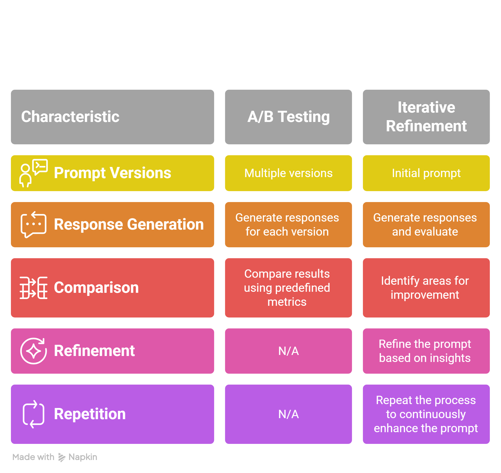

## Phase 3: Mastery & Experimentation ⚡

**Instruction Engineering Handbook**

As language models become more advanced, the quality of instructions we provide becomes increasingly important. Well-crafted instructions can significantly improve the model's output, leading to more accurate, relevant, and useful responses.

This section equips you with practical guidelines to create effective instructions that maximize the potential of AI language models.

### Instruction Engineering Guidelines

| #  | Guideline                  | Description and Techniques                                                                 | Result / How It Helps |
|----|----------------------------|--------------------------------------------------------------------------------------------|-----------------------|
| 1  | Clarity                    | Write easy-to-understand prompts stating exactly what you want. Repeat key instructions at the end. | Clarifies the goal, reduces confusion; output focuses on explanation. |
| 2  | Negative Prompting         | Specify what to avoid, like exclusions or negative examples.                               | Refines by excluding unwanted content; output stays factual. |
| 3  | Constrained and Guided Generation | Control tone, style, length, or rules (e.g., "friendly tone," "under 200 words").         | Guides style and limits; output is concise and engaging. |
| 4  | Be Descriptive             | Use vivid details, analogies, or specific terms.                                           | Adds clarity with analogy; output is more relatable. |
| 5  | Order Matters              | Sequence info to leverage recency bias (e.g., instructions first or last).                 | Prioritizes instructions; emphasizes task in output. |
| 6  | Specificity                | Balance freedom: high (open), medium (patterns), low (exact). Match to task fragility.     | Adds medium specificity; output follows structured path. |
| 7  | Output Format              | Request specific structures (e.g., tables, bullets).                                       | Structures response; output is easy to read. |
| 8  | Context                    | Provide background for relevance (e.g., user level).                                       | Aligns to audience; output is beginner-friendly. |
| 9  | Be Concise                 | Cut unnecessary details; check relevance.                                                  | Shortens prompt; focuses AI, reduces token use. |
| 10 | Avoiding Hallucinations    | Allow "I don't know"; ask for evidence; lower temperature.                                 | Promotes accuracy; output cites facts reliably. |
| 11 | Using Relevant Examples    | Add input-output pairs; make them relevant and diverse.                                    | Guides format/tone; output mirrors example structure. |
| 12 | Add Clear Syntax           | Use Markdown/XML labels for structure.                                                     | Improves parsing; output is organized and consistent. |
| 13 | Break the Task Down        | Split into steps (e.g., "Step 1: Extract, Step 2: Verify").                                | Enhances performance on complex parts; output is logical. |
| 14 | Adding System Messages     | Set role/rules for consistency (e.g., "You are a helpful tutor.").                         | Ensures consistent behavior; output feels tutorial-like. |
| 15 | Iterate and Refine         | Test, review, tweak (e.g., add limits if too long).                                        | Final tweaks from testing; output is optimized and precise. |

**Best Practices Reference:**  
[Best practices for prompt engineering with the OpenAI API](https://help.openai.com/en/articles/6654000-best-practices-for-prompt-engineering-with-the-openai-api)

---

### Prompt Evolution Using the Prompt Crafting Handbook

Here’s how a simple prompt evolves into a highly effective one by applying the guidelines step by step:

**Starting Prompt:**  
"Tell me about AI."

**After applying Clarity** →  
"Explain what AI is. Remember, explain what AI is."

**After Negative Prompting** →  
"Explain what AI is, but do not include opinions or future predictions. Remember, explain what AI is."

**After Constrained and Guided Generation** →  
"Explain what AI is in a friendly tone, under 200 words, but do not include opinions or future predictions. Remember, explain what AI is."

**After Be Descriptive** →  
"Explain what AI is like a smart helper in everyday life, using simple terms, in a friendly tone, under 200 words, but do not include opinions or future predictions. Remember, explain what AI is."

**After Order Matters** →  
"In a friendly tone, under 200 words, explain what AI is like a smart helper in everyday life, using simple terms, but do not include opinions or future predictions. Remember, explain what AI is."

**After Specificity** →  
"In a friendly tone, under 200 words, explain what AI is like a smart helper in everyday life, using simple terms—follow this outline: Definition, Examples, Benefits—but do not include opinions or future predictions. Remember, explain what AI is."

**After Output Format** →  
"In a friendly tone, under 200 words, explain what AI is like a smart helper in everyday life, using simple terms—follow this outline: Definition, Examples, Benefits—but do not include opinions or future predictions. Output in 3 bullet points. Remember, explain what AI is."

**After Context** →  
"As a beginner, in a friendly tone, under 200 words, explain what AI is like a smart helper in everyday life, using simple terms—follow this outline: Definition, Examples, Benefits—but do not include opinions or future predictions. Output in 3 bullet points. Remember, explain what AI is."

**After Be Concise** →  
"For beginners: Explain AI like a smart helper, friendly tone, under 200 words—outline: Definition, Examples, Benefits. No opinions or predictions. 3 bullet points. Remember, explain AI."

**After Avoiding Hallucinations** →  
"For beginners: Explain AI like a smart helper, friendly tone, under 200 words—outline: Definition, Examples, Benefits. No opinions or predictions. If unsure, say 'I don't know.' Ask for evidence first. Use low temperature. 3 bullet points. Remember, explain AI."

**After Using Relevant Examples** →  
"For beginners: Explain AI like a smart helper, friendly tone, under 200 words—outline: Definition, Examples, Benefits. No opinions or predictions. If unsure, say 'I don't know.' Ask for evidence first. Use low temperature. Example: Input: 'Machine learning.' Output: '- Definition: Subset of AI. - Examples: Recommendations. - Benefits: Efficiency.' Now, explain AI. 3 bullet points. Remember, explain AI."

**After Add Clear Syntax** →  
"System: You explain tech simply.  
User:  
For beginners: Explain AI like a smart helper, friendly tone, under 200 words—outline: Definition, Examples, Benefits.  
No opinions or predictions.  
If unsure, say 'I don't know.' Ask for evidence first. Use a low temperature.  
Example: Input: 'Machine learning.' Output: '- Definition: Subset of AI. - Examples: Recommendations. - Benefits: Efficiency.'  
Now, explain AI. 3 bullet points. Remember, explain AI."

**After Break the Task Down** →  
"System: You explain tech simply.  
User:  
Step 1: Define AI.  
Step 2: Give examples.  
Step 3: List benefits.  
For beginners: Like a smart helper, friendly tone, under 200 words.  
No opinions or predictions. If unsure, say 'I don't know.' Ask for evidence first. Use low temperature.  
Example: Input: 'Machine learning.' Output: '- Definition: Subset of AI. - Examples: Recommendations. - Benefits: Efficiency.'  
Now, explain AI. 3 bullet points. Remember, explain AI."

**After Adding System Messages** →  
"System: You are a helpful tutor who explains tech simply.  
User:  
Step 1: Define AI.  
Step 2: Give examples.  
Step 3: List benefits.  
For beginners: Like a smart helper, friendly tone, under 150 words (refined from test).  
No opinions or predictions. If unsure, say 'I don't know.' Ask for evidence first. Use low temperature.  
Example: Input: 'Machine learning.' Output: '- Definition: Subset of AI. - Examples: Recommendations. - Benefits: Efficiency.'  
Now, explain AI. 3 bullet points. Remember, explain AI."

**Final Step: Iterate, Optimize and Refine**

---

**[← Back to Phase 2](../02_Phase-2-Core-Prompt-Engineering-Skills/README.md)**  **[Continue in Phase 3 →](#next-sections-in-phase-3)**

---

## How to Optimize and Refine a Prompt

As AI language models become more sophisticated, the quality of prompts used to interact with them becomes increasingly important. Optimized prompts can lead to more accurate, relevant, and useful responses, enhancing the overall performance of AI applications.

This section gives you practical techniques to systematically improve your prompts.

---

### Key Components of Prompt Optimization

1. **A/B Testing Prompts** — A method to compare the effectiveness of different prompt variations.
2. **Iterative Refinement** — A strategy for gradually improving prompts based on feedback and results.
3. **Performance Metrics** — Ways to measure and compare the quality of responses from different prompts.

---

### Method Details

#### 1. Setup
Start by setting up your environment with the necessary libraries and API keys (e.g., OpenAI, Grok, or your preferred provider).

#### 2. A/B Testing
- Define multiple versions of a prompt
- Generate responses for each version
- Compare results using predefined metrics

#### 3. Iterative Refinement
- Start with an initial prompt
- Generate responses and evaluate
- Identify areas for improvement
- Refine the prompt based on insights
- Repeat the process to continuously enhance the prompt

#### 4. Performance Evaluation
- Define relevant metrics (e.g., relevance, specificity, coherence)
- Implement scoring functions
- Compare scores across different prompt versions

---

### Step-by-Step Optimization Workflow

1. **Start with a baseline prompt** — Write your initial version.
2. **Run A/B tests** — Create 2–4 variations (change one thing at a time: tone, structure, specificity, examples, etc.).
3. **Generate responses** — Use the same model settings (temperature, max tokens) for fair comparison.
4. **Evaluate using metrics** — Score for accuracy, usefulness, coherence, adherence to format, etc.
5. **Identify weaknesses** — Look for hallucinations, missing details, wrong tone, or extra fluff.
6. **Refine** — Apply one or more guidelines from the Instruction Engineering Handbook (Clarity, Specificity, Negative Prompting, Output Format, etc.).
7. **Test again** — Repeat until the prompt consistently delivers high-quality output.
8. **Document the final version** — Save the best prompt with notes on what worked.

**Pro Tip:** Change only **one variable** per test. This helps you clearly see what actually improves (or hurts) the result.

---

**You now have a repeatable system for turning average prompts into highly effective ones.**

Combine this optimization process with **the layering techniques from Phase 2** and the **guidelines from the Instruction Engineering Handbook** to reach true mastery.

**[← Back to Phase 3 Top](#phase-3-mastery--experimentation)**  **[Continue in Phase 3 →](#next-sections)**

*Phase 3 of "All You Need to Know About Prompt Engineering" — Portfolio Project by Mirza (BS AI)*

*Phase 3 of "All You Need to Know About Prompt Engineering" — Portfolio Project by Mirza (BS AI)*
