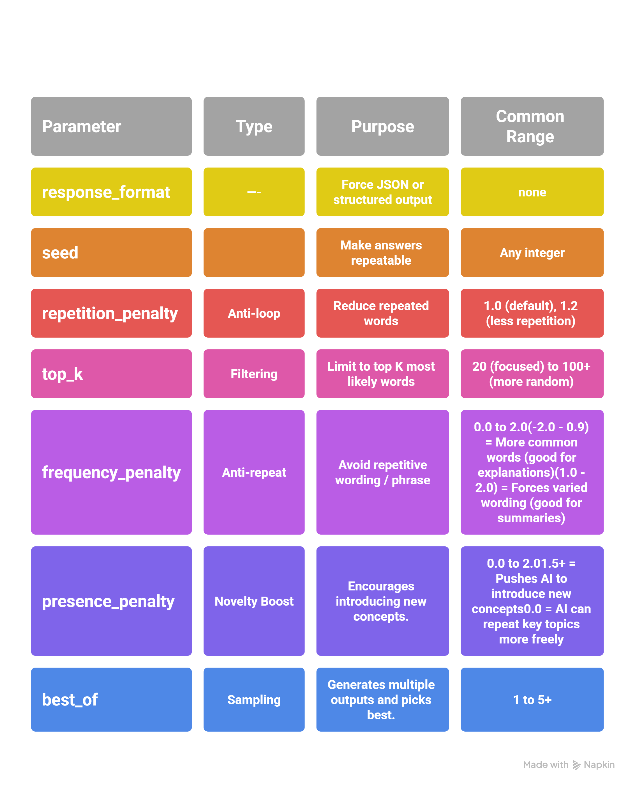

# Chapter 1: Controlling AI Response Parameters ⚙️

In **developer mode** (using APIs or IDEs like OpenAI Playground, Anthropic Console, or code editors), you can tweak powerful parameters to control exactly how the AI responds.  

These settings are **separate from the words in your prompt**. You don’t need to use all of them — pick just **one or two** that match your goal.

This section explains the four most common parameters, how they affect output, when to use them, and how to apply them in two ways:
- **Text-based prompts** (simple instructions you add)
- **Developer mode / IDE** (actual code settings)


---

## 1. Temperature

**Temperature** controls randomness and creativity. It adjusts how predictable or surprising the AI’s responses will be.

- **Low Temperature (0.0 – 0.3)** → Very precise, almost the same answer every time
- **Medium Temperature (0.4 – 0.7)** → Balances accuracy and creativity
- **High Temperature (0.8 – 1.5)** → Creative, diverse, and sometimes surprising responses


### When to Use Different Temperatures?

| Use Case                                                         | Recommended Temperature     | Why?                                      |
|------------------------------------------------------------------|-----------------------------|-------------------------------------------|
| Factual & Technical Queries<br>(math, coding, medical advice)    | 0.0 – 0.3                   | Precise & reliable                        |
| Balanced Responses<br>(general recommendations, summarization)   | 0.4 – 0.7                   | Balanced & natural                        |
| Creative Tasks<br>(storytelling, brainstorming, poetry)          | 0.8 – 1.2                   | Diverse & imaginative                     |
| Randomized Fun Chats<br>(jokes, character roleplay)              | 1.3 – 1.5                   | Maximizes unpredictability                |

### How to Implement Temperature

**Text-based prompt** (simulates the effect):

```python
Answer factually and precisely with low creativity.
response = client.chat.completions.create(
    model="gpt-4o",
    temperature=0.3,      # Change this number
    # ... other parameters
)
```

---

## 2. Top-P Sampling (Nucleus Sampling)

**Top-P Sampling** (also called Nucleus Sampling) filters the AI’s word choices by probability instead of using pure randomness. It is often more precise and controllable than using **Temperature** alone.

- **Top-P (0.1 – 0.3)** → AI picks from only the top 10-30% most likely words.  
  Responses become safe, predictable, and highly consistent.
- **Top-P (0.4 – 0.7)** → AI considers the top 40-70% most likely words.  
  Good balance between relevance and variety.
- **Top-P (0.8 – 1.0)** → Very little or no filtering (AI can pick from almost all words).  
  Allows much more diverse and creative responses.


### How Top-P Works – Example

**Example Prompt:** "Suggest a fantasy novel."

| Top-P |                                       AI Response                                                                    | Style                  |
|-------|----------------------------------------------------------------------------------------------------------------------|------------------------|
| 0.1   |                       "I recommend ‘The Hobbit’ by J.R.R. Tolkien."                                                  | Highly predictable     |
| 0.5   |         "You might enjoy ‘The Hobbit’ or ‘The Name of the Wind’ by Patrick Rothfuss."                                | Balanced               |
| 0.9   |    "Try ‘The Hobbit,’ ‘The Name of the Wind,’ or even something unique like ‘The Black Prism’ by Brent Weeks!"       | Creative & diverse     |

### How to Implement Top-P

**Text-based prompt** (approximates the effect):

```python
Only use the most likely and relevant words.
response = client.chat.completions.create(
    model="gpt-4o",
    top_p=0.9,           # Change this value
    # ... other parameters
)
```

---

|              Use Case                               |                  Best Setting                                    |                 Why?                               |
|-----------------------------------------------------|------------------------------------------------------------------|----------------------------------------------------|
| Factual & Precise Answers(math, science, coding)    | Low Temperature (0.0–0.3) + Low Top-P (0.1–0.3)                  | Ensures only the most reliable words are chosen    |
| Balanced Responses(general chat, recommendations)   | Medium Temp (0.4–0.7) + Medium Top-P (0.4–0.7)                   | Keeps responses coherent yet varied                |
| Creative Writing & Brainstorming(stories, poetry)   | High Temp (0.8–1.2) + High Top-P (0.8–1.0)                       | Encourages diverse and novel ideas                 |


**Quick Combo Tip:**

- Creative writing → temperature=0.8 + top_p=0.9
- Strict facts → temperature=0.3 + top_p=1.0

**⚠️ Avoid extremes together (e.g., temperature=1.0 + top_p=0.2). This combination often produces chaotic or incoherent results.**

**Pro Tip: Many developers prefer controlling output with Top-P instead of Temperature because it gives more predictable and stable results while still allowing creativity when needed.**

---

## 3. Max Tokens

**Max Tokens** sets the maximum length of the AI’s response.  
(1 token ≈ 4 English characters)

💡 **Smaller Max Tokens** = Concise, direct answers  
💡 **Larger Max Tokens** = Detailed explanations

### Example with Prompt: “Explain Saturn’s rings.”

| Max Tokens |                                                                             AI’s Response                                                                                             |
|------------|---------------------------------------------------------------------------------------------------------------------------------------------------------------------------------------|
| 20         | "Saturn's rings are made of ice, rock, and dust."                                                                                                                                     |
| 50         | "Saturn's rings are made of ice, rock, and dust. They are over 280,000 km wide but only 10 meters thick."                                                                             |
| 100        | "Saturn's rings are made of ice, rock, and dust. They are over 280,000 km wide but only 10 meters thick. Some scientists believe they formed when a moon broke apart due to gravity." |

### How to Implement Max Tokens

**Text-based prompt** (approximates the effect):

```python
Answer in no more than 50 words.

response = client.chat.completions.create(
    model="gpt-4o",
    max_tokens=150,       # Change this value
    # ... other parameters
)

```
**Pro Tips:**

- Start with max_tokens=150–300 for most tasks.
- Use lower values (50–100) for short answers, summaries, or chatbots.
- Use higher values (500–2000) for detailed explanations, code generation, or reports.
- Always leave headroom — never push close to the model’s absolute maximum context window.

**Recommended Practice:**
Combine **max_tokens** with a clear output instruction (e.g., “Answer in 3 bullet points”) for best control and efficiency.

---

## 4. Stop Sequences

**Stop Sequences** tell the AI to stop generating exactly when it sees a specific word, symbol, or phrase.  
This gives cleaner control than simply cutting off at `max_tokens`.

### Stop Sequence Examples

| Stop Sequence      | AI’s Response                                      |
|--------------------|----------------------------------------------------|
| `stop=["."]`       | "The sun is a star in our galaxy."                 |
| `stop=["\n"]`      | "The sun is a star" (stops at first new line)      |

### Common Use Cases

| Use Case          | Stop Sequence       | Effect                              |
|-------------------|---------------------|-------------------------------------|
| Chatbots          | `"\nUser:"`         | Stops before next user turn         |
| Summaries         | `"[END]"`           | Clean ending                        |
| Stories           | `"The End"`         | Ends the story naturally            |
| Lists             | `"\n- "`            | Stops extra bullet points           |
| Code              | `"###"`             | Stops after code block              |

### How to Implement

**Text-based (in prompt):**
```python
End your answer with the word END.
response = client.chat.completions.create(
    model="gpt-4o",
    messages=[{"role": "user", "content": "Explain the solar system"}],
    stop=["###"]          # ← Change this value
)

```
**Pro Tips:**

- Use stop sequences to prevent unwanted continuations (e.g., extra explanations, new sections, or repetitive loops).
- Combine with max_tokens for precise control.
- Common stop tokens: "\n", "###", "END", "\nUser:", "[DONE]".

**Best Practice:
Always define at least one stop sequence when building chatbots or structured outputs to keep responses clean and predictable.**

---

## Summary of Response Parameters

The four core parameters — **Temperature**, **Top-P**, **Max Tokens**, and **Stop Sequences** — give you precise control over how the model behaves.

### Parameter Overview

| Parameter      | Purpose                          | Typical Range       | Best For                              |
|----------------|----------------------------------|---------------------|---------------------------------------|
| Temperature    | Creativity level                 | 0.0 – 1.5           | Any task needing more/less surprise   |
| Top-P          | Word-choice filtering            | 0.1 – 1.0           | Fine control over diversity           |
| Max Tokens     | Response length                  | 50 – 1000+          | Keeping answers short or detailed     |
| Stop           | Exact stopping point             | Any string you choose | Clean structured outputs            |

### Best Practice Settings

| Use Case              | Temperature | Top-P | Max Tokens | Stop          |
|-----------------------|-------------|-------|------------|---------------|
| Creative writing      | 0.8–1.0     | 0.9   | 200–500    | None          |
| Code completion       | 0.2–0.4     | 0.8   | 100–400    | `"###"`       |
| Customer support      | 0.3–0.6     | 0.85  | 200–300    | `"\nUser:"`   |
| Data extraction       | 0.0–0.2     | 0.9   | 100–150    | None          |

### How to Implement (Step-by-Step Guide)

1. **Decide your goal** — Do you need creativity, precision, short answers, or strict formatting?
2. **Choose parameter values** using the tables above.
3. **Apply in text prompt** (simple):

   ```python
   Answer concisely. Max 100 words. End with the word END.
   response = client.chat.completions.create(
    model="gpt-4o",
    messages=[{"role": "user", "content": "Your prompt here"}],
    temperature=0.3,      # Creativity control
    top_p=0.85,           # Diversity control
    max_tokens=250,       # Length control
    stop=["END"]          # Exact stop point
   )
   ```

4. Test and iterate — Run the same prompt with small changes and compare results.
5. Document your settings — Save successful combinations as reusable templates.
   

**Pro Tip: Start conservative (low temperature + reasonable max_tokens) and only increase creativity when needed. This combination gives you the best balance of quality, cost, and control.**

---

## Other Less Commonly Used Controlling Parameters

While Temperature, Top-P, Max Tokens, and Stop Sequences are the most frequently used, several other parameters give advanced control for production-grade applications.




**Pro Tip:**  
Start simple — change only **temperature** or **max_tokens** first. Test, observe the difference, then add more parameters only when needed. This keeps your prompts clean and your results predictable.

#### How to Implement (Step-by-Step Guide)

1. Identify the problem (repetition, off-topic drift, unwanted words, etc.).
2. Choose the appropriate parameter from the table above.
3. Add it to your API call:
   
   ```python
   response = client.chat.completions.create(
       model="gpt-4o",
       messages=[{"role": "user", "content": "Your prompt here"}],
       temperature=0.7,
       max_tokens=300,
       frequency_penalty=0.5,      # ← Add here
       presence_penalty=0.3        # ← Add here
   )
   ```
---


   


