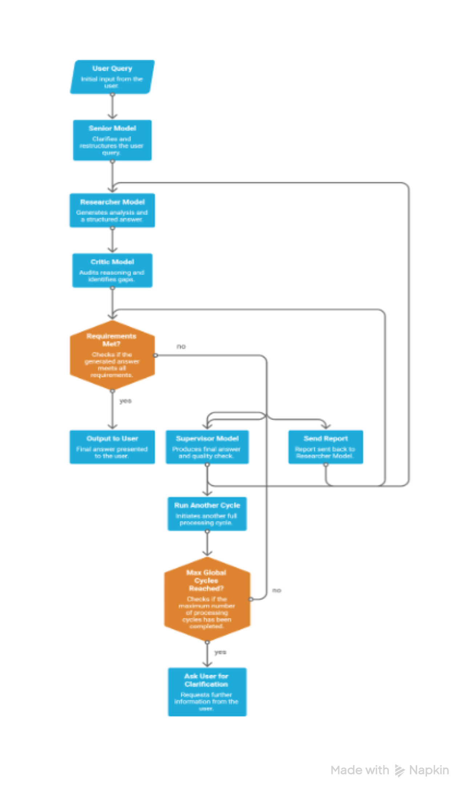
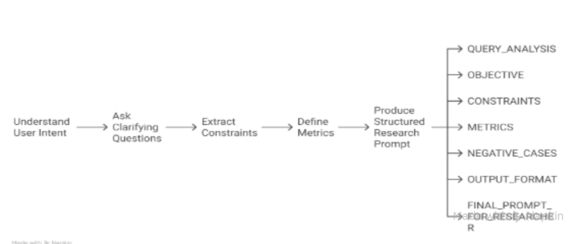
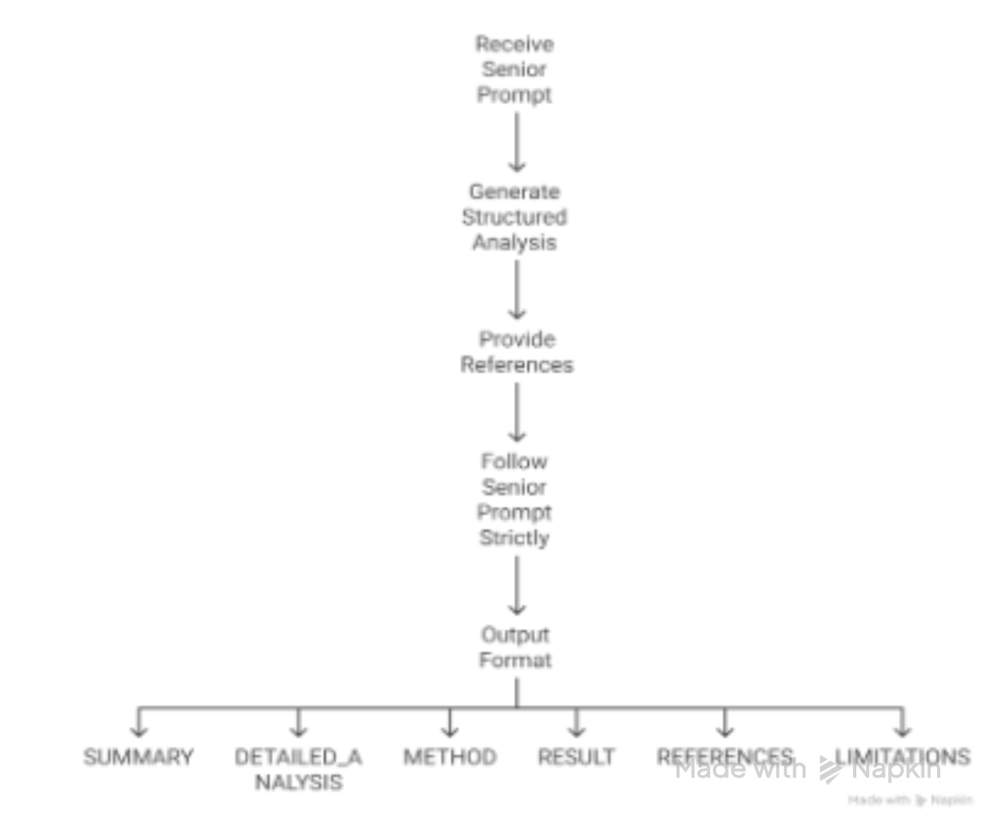
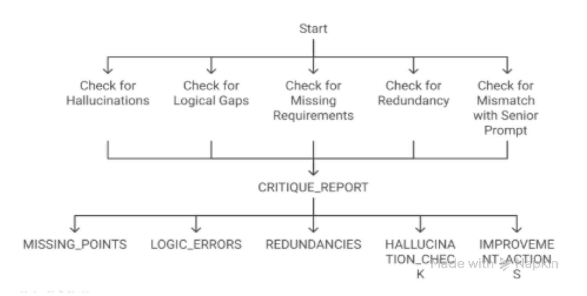
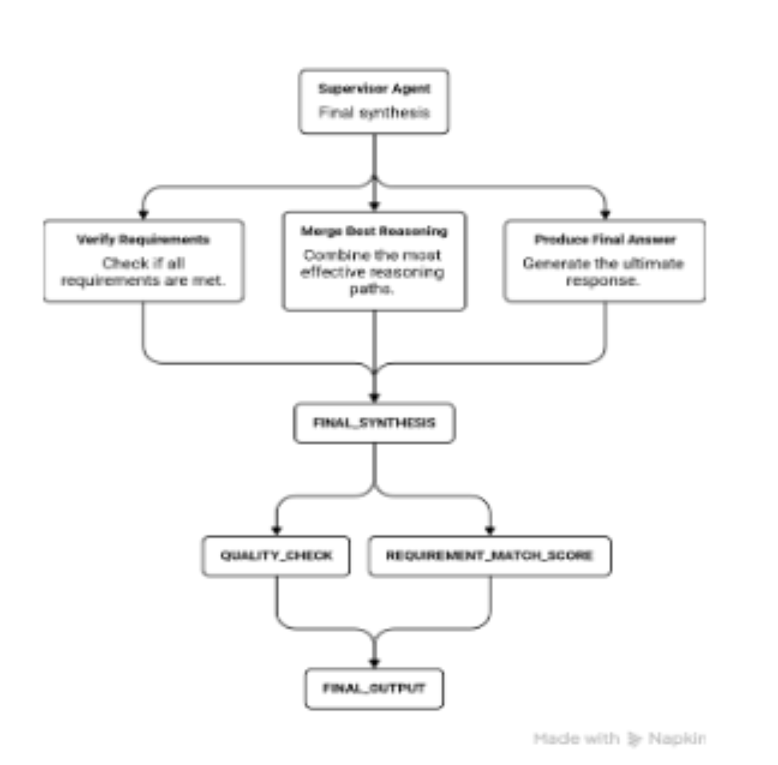

# Chapter-10-Chatbot-Evolution
→ From simple chatbots to stateful, memory-aware, production-ready agents.

---

## Chatbot 1: Building a Single Agent Chatbot (API calling)— memory + system message + loop
This project combines everything you’ve learned: API parameters, conversation history (memory), a professional system prompt, and an interactive loop.

### Installation & Setup

**Step 1: Install & set up OpenAI library**

   ```bash
   pip install openai
   ```

**Step 2: Get your API key**:
     - Go to platform.openai.com
     - Log in → API keys → Create new secret key
     - Copy it (starts with sk-)

**Step 3: Create a `.env` file in your project folder:**
         **Why use `.env`?** It keeps your API key secure and out of your source code.
   * In your project directory, create a file named `.env` at the root level.
   * In your `.env` file, define key-value pairs for your configuration settings. For example: `OPENAI_API_KEY=sk-your-real-key-here`
   * The program will utilize the loaded environment variables from the `.env` file, and the output will display the value associated with the specified key, such as `MY_KEY`.

### Full Chatbot Code:
```python
from openai import OpenAI
import os
from dotenv import load_dotenv

# ====================== SETUP ======================
load_dotenv()  # Load variables from .env file
client = OpenAI(api_key=os.getenv("OPENAI_API_KEY"))

# ====================== MEMORY (Conversation History) ======================
conversation = []  # This list will remember the entire chat

# ====================== PROFESSIONAL SYSTEM PROMPT ======================
SYSTEM_PROMPT = """
You are a world-class AI tutor specializing in mathematics.
TASK: Explain concepts clearly with step-by-step reasoning.
CONTEXT: Use real-life examples whenever possible.
CONSTRAINTS: Use simple language, avoid jargon.
FORMAT: Always use numbered steps and relevant emojis.
THINKING: Think step by step before answering.
OPTIMIZE: Make explanations fun, engaging, and easy to understand.
"""

# Add system prompt once at the beginning
conversation.append({"role": "system", "content": SYSTEM_PROMPT})

# ====================== CHAT FUNCTION ======================
def chat_with_ai(user_input, temperature=0.7, max_tokens=400):
    # Add new user message to history
    conversation.append({"role": "user", "content": user_input})
    
    # Call OpenAI with full conversation history
    response = client.chat.completions.create(
        model="gpt-4o",           # or "gpt-4o-mini" for lower cost
        messages=conversation,
        temperature=temperature,  # Creativity control
        max_tokens=max_tokens,    # Length limit
        top_p=0.9
    )
    
    ai_reply = response.choices[0].message.content
    
    # Save AI reply to memory for next turns
    conversation.append({"role": "assistant", "content": ai_reply})
    
    return ai_reply

# ====================== MAIN CHAT LOOP ======================
print("🤖 Math Tutor Chatbot is ready! Type 'exit' to stop.\n")

while True:
    user_input = input("You: ")
    if user_input.lower() in ["exit", "quit", "bye"]:
        print("👋 Goodbye!")
        break
    
    reply = chat_with_ai(user_input)
    print(f"AI: {reply}\n")
```
### How Everything Works Together:

| Layer          |  What It Does                                            | Where You See It in the Code                        |           
|----------------|----------------------------------------------------------|-----------------------------------------------------|
| Setup          |  Loads API key securely from .env                        |  Top 5 lines                                        | 
| Memory         |  Stores every message so the AI remembers context        | `conversation = []` list                            | 
| System Prompt  |  Sets personality, rules, and response style             | `SYSTEM_PROMPT` variable                            |
| Core Function  |  Sends full history to OpenAI and saves reply            | `chat_with_ai()` function                           | 
| Chat Loop      |  Keeps the conversation going indefinitely               | `while True:` loop                                  | 

**Key Learning Points:**
* The `conversation` list acts as the memory of the chatbot.
* The system prompt is added only once and defines consistent behavior throughout the chat.
* Every new user message and AI reply is appended to the list, so the model always has full context.
* You can easily adjust `temperature`, `max_tokens`, and other parameters inside the `chat_with_ai()` function.

**Pro Tip**: Start with a strong, detailed system prompt. It often has more impact on output quality than individual user messages.
This single-agent chatbot is the foundation for more advanced agents, multi-agent systems, and tool-calling applications you will build later in Phase 4.

---

## CHATBOT 2: Multi-Model Research Chatbot with Ollama

This is a smart research chatbot that uses 4 specialized models working together like a team. Instead of one model doing everything (and making mistakes), they collaborate in a loop until the answer is accurate and complete.
The system resembles a research pipeline with role-specialized agents.

[Github Repo you can visit](https://github.com/openai/openai-cookbook/blob/main/examples/Enhance_your_prompts_with_meta_prompting.ipynb)


### System Architecture

#### Core Idea
A multi-agent pipeline where each model performs a specific cognitive task.

| Role                | Function                                                 |     
|---------------------|----------------------------------------------------------|
| Senior Model        |  Clarifies and restructures the user query               |
| Researcher Model    | Generates analysis and a structured answer               | 
| Critic Model        |  Audits reasoning and identifies gaps                    | 
| Supervisor Model    |  Produces final answer and quality check                 |


### Pipeline Logic


<br clear="all"/>


### Model Selection

Using Ollama-available models optimized for role specialization.

| Role           |  Model                             | Why                                           | Strength                   | Weakness                     |  RAM needed         |            
|----------------|------------------------------------|-----------------------------------------------|----------------------------|------------------------------|---------------------|   
| Senior         |  Llama 3.1 8B                      |  strong reasoning and prompt reformulation    | contextual understanding   |  moderate hallucination      | 16GB                |   
| Researcher     |  Mistral 7B                        |  fast analytical output                       | speed and structure        |  slightly weaker reasoning   | 12GB                |   
| Critic         |  DeepSeek‑R1 Distill               | chain-of-thought evaluation                   | reasoning accuracy         |  slower                      | 16GB                |   
| Supervisor     |  Llama 3.1 70B (or 8B locally)     | synthesis and evaluation                      | Coherence                  |  heavy compute               | 16GB                |   

**For minimal setup: Llama3.1 8B, Mistral 7B, DeepSeek-R1 Distill 8B: Minimal setup (runs on most laptops): All 8B/7B models. **


### Agent Responsibilities

##### Senior Agent


<br clear="all"/>


#### Researcher Agent


<br clear="all"/>


#### Critic Agent


<br clear="all"/>


#### Supervisor Agent


<br clear="all"/>


### Installation Guide

#### Step 1 — Install Ollama

**Linux/Mac:**

```Bash
curl -fsSL https://ollama.com/install.sh | sh
```

**Windows:**
Download the installer from [Ollama](https://ollama.com)


#### Step 2 — Pull models

```
ollama pull llama3.1
```

```
ollama pull mistral
```

```
ollama pull deepseek-r1
```


#### Step 3 — Install Python library

```
pip install ollama
```

#### Step 4 — Run the chatbot

python chatbot.py

```python

import ollama

# ------------------- Generic Call Function -------------------

    ""”   Sends a prompt to the Ollama model and returns response text.
    Parameters:
    model : str  (Name of ollama model)
    prompt : str ( Input prompt) 
    temperature : float  ,  Creativity control    """


def call_model(model, prompt, temperature=0.3):
    response = ollama.chat (
        model=model,
        messages=[{"role": "user", "content": prompt}],
        options={  "temperature": temperature,   "top_p": 0.9    }
)

    return response["message"]["content"]


# -------------------------------------------------- Senior agent --------------------------------------------------

def senior_agent(query):
    senior_prompt = f"""You are a senior research analyst.
Understand the user query and restructure it clearly.
Extract: objective, constraints, success metrics, negative cases, required output format.
Return ONLY a structured research prompt for the next model.
USER QUERY: {query}"""

    return call_model("llama3.1:8b", senior_prompt, temperature=0.2)


# -------------------------------------------------- Researcher agent --------------------------------------------------

def researcher_agent(senior_prompt):
    prompt = f"""You are a research analyst.
Use the structured prompt below and generate a detailed answer.
PROMPT: {senior_prompt}
Return in this exact format:
SUMMARY
DETAILED ANALYSIS
METHOD
RESULT
REFERENCES
LIMITATIONS"""

    return call_model("mistral:7b", research_prompt, temperature=0.4)


# -------------------------------------------------- Critic agent --------------------------------------------------

def critic_agent(senior_prompt, research_output):
    critique_prompt= f"""You are a critical reviewer.
Compare the research output against the senior prompt. Create a critique report and find: missing points, logic errors, hallucinations, and redundancies. Give clear improvement actions. 
SENIOR PROMPT: {senior_prompt}
RESEARCH OUTPUT: {research_output}"""

   return call_model("deepseek-r1:8b", critique_prompt, temperature=0.1)


# -------------------------------------------------- Supervisor agent --------------------------------------------------

def supervisor_agent(query, research_output, critique):
    prompt = f"""
You are a supervisor AI.
User query: {query}
Research output: {research_output}
Critique report: {critique}
Task:
1. Fix issues identified    2. Produce final answer   3. Verify requirements met
Return:
FINAL_OUTPUT
QUALITY_CHECK
REQUIREMENT_MATCH_SCORE  """

    return call_model("llama3.1:8b", prompt, temperature=0.3)


# --------------------------------------------------  Main chatbot loop  --------------------------------------------------

def collaborative_chatbot(query):
    senior_prompt = senior_agent(query)
    research_output = " "
    critique = " "
    # Researcher ↔ Critic loop (3 iterations)
    for i in range(3):
        research_output = researcher_agent(senior_prompt)
        critique = critic_agent(senior_prompt, research_output)
         # append critique feedback
        senior_prompt += f"\n\nCRITIQUE_FEEDBACK:\n{critique}"
    # supervisor synthesis
    final_answer = supervisor_agent(query, research_output, critique)
    return final_answer


# -------------------------------------------------- Run chatbot --------------------------------------------------

if __name__ == "__main__":
    user_query = input("Enter your research question: ")
    result = collaborative_chatbot(user_query)
    print("\n" + "="*50)
    print("FINAL ANSWER")
    print("="*50)
    print(result)


```
---

## CHATBOT 3: Multi-Model Research Chatbot with Memory + Auto-Summarization
Now includes permanent conversation history and smart summarization when the history becomes too long (preventing context overflow).

#### New Features Added
* Every message (user + assistant) is saved in `conversation = []`
* Before each new query, the code checks the total length
* When limit is reached → `update_summary()` compresses old messages
* New prompts now use: **Summary + Last 4 messages** (keeps context fresh)
* You can continue long conversations without losing important context

#### Example after many turns:

* Old history gets summarized as: "User is a biology researcher in Berlin preparing a research paper."
* Recent messages stay full → AI still remembers your name and current topic.

### Installation Guide

#### Step 1 — Install Ollama

**Linux/Mac:**

```Bash
curl -fsSL https://ollama.com/install.sh | sh
```

**Windows:**
Download the installer from [Ollama](https://ollama.com)


#### Step 2 — Pull models

```
ollama pull llama3.1
```

```
ollama pull mistral
```

```
ollama pull deepseek-r1
```


#### Step 3 — Install Python library

```
pip install ollama
```

#### Step 4 — Run the chatbot

python chatbot.py

```python

import ollama

# ====================== GLOBAL MEMORY & SUMMARY ======================

conversation = [ ]   # Stores full history: [{"role": "user/assistant", "content": "..."}]

summary = " "        # Compressed memory of old conversation


# ====================== TOKEN LIMIT CHECK (Simple but effective) ======================

MAX_HISTORY_CHARS = 12000   # Approx 3000-4000 tokens for 8B models

def should_summarize():
    total_chars = sum(len(msg["content"]) for msg in conversation)
    return total_chars > MAX_HISTORY_CHARS


# ====================== UPDATE SUMMARY FUNCTION ======================

def update_summary():
    global summary
    if len(conversation) < 4:  # Too short to summarize
        return

    # Summarize everything except the last 3 messages (keep recent context)
    old_convo = conversation[:-3]
    history_text = "\n".join([f"{msg['role'].upper()}: {msg['content']}" for msg in old_convo])

    prompt = f"""   Briefly and accurately summarize the following conversation history. Keep only key facts, user details, goals, and important context. Do NOT add new information.
CONVERSATION:
{history_text}  """

    response = ollama.generate(model="llama3.1:8b", prompt=prompt)
    summary = response["response"].strip()
    print("📝 Conversation summarized (old history compressed)")


# ====================== GENERIC MODEL CALL ======================

def call_model(model, prompt, temperature=0.3):
    response = ollama.chat (
        model=model,
        messages=[{"role": "user", "content": prompt}],
        options={"temperature": temperature, "top_p": 0.9}
 )

    return response["message"]["content"]


# ====================== SENIOR AGENT (Now uses summary) ======================

def senior_agent(query):
    global summary

    # Trigger summarization if needed
    if should_summarize():
        update_summary()

    # Build prompt with summary + recent history
    history_recent = "\n".join( [ f"{msg['role'].upper()}: {msg['content']}" for msg in conversation[-4:] ] )

    prompt = f"""You are a senior research analyst.
{summary}  # ← Compressed memory
Recent conversation:
{history_recent}
New user query: {query}
Understand the intent and restructure it. Extract: objective, constraints, success metrics, negative cases, required output format. Return ONLY a structured research prompt for the Researcher."""

    return call_model("llama3.1:8b", prompt, temperature=0.2)


# =============================================== OTHER AGENTS (unchanged) ===============================================================================

# -------------------------------------------------- Researcher agent --------------------------------------------------

def researcher_agent(senior_prompt):
    prompt = f"""You are a research analyst.
Use the structured prompt below and generate a detailed answer.
PROMPT: {senior_prompt}
Return in this exact format:
SUMMARY
DETAILED ANALYSIS
METHOD
RESULT
REFERENCES
LIMITATIONS"""

    return call_model("mistral:7b", research_prompt, temperature=0.4)


# -------------------------------------------------- Critic agent --------------------------------------------------

def critic_agent(senior_prompt, research_output):
    critique_prompt= f"""You are a critical reviewer.
Compare the research output against the senior prompt. Create a critique report and find: missing points, logic errors, hallucinations, and redundancies. Give clear improvement actions. 
SENIOR PROMPT: {senior_prompt}
RESEARCH OUTPUT: {research_output}"""

    return call_model("deepseek-r1:8b", critique_prompt, temperature=0.1)


# -------------------------------------------------- Supervisor agent --------------------------------------------------

def supervisor_agent(query, research_output, critique):
    prompt = f"""
You are a supervisor AI.
User query: {query}
Research output: {research_output}
Critique report: {critique}
Task:
1. Fix issues identified    2. Produce final answer   3. Verify requirements met
Return:
FINAL_OUTPUT
QUALITY_CHECK
REQUIREMENT_MATCH_SCORE  """

    return call_model("llama3.1:8b", prompt, temperature=0.3)


# ====================== MAIN COLLABORATIVE CHATBOT ======================

def collaborative_chatbot(query):

    # Add user message to permanent memory
    conversation.append({"role": "user", "content": query})    # Store query in conversation list

    # Run the pipeline
    senior_prompt = senior_agent(query)
    research_output = ""
    critique = ""

    # Researcher ↔ Critic loop (3 iterations)
    for _ in range(3):
        research_output = researcher_agent(senior_prompt)
        critique = critic_agent(senior_prompt, research_output)
        senior_prompt += f"\n\nCRITIQUE_FEEDBACK:\n{critique}"

    # Final synthesis
    final_answer = supervisor_agent(query, research_output, critique)

    # Add AI reply to memory
    conversation.append({"role": "assistant", "content": final_answer})

    return final_answer


# ====================== RUN CHATBOT ======================

if __name__ == "__main__":
    print(" Hi! Its chatty, your research partner! Tell me where can I assist you… \n")
    print("Type 'exit' to stop.\n")
    while True:
        user_query = input("You: ")
        if user_query.lower() in ["exit", "quit", "bye"]:
            print("👋 Goodbye!")
            break
        result = collaborative_chatbot(user_query)
        print(f"\nAI: {result}\n")

```
---
