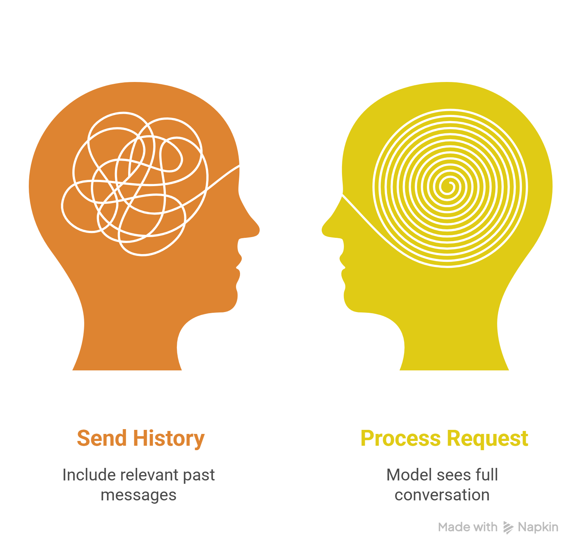
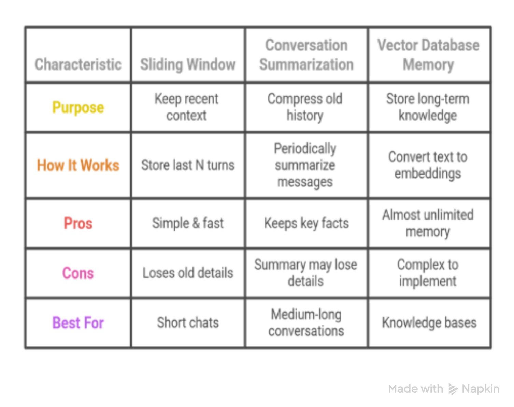

# Chapter-3-Memory-Management-Multi-turn-Chats

Now that you can call the OpenAI API and control response parameters, the next critical skill is **memory management**. Real-world chatbots, agents, and assistants must remember previous messages across multiple turns.

This chapter explains why LLMs are stateless, how conversation history actually works, and how to maintain context effectively in code.

---
## Table of Contents
- [Why Chat History Matters](#why-chat-history-matters)
- [How LLMs Handle & Remember Conversations](#how-llms-handle--remember-conversations)
- [How the Model Actually Sees a Conversation](#how-the-model-actually-sees-a-conversation)
- [Ways Developers Make LLMs “Remember” Things](#ways-developers-make-llms-remember-things)
- [Method 1: Manual Tagging (LLaMA-2 / LLaMA-3 Style)](#method-1-manual-tagging-llama-2--llama-3-style--most-educational)
- [Method 2: Using a Helper Function (llama_chat / chat wrapper)](#method-2-using-a-helper-function-llama_chat--chat-wrapper)
- [Method 3: Storing Messages in a List (Most Popular Production Method – OpenAI Style)](#method-3-storing-messages-in-a-list-most-popular-production-method--openai-style)
- [Summary: Choosing the Right Memory Method](#summary-choosing-the-right-memory-method)
- [Chatbot 1: Building a Single Agent Chatbot](#chatbot-1-building-a-single-agent-chatbot-api-calling-memory--system-prompt)
- [Relationship to Context Window Limits & Memory Management Strategies](#relationship-to-context-window-limits--memory-management-strategies)
- [Top 10 Benchmarking & Evaluation Metrics](#top-10-benchmarking--evaluation-metrics-for-choosing-the-right-model-based-on-context-window)
- [The Truth About Advertised vs. Actual Context Performance](#the-truth-about-advertised-vs-actual-context-performance)
- [Senior Techniques to Avoid Hitting Context Window Limits](#senior-techniques-to-avoid-hitting-context-window-limits)
- [Memory Management Strategies](#memory-management-strategies)


* | **[Back to Phase 4 Main Page](../README.md)**


---

## Why Chat History Matters

Consider two cases.

### Case 1 — Without History** -- Like we did in the past lecture on *API calling*

```python
messages = [
   {"role": "system", "content": "You are a friendly chatbot."},
   {"role": "user", "content": "What is my name?"} 
  
  ]
```
The model receives no earlier context.

**Result**:  *"I don't know your name."*


### Case 2 — With Full History

```python
messages = [
   {"role": "system", "content": "You are a friendly chatbot."},
   {"role": "user", "content": "Hi, my name is Mirza"},
   {"role": "assistant", "content": "Nice to meet you, Mirza."},
   {"role": "user", "content": "What is my name?"}  
   
   ]
```

Now the model sees:

The user introduced their name earlier
**Response**:  *"Your name is **Mirza**."*
The model did not remember — it simply read the earlier message again.


---

 **[↑ Back to Top](#chapter-3-memory-management--multi-turn-chats-)** 
 
---

## How LLMs Handle & Remember Conversations (Multi-Turn Chat Explained)

**Previous conversation ≠ automatically remembered**



Large language models (GPT, Claude, LLaMA, Grok, etc.) are stateless by design. They do not retain any information between separate API calls or terminal sessions.
Every time you send a request, the model sees only the exact messages you include in that request.

**Key Rule:**
If you want the model to remember names, previous answers, assigned roles, tasks in progress, or any context, you must send the full relevant history as part of every new API call.
This is exactly how production chat systems (ChatGPT, Claude, custom agents) create the illusion of memory.

---

 **[↑ Back to Top](#chapter-3-memory-management--multi-turn-chats-)** 

---

## How the Model Actually Sees a Conversation
Internally, the model receives a single combined sequence of text tokens.

### Conversation Flow:
```markdown
                     System message (optional – sets personality/rules)
                                          ↓
                                    User message 1
                                          ↓
                                  Assistant reply 1
                                          ↓
                                   User message 2
                                          ↓
                                  Assistant reply 2
                                          ↓
                                    User message 3
                                          ↓
                               ... (all previous turns)
                                          ↓
                Current user message ← model predicts next assistant reply here
                
```
You are responsible for maintaining and sending the entire conversation history with every new request. The model reads the whole sequence from top to bottom and generates only the next assistant message.

---

 **[↑ Back to Top](#chapter-3-memory-management--multi-turn-chats-)** 
 
---

## Ways Developers Make LLMs “Remember” Things

There are several proven patterns developers use to maintain conversation state. We’ll start with the most educational approaches used in open-source models (LLaMA family) before moving to production-grade techniques in later sections.

---

### Method 1: Manual Tagging (LLaMA-2 / LLaMA-3 Style – Most Educational)

Many open-source chat models (LLaMA-2, LLaMA-3, Mistral, etc.) expect **special instruction tags** to distinguish between system instructions, user input, and assistant responses.

**Key tags used by these models:**
- `<s>` — Start of a message
- `</s>` — End of a message
- `[INST]` — Start of an instruction (user prompt)
- `[/INST]` — End of an instruction

#### Example: Building a Multi-turn Chat Manually

```python
# Turn 1
prompt_1 = "What are fun activities I can do this weekend?"
response_1 = llama(prompt_1)          # Assume model replies: "Hiking, cycling, yoga, movies."

# Turn 2 – Manually construct full history with tags
full_chat_prompt = f"""
<s>[INST] {prompt_1} [/INST]
{response_1}
</s>
<s>[INST] Which of these would be good for my health? [/INST] 
"""

response_2 = llama(full_chat_prompt, add_inst=False)   # Disable auto-tagging
```

**Result:** The model now sees the complete conversation and answers correctly, for example:
“Hiking and cycling are excellent for cardiovascular health…”

**When to use this method:**

* Learning how chat formatting actually works under the hood
* Working with older LLaMA-2 models or custom fine-tunes
* Needing maximum low-level control
* Educational projects and experimentation


---
 
 **[↑ Back to Top](#chapter-3-memory-management--multi-turn-chats-)** 
 
---

### Method 2: Using a Helper Function (llama_chat / chat wrapper)

Most modern libraries and courses provide a helper function that automatically builds the correctly tagged prompt for you — eliminating manual string formatting errors.

#### Example pattern (very common in tutorials):

```python
from utils import llama_chat   # Helper function provided by the course/library

prompts = [
    "What are fun weekend activities?",
    "Which of these would be good for my health?"
]

responses = []

# First turn
resp1 = llama(prompts[0])
responses.append(resp1)

# Second turn – helper automatically adds history with correct tags
resp2 = llama_chat(prompts, responses)
print(resp2)   # Model now has full context
```
**What the helper does internally:**
It constructs the same tagged structure shown in Method 1, but automatically handles `<s>`, `</s>`, `[INST]`, and `[/INST]` tags.

**When to use this method:**

* Following structured courses or official documentation
* Avoiding manual string formatting mistakes
* Rapid prototyping and learning
* When working with libraries that provide `chat()` or `chat_completion()` wrappers

---

**Pro Tip:
Manual tagging (Method 1) teaches you the underlying mechanics. Helper functions (Method 2) save time in real projects. Both approaches follow the same core principle: you must send the full conversation history with every new request.**

---
 
 **[↑ Back to Top](#chapter-3-memory-management--multi-turn-chats-)** 
 
 ---

### Method 3: Storing Messages in a List (Most Popular Production Method – OpenAI Style)

This is the **industry standard** for almost every real chatbot that works today — including ChatGPT, Grok, Claude web/app interfaces, and most custom production applications. 

You maintain **one growing list** of messages that represents the entire conversation history.

### Structure of Messages

Each message is a dictionary with exactly two fields:
- **`role`**: Who sent the message (`system`, `user`, or `assistant`)
- **`content`**: The actual text of the message

**Possible roles:**
- **`system`** — Sets behavior, personality, and rules (usually at the beginning)
- **`user`** — Human input / questions
- **`assistant`** — Model’s previous responses

#### Implementation Example: 

**Simple Interactive Loop:** 
```python
conversation = [
    {"role": "system", "content": "You are a helpful and friendly chatbot."}
]

while True:
    user_input = input("You: ")
    
    # Add user message to history
    conversation.append({
        "role": "user",
        "content": user_input
    })
    
    # Send full conversation to the model
    reply = chat(conversation)          # Your chat function
    
    print("AI:", reply)
    
    # Save the assistant's reply to history
    conversation.append({
        "role": "assistant",
        "content": reply
    })

```
    
**Reusable Function Approach:**
```python
def chat_with_memory(conversation, new_user_message, model="gpt-4o", temperature=0.7):
    """
    Append new user message, call the model with full history,
    Then append the assistant's reply to the conversation.
    """
    # Add the new user input
    conversation.append({
        "role": "user",
        "content": new_user_message
    })
    
    # Call the model with the complete conversation history
    response = client.chat.completions.create(
        model=model,
        messages=conversation,
        temperature=temperature
    )
    
    reply = response.choices[0].message.content
    
    # Save the assistant's reply to maintain memory
    conversation.append({
        "role": "assistant",
        "content": reply
    })
    
    return reply
```

**Object-Oriented Approach (Recommended for Larger Projects):**
```python
class Conversation:
    def __init__(self, system_prompt="You are a helpful assistant."):
        self.messages = []
        if system_prompt:
            self.messages.append({
                "role": "system", 
                "content": system_prompt
            })
    
    def generate(self, user_question, model="gpt-4o", temperature=0.7):
        # Append the new user question
        self.messages.append({
            "role": "user", 
            "content": user_question
        })
        
        # Call the model with full conversation history
        response = client.chat.completions.create(
            model=model,
            messages=self.messages,
            temperature=temperature
        )
        
        reply = response.choices[0].message.content
        
        # Append the assistant's response to maintain memory
        self.messages.append({
            "role": "assistant", 
            "content": reply
        })
        
        return reply
```

**Usage Example:**
```python
chat = Conversation("You are a friendly AI tutor specializing in prompt engineering.")
print(chat.generate("What is few-shot prompting?"))
print(chat.generate("Can you give me an example?"))   # Remembers previous context
```

**Explanation (Analogy):**
Think of the messages list as a notebook that records the entire conversation. Every time you talk to the model, you show it the full notebook so it can continue the conversation naturally.

**Key Advantages of this Method:**

* Simple and clean
* Works with OpenAI, Anthropic, Grok, Ollama, and most providers
* Easy to debug and inspect conversation history
* Foundation for more advanced memory techniques (summarization, vector memory, etc.)

---

 **[↑ Back to Top](#chapter-3-memory-management--multi-turn-chats-)** 
> 💡 **Want to see this in a working chatbot?**  
> **[🤖 Open Full Single-Agent Chatbot Implementation](../Chapter-10-Chatbot-Evolution/README.md)**

---

## Relationship to Context Window Limits & Memory Management Strategies

As your conversation grows, memory management becomes directly tied to the model’s **context window** — one of the most important technical constraints in LLM applications.

### What is the Context Window?

Every message in a chat (both user and assistant) consumes **tokens**. Models have a hard limit called the **context window** — the maximum number of tokens the model can process in a single interaction.

> **1 Token ≈ 3–4 English characters**

Once the total tokens in your `messages` list exceed the context window, the API call will fail or the oldest messages will be automatically truncated (depending on the provider).

---

### Why a Larger Context Window Matters

A larger context window improves:
- Long-form reasoning (documents, research papers, books)
- Multi-turn conversation coherence over many exchanges
- Codebase-level analysis and large document understanding
- Retention of earlier instructions, user preferences, and project context

---

### Leading AI Models Context Window Comparison (2026)

| Model                    | Context Window     | Best For                                      |
|--------------------------|--------------------|-----------------------------------------------|
| Llama 4 Scout            | 10M tokens         | Extremely long documents & massive context    |
| Gemini 3 Pro             | 10M tokens         | Large-scale reasoning & research              |
| Grok 4.1 Fast            | 2M tokens          | Long conversations & complex agent workflows  |
| GPT-4.1                  | 1M tokens          | Enterprise applications & long documents      |
| Gemini 2.5 Pro           | 1M tokens          | Multimodal + long context                     |
| Claude 4 Sonnet          | 200k tokens        | High-quality reasoning & coding               |
| Meta Llama 3.1           | 128k tokens        | Balanced performance & open-source use        |
| Cohere Command-R+        | 128k tokens        | Enterprise RAG & tool use                     |
| Gemma 3                  | 128k tokens        | Efficient local & edge deployment             |
| DeepSeek V3              | 128k tokens        | Cost-effective long context                   |
| GPT-5                    | 400k tokens        | General purpose with strong reasoning         |

---

### Choosing the Right Context Window for Your Application

| Application Type                  | Recommended Context Window | Suggested Models                     |
|-----------------------------------|----------------------------|--------------------------------------|
| Simple chatbots & quick tasks     | 32K – 128K tokens          | GPT-4o-mini, Llama 3.1 8B, Gemma 3   |
| Medium workflows & agents         | 200K – 400K tokens         | Claude 4 Sonnet, GPT-5, Llama 3.1    |
| Large-scale projects              | 1M+ tokens                 | GPT-4.1, Gemini 3 Pro, Grok 4.1, Llama 4 Scout |

---
 
 **[↑ Back to Top](#chapter-3-memory-management--multi-turn-chats-)** 
 
---

## Top 10 Benchmarking & Evaluation Metrics for Choosing the Right Model based on Context Window

When working with long conversations or large context, you need objective metrics to evaluate and optimize performance.

| #  | Metric                    | Meaning                          | Calculation                          | Systematic Use                          | When Needed Most                  |
|----|---------------------------|----------------------------------|--------------------------------------|-----------------------------------------|-----------------------------------|
| 1  | **Context Utilization %** | How much context is actually useful | useful_tokens / total_tokens        | Track & cut waste                       | Long prompts = high cost          |
| 2  | **Token Efficiency**      | Quality per token                | output_quality / tokens_used        | Optimize prompt length                  | Save cost                         |
| 3  | **Latency (Response Time)** | Speed of response              | total_time / request                | Monitor speed, reduce size              | Real-time needs                   |
| 4  | **Cost per Output**       | Money per reply                  | tokens × price                      | Budget control                          | High-scale usage                  |
| 5  | **Retrieval Precision**   | Right info found                 | relevant / retrieved                | Improve retriever tuning                | RAG systems                       |
| 6  | **Recall Accuracy**       | Nothing missed                   | retrieved_relevant / total_relevant | Increase coverage                       | Research, QA systems              |
| 7  | **Hallucination Rate**    | Fake answers %                   | wrong_outputs / total_outputs       | Add grounding, constraints              | Critical accuracy tasks           |
| 8  | **Context Drop Threshold**| When it fails                    | max_tokens_before_failure           | Set safe limits                         | Long-context tasks                |
| 9  | **Compression Ratio**     | Shrink without loss              | original / compressed               | Tune summarization                      | Memory saving                     |
| 10 | **Throughput (RPS)**      | Replies per second               | requests / second                   | Scale infrastructure                    | High traffic systems              |

### Metrics to Prioritize First
Focus on these four initially:
- **Context Utilization %**
- **Hallucination Rate**
- **Retrieval Precision**
- **Latency**
- **Cost per Output**

### Metric Usage Flow (Systematic Pattern)

**Step 1: Measure**  
Log tokens used, latency, outputs, and retrieval stats.

**Step 2: Detect Problems**  
- Low utilization → wasted context  
- High hallucination → weak grounding  
- High latency → too many tokens  

**Step 3: Optimize**  
- Use summarization  
- Add RAG  
- Reduce prompt size  
- Reorder context  

**Step 4: Re-measure**  
Compare before vs after and track improvement trends.

**Example System Loop:**
- Input a large document → Utilization = 30%
- Apply chunking + RAG → New utilization = 75%
- Result: Latency reduced, cost reduced

---
 
 **[↑ Back to Top](#chapter-3-memory-management--multi-turn-chats-)** 
 
---

## The Truth About Advertised vs. Actual Context Performance

**Advertised context ≠ Effective context.**

In practice:
- More tokens ≠ better output
- More **relevance** = better output

### Important Real-World Observations
- Models typically perform reliably only up to **60–70%** of their stated context limit.
- Performance often drops **suddenly**, not gradually.
- Information in the **middle** of long contexts is much harder to retrieve (“Lost in the Middle” effect).

### 15 Critical Tradeoffs (Often Ignored)

| #  | Tradeoff                      | Caveman Analogy             | Problem                              | Avoid / Strategy                      |
|----|-------------------------------|-----------------------------|--------------------------------------|---------------------------------------|
| 1  | Size vs Speed                 | Carry more → walk slow      | Large window slows response          | Chunk + RAG                           |
| 2  | Context Size vs Accuracy      | Too much noise              | Irrelevant tokens reduce accuracy    | Filter + rank context                 |
| 3  | Context Size vs Cost          | Carry extra food waste      | More tokens → higher cost            | Prune + compress                      |
| 4  | Long Context vs Recall        | Forget middle items         | “Lost in the middle” effect          | Put key info at start/end             |
| 5  | Summarization vs Detail Loss  | Short story loses facts     | Over-compression removes info        | Use layered summaries                 |
| 6  | RAG vs Latency                | Search before hunt          | Retrieval adds delay                 | Cache frequent queries                |
| 7  | RAG vs Precision              | Wrong tool picked           | Irrelevant chunks retrieved          | Improve embeddings + rerank           |
| 8  | Chunk Size vs Relevance       | Big pieces hard to chew     | Large chunks dilute signal           | Use semantic chunking                 |
| 9  | Chunk Size vs Context Break   | Too small fragments         | Lose continuity                      | Overlap chunks                        |
| 10 | KV Cache vs Memory Usage      | Store too much              | High RAM/VRAM usage                  | Limit cache length                    |
| 11 | Model Size vs Speed           | Bigger brain slower         | Large models slower inference        | Use smaller models for simple tasks   |
| 12 | Model Size vs Cost            | Big brain eats more         | Expensive per call                   | Route tasks by complexity             |
| 13 | Instruction Length vs Compliance | Too many rules confuse   | Long prompts reduce adherence        | Use concise structured prompts        |
| 14 | Multi-turn Memory vs Drift    | Old memories mislead        | Context drift over time              | Periodic reset + summary              |
| 15 | Throughput vs Quality         | Fast but sloppy hunt        | High RPS reduces quality             | Queue + prioritize tasks              |

### Problems Without Proper Memory Control

If you keep adding messages without any control:
- Prompt becomes: User1 + AI1 + User2 + AI2 + … + User50 + AI50
- Eventually: Total tokens > model limit

**Consequences**:
- API error (“context too long”)
- Extremely slow responses
- High cost (more tokens = more money)
- The model forgets early important details

**Best Practice**: Always monitor Context Utilization % and Hallucination Rate. Implement summarization or RAG before you hit the context limit.

---
 
 **[↑ Back to Top](#chapter-3-memory-management--multi-turn-chats-)** 
 
---

## Senior Techniques to Avoid Hitting Context Window Limits

Experienced prompt engineers and developers use these practical strategies to stay well below context limits while maintaining high-quality output and controlling costs.

### Proven Senior-Level Techniques

- **Edit instead of follow-up**: When the model misses something, **edit the original prompt and regenerate** rather than sending a new follow-up message. This single habit can save up to **80% tokens** across long sessions.

- **Proactive chat switching**: Switch to a new chat when context utilization reaches **60%** or after every **20–30 messages**. This prevents sudden performance drops.

- **Project-based context**: For repetitive tasks, create a dedicated project/chat. Upload key files once and keep consistent instructions. The model then "remembers" the project context across multiple sessions.

- **Never re-upload the same file**: Every upload counts as tokens again. Extract and condense information once, then reuse the cleaned version.

- **Kill the filler (Caveman Method)**: Ruthlessly remove unnecessary words. Many seniors reduce message size by ~30% simply by writing in concise, direct language.

- **Avoid peak hours**: Schedule heavy work outside peak times (e.g., avoid weekdays 5 AM – 11 AM PT) or split long sessions into 2–3 parts across the day.

- **Conversation compaction**: After every **25–35 messages**, summarize the entire conversation and upload it as a compact JSON or clean text in a new chat.

- **Smart file handling**: Never directly upload PDFs. First feed the PDF to a capable model, then extract only key information as condensed plain text (removing filler words). This can save **~80% tokens** per session.
   
- **Match model to task**: Use smaller/faster models for simple tasks and large-context models only when truly needed.

- **Strategic instruction engineering**: Use layered prompts, clear constraints, and proper formatting. Well-engineered prompts require fewer clarification messages.

- **Batch questions intelligently**: Never ask more than **3–4 questions** in one go. Also avoid sending 3 separate messages — batch them strategically into one well-structured prompt for better coherence and lower token usage.

- **Leverage tools wisely**: Manually enable tools such as web search, research mode, or connectors only when necessary, as each tool call adds overhead.

---
**Key Mindset Shift**  
Seniors treat context as a **precious resource**, not an unlimited bucket. They focus on **relevance** and **compression** rather than just sending more messages.

**Pro Tip**:  
Combine these techniques with regular monitoring of **Context Utilization %** and **Hallucination Rate** (from the previous section). This combination keeps your applications efficient, cost-effective, and high-performing even in long-running conversations.

---

 **[↑ Back to Top](#chapter-3-memory-management--multi-turn-chats-)** 

---

## Memory Management Strategies

Even with very large context windows (1M–10M tokens), it is still best practice to keep conversations clean and relevant. Sending unnecessary old messages wastes tokens, increases cost, and can dilute the model’s focus.

This is where the **three main memory management strategies** come in. These techniques are widely used in frameworks like **LangChain** and **LlamaIndex** and are often combined in real-world AI assistants (ChatGPT, Claude, Grok, and custom bots).


<br clear="all"/>

### Strategy 1: Sliding Window Memory (Buffer)

**Simple rule**: Keep only the last X messages (turns).

```python
memory = []   # list of messages

def add_to_memory(role, content):
    memory.append({"role": role, "content": content})
    if len(memory) > 10:          # Keep only last 10 turns
        memory.pop(0)             # Remove oldest message
```

**When to use:** Quick prototypes, short customer support chats.

**Advantages:** very simple & fast

**Disadvantage:**   -  older context lost
---

### Strategy 2: Memory Summarization 
**Old messages are replaced by a short summary.**

**Example:**

Original long history: User works as a biology researcher, lives in Berlin, preparing a research paper...
Compressed summary: “User is a biology researcher in Berlin working on a research paper.”

Implementation Sketch:
```python

summary = ""

def update_summary(conversation):
    global summary
    old_text = "\n".join([f"{msg['role']}: {msg['content']}" for msg in conversation[:-3]])
    
    prompt = f"""Summarize this conversation briefly. Keep only key facts, goals, and user details:\n{old_text}"""
    
    response = ollama.generate(model="llama3.1:8b", prompt=prompt)
    summary = response["response"]
    return summary
```
**Prompt Construction: Summary + Recent messages only.**

**When to use:** Long personal chats, research assistants, local Ollama bots.

---

### Strategy 3: Vector Database Memory (Advanced / Long-Term)
Best for knowledge bases or very long projects.

**Steps:**
- Convert every important message into embeddings (numerical vectors that represent meaning).
- Store them in a vector database (Chroma, FAISS, Pinecone, Weaviate, etc.).
- When the user asks something new → retrieve only the most relevant old messages.
- Add those relevant pieces into the current prompt.

**Advantages:** Can handle thousands of messages without hitting context limits.

**Used in:**
- RAG (Retrieval-Augmented Generation) systems
- Personal knowledge assistants
- Company document chatbots

Workflow:
Conversation → Create Embeddings → Store in Vector DB → Retrieve Relevant Memories → Add to Prompt
This approach enables almost unlimited long-term memory.

### Real-World Architecture (How ChatGPT & Claude Actually Work)
Modern production assistants combine all three strategies:
```
User Message
     ↓
Short-Term Buffer (last 5–10 turns)          ← Sliding Window
     ↓
Conversation Summary (old history compressed) ← Summarization
     ↓
Vector Memory (retrieve relevant past knowledge) ← Vector DB / RAG
     ↓
Prompt Builder (puts everything together intelligently)
     ↓
LLM (generates reply)
```

**Pro Tip: Start with Sliding Window + Summarization for most projects. Add Vector Memory (RAG) when your application needs long-term knowledge retention.**

---

 **[↑ Back to Top](#chapter-3-memory-management--multi-turn-chats-)** 
 
---
Phase 4 of "All You Need to Know About Prompt Engineering" — Portfolio Project by Mirza (BS AI Student, Karachi)
---


