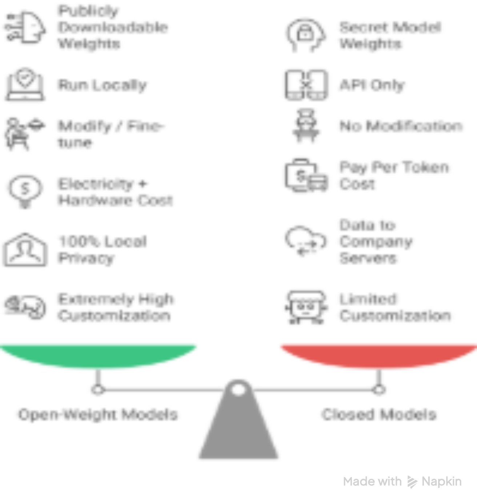
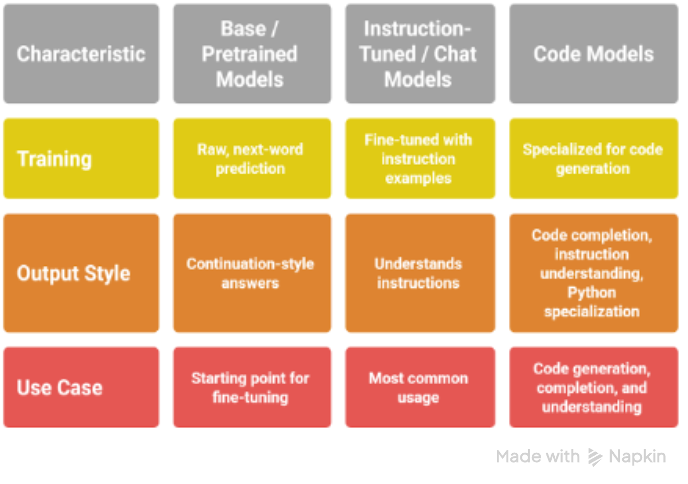
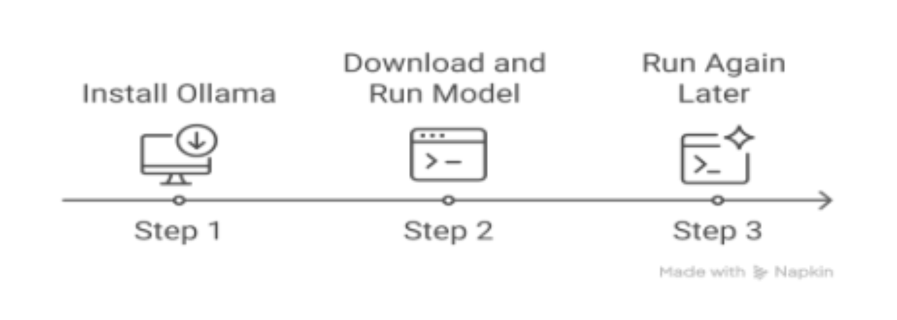

# Chapter 4: Local LLMs & Running Models on Your Machine 💻

---

## Table of Contents
- [Introduction to LLaMA Models – Running LLMs Locally](#introduction-to-llama-models--running-llms-locally)
- [What is LLaMA?](#what-is-llama)
- [Why LLaMA Changed Everything](#why-llama-changed-everything)
- [LLaMA Family Overview (2023–2026)](#llama-family-overview-2023-2026)
- [Three Main Types of LLaMA Models](#three-main-types-of-llama-models)
- [Ways to Access LLaMA Models](#ways-to-access-llama-models)
- [How to Run LLaMA Locally – Quick Start Guide](#how-to-run-llama-locally-quick-start-guide)
- [Running Large Models with Low Hardware – Practical Strategies](#running-large-models-with-low-hardware-feasibility)
  
**[← Back to Chapter 3](../Chapter-3-Memory-Management-Multi-turn-Chats/README.md)** | **[Next Section →](#)** | **[↑ Back to Top](#chapter-4-local-llms--running-models-on-your-machine-)** | **[Back to Phase 4 Main Page](../README.md)**

---

## Introduction to LLaMA Models – Running LLMs Locally

LLaMA is one of the most influential **open-weight** large language model families ever released. It made powerful AI accessible to everyone — not just companies with huge server farms.

---

## What is LLaMA?

**LLaMA** stands for **Large Language Model Meta AI**. It is a family of open-weight models created by Meta AI.

LLaMA models excel at:
- Text generation
- Answering questions
- Summarizing documents
- Helping write or understand code
- Having natural conversations

### Key Difference from ChatGPT / Gemini / Claude

→ You can **download the actual model files (weights)** and run them **on your own computer**.

**What are “weights”?**  
In simple terms, weights are the learned numbers inside the model that decide how strongly different words and ideas connect to each other.  

Downloading weights = downloading the **“brain”** of the AI.

### Open-Weight vs Closed Models


<br clear="all"/>

---

## Why LLaMA Changed Everything

Before LLaMA (early 2023), almost all strong models were locked behind paid APIs.

After LLaMA:

- Millions of people started running powerful AI **locally** on their laptops
- Researchers could study and improve how large models really work
- Startups built custom models without paying huge API bills
- Communities created thousands of fine-tuned versions (Alpaca, Vicuna, WizardLM, Orca, etc.)

---

## LLaMA Family Overview (2023–2026)

| Generation   | Year      | Key Sizes                  | Context Window     | Notes / Improvements                     |
|--------------|-----------|----------------------------|--------------------|------------------------------------------|
| LLaMA 1      | 2023      | 7B, 13B, 30B, 65B          | ~2k–4k             | First shock to the industry              |
| LLaMA 2      | 2023      | 7B, 13B, 70B               | 4k                 | Better license, improved chat versions   |
| LLaMA 3      | 2024      | 8B, 70B                    | 8k → 128k          | Much better reasoning capabilities       |
| LLaMA 3.1    | 2024      | 8B, 70B, 405B              | 128k               | Very strong open model                   |
| LLaMA 3.2    | 2025      | 1B, 3B, 11B, 90B (vision)  | 128k+              | Small + multimodal (vision support)      |
| LLaMA 4      | 2025–26   | Various (rumored)          | 1M+?               | Expected to be even stronger             |

---

## Three Main Types of LLaMA Models


<br clear="all"/>

---

## Ways to Access LLaMA Models

LLaMA models (Meta’s open-weight family) can be used in three main ways, each offering different trade-offs in **ease of use**, **cost**, **privacy**, **speed**, and **control**.

Here are the three common approaches, ranked from **easiest** to **most advanced**:

---

### 1. Hosted API (Recommended for Most People)

You send prompts to someone else’s server and receive responses — exactly like using ChatGPT.

| Provider          | Typical Cost (8B model)       | Strengths                          | Best For                              |
|-------------------|-------------------------------|------------------------------------|---------------------------------------|
| Together.ai       | ~$0.06–0.20 / 1M tokens       | Fast, many Llama variants, easy API| Beginners, prototyping, production    |
| Groq              | Very low latency              | Extremely fast inference           | Real-time apps, chatbots              |
| Fireworks.ai      | Competitive pricing           | Good Llama 3.1 & 3.2 support       | Speed + cost balance                  |
| Amazon Bedrock    | Pay-per-use                   | Enterprise-grade, compliance       | Companies needing SOC2 / audit logs   |
| Google Vertex AI  | Higher cost                   | Very reliable, integrated with GCP | Google Cloud users                    |
| Microsoft Azure   | Enterprise pricing            | Good for Windows / Azure shops     | Large organizations                   |

#### Quick Code Example (Together.ai style – most popular in 2026)

```python
from openai import OpenAI

client = OpenAI(
    base_url="https://api.together.xyz/v1",
    api_key="your-together-api-key"
)

response = client.chat.completions.create(
    model="meta-llama/Llama-3.1-8B-Instruct-Turbo",
    messages=[{"role": "user", "content": "Write a short poem about Karachi at night."}],
    temperature=0.7,
    max_tokens=200
)

print(response.choices[0].message.content)
```
#### Why most developers start here:

* No GPU required
* Instant setup (just an API key)
* Access to the newest LLaMA variants within days of release
* Easy to switch between models


### 2. Cloud Deployment (You Host It)
You rent GPU servers and run the model yourself.

| Platform          | Typical Cost (A100/H100)      | Best For                           | Difficulty                            |
|-------------------|-------------------------------|------------------------------------|---------------------------------------|
| RunPod            | $0.4–1.2/hour                 | Fast setup,many GPU types          |Easy                                   |
| Vast.ai           | Often cheapest                | Peer-to-peer GPUs                  | Medium                                |
| Lambda Labs       | $1.1–2.5/hour                 | "Reliable, good support"           | Easy                                  |
| AWS SageMaker     | Higher                        | "Enterprise, auto-scaling"         | Hard                                  |
| Google Cloud      | High                          | TPUs + good integration            | Medium                                |

#### Typical Workflow:

* Rent a GPU instance (A100 40GB or H100)
* Install Ollama / vLLM / llama.cpp
* Pull the model (e.g., ollama run llama3.1:70b)
* Expose an OpenAI-compatible API endpoint
* Point your code to your own server

#### Best for:

* Full data privacy
* Running custom fine-tuned versions
* Very high volume usage (becomes cheaper than APIs after ~10–20M tokens/day)
  
### 3. Local Installation (Run on Your Own Computer)
Download and run models completely offline on your laptop or desktop.

| Tool              | Ease of Use                   | Speed        |  Model Support               | Best For                              |
|-------------------|-------------------------------|--------------|------------------------------|---------------------------------------|
| Ollama            | ★★★★★                      | Fast         | Almost all GGUF model        | "Beginners, daily use "               |
| LM Studio         | ★★★★★                      | Fast         | GGUF + Hugging Face          |  GUI lovers                           |
| GPT4All           | ★★★★                        | Good        | GGUF                          | Simple desktop app                    |
| llama.cpp         | ★★★                         | Fastest      |  GGUF (most efficient)       | Maximum speed & low RAM                |
| KoboldCPP         | ★★★★                        | Good         | GGUF + extras                | Roleplay & creative writing           |

#### Hardware Requirements

| Model Size         | RAM / VRAM Needed      | Realistic Speed (tokens/sec)       | Laptop?              |
|-------------------|-------------------------|------------------------------------|----------------------|
| 3B–8B             | 8–16 GB                 | 40–120 t/s                         | Yes                  |
| 13B–34B           | 20–40 GB                |  20–60 t/s                         | Possible             |
| 70B               | 48–80 GB                | 8–30 t/s (quantized)               | Hard                 |
| 405B              | 300+ GB                 | Very slow                          | No (Server required) |
 
#### Quick Start with Ollama

```Bash
# Install Ollama
curl -fsSL https://ollama.com/install.sh | sh
```

```Bash
# Download and chat immediately
ollama run llama3.1:8b
# or
ollama run llama3.1:70b
```

#### Python Usage:

```Python
import ollama

response = ollama.chat(
    model='llama3.1:8b',
    messages=[{'role': 'user', 'content': 'Tell me a short story about a cat in Karachi.'}]
)

print(response['message']['content'])
```

### Quick Decision Guide

| Goal                                    | Best Choice                     | Why                          |
|-----------------------------------------|---------------------------------|------------------------------|
| Just want to try Llama quickly          | Ollama + llama3.1:8b            | "Zero setup, instant"        |
| Build a real app/product                | Together.ai or Groq API         | "Reliable, scalable, fast"   |
| Maximum privacy & no recurring cost     |  Local with Ollama / LM Studio  | 100% offline after download  |
| Fine-tune your own version              | Local + LoRA on RunPod/Vast.ai  | Full control                 |
| Need 70B+ quality on low budget         | Together.ai Llama-3.1-70B       | Best price/performance       |
| Enterprise / compliance                 | Amazon Bedrock or Azure         | "Audits, SLAs, security"     |

---

## How to Run LLaMA Locally – Quick Start Guide

Running LLaMA models locally means you **download the model files** and use them on your own computer. Benefits include:
- Full privacy (no data leaves your machine)
- Zero API costs after download
- Works completely offline
- Full control over the model

This guide focuses on the **easiest and most popular method in 2026**: **Ollama** — still the #1 choice for beginners and intermediate users.

---

### Option 1: Easiest & Recommended – Ollama (Beginner-Friendly)


<br clear="all"/>

#### Step 1: Install Ollama (One-Time, ~2 minutes)

**Windows:**
1. Go to [https://ollama.com](https://ollama.com)
2. Click **Download** → choose Windows
3. Run the `.exe` installer (just like any normal program)
4. Let it finish — Ollama will run in the background automatically

**Mac / Linux:**
```bash
curl -fsSL https://ollama.com/install.sh | sh          
```
After installation, open a terminal/command prompt.

#### Step 2: Download and Run Your First Model
In the terminal, type one of these commands:

```Bash
# Best general-purpose chat model (excellent quality, runs on most laptops)
ollama run llama3.1:8b
```

```Bash
# Much stronger reasoning (needs more RAM/GPU)
ollama run llama3.1:70b
```

```Bash
# Very fast & lightweight alternative
ollama run mistral:7b
```

```Bash
# Excellent for coding tasks
ollama run deepseek-coder-v2:16b
```

#### First time only:

* Ollama will download the model (4–45 GB depending on size)
* This may take 5–40 minutes depending on your internet speed
* After download, the model starts instantly every time

You will see the prompt:

```text
>>>
```

Now just type questions like you would in ChatGPT.
Example:

```text
>>> Write a short poem about rain in Karachi at night
```

To exit the chat:

```text
/bye
```

#### Step 3: Run It Again Later
Simply type the same command again:

```Bash
ollama run llama3.1:8b
```
It starts in 2–5 seconds because the model is already saved on your disk.

#### Useful Ollama Commands:

```Bash
ollama list                    # See all downloaded models
ollama rm llama3.1:8b          # Remove a model to free space
ollama pull llama3.1:70b       # Download without starting chat
ollama run llama3.1:8b-instruct-q4_0   # Run a quantized version (faster, less RAM)
```

#### Hardware Reality Check

| Model Size | Approx Download Size | Minimum RAM | Realistic Speed (tokens/sec) | Runs well on               | 
|------------|----------------------|-------------|------------------------------|----------------------------| 
| 3B–8B      | 2–5 GB               | 8–16 GB     | 40–120 t/s                   | Most laptops (2020+)       | 
| 13B–34B    | 7–20 GB              | 20–40 GB    | 20–60 t/s                    | Gaming laptop / desktop    | 
| 70B        | 40–50 GB             | 48–80 GB    | 8–30 t/s (quantized)         | High-end desktop / server  | 
| 405B       | 200+ GB              | 300+ GB     | Very slow                    | Cloud or serious cluster   | 

**Tip: Start with llama3.1:8b or a quantized version like llama3.1:8b-instruct-q5_K_M (almost same quality, much faster and uses less RAM).**


### Option 2: GUI Tools (Even Easier, No Terminal Needed)

If you prefer a beautiful graphical interface instead of the terminal, these tools make running LLaMA models extremely beginner-friendly.

| Tool          | Why Choose It                              | Download Link          |
|---------------|--------------------------------------------|------------------------|
| **LM Studio** | Beautiful interface, built-in model search, easy model management | [lmstudio.ai](https://lmstudio.ai) |
| **GPT4All**   | Simple desktop app, supports many models   | [gpt4all.io](https://gpt4all.io)   |
| **Jan**       | Clean UI, very beginner-friendly           | [jan.ai](https://jan.ai)           |
| **Faraday.dev** | Focused on roleplay & creative writing   | [faraday.dev](https://faraday.dev) |


These GUI tools are excellent for users who want to chat with models without writing any code.


### Option 3: Developer / Code Style (Python)

For building scripts, applications, or integrating LLaMA into your projects, use the Python library.

#### Quick Ollama Python Example

```python

import ollama

response = ollama.chat(
    model='llama3.1:8b',
    messages=[
        {'role': 'user', 'content': 'Explain quantum entanglement like I’m 12 years old.'}
    ]
)

print(response['message']['content'])

```
**This approach gives you full programmatic control and is the foundation for building local AI agents and applications.**

### Summary: Choosing the Right Way to Run LLaMA (2026)

| Your Goal                                  | Best Choice (2026)        | Setup Time  | Hardware Needed         | 
|--------------------------------------------|---------------------------|-------------|-------------------------|
| Just try LLaMA right now                   | Ollama + llama3.1:8b      | 5–20 min    | Normal laptop           | 
| Want nice buttons & interface              | LM Studio or Jan          | 5 min       | Normal laptop           | 
| Building an app or script                  | Ollama Python library     | 10 min      | Any computer            | 
| Need best quality possible locally         | llama3.1:70b (quantized)  | 30–60 min   | 48+ GB RAM / GPU        | 
| "Want zero hassle, don’t care about local" | Together.ai / Groq API    | 2 min       | Any computer + internet | 

**Pro Tip: Most people start with Ollama (terminal or GUI via LM Studio/Jan). Once comfortable, move to the Python library when building real applications.**

---

## Running Large Models with Low Hardware – Practical Strategies

Running big LLMs (70B+ parameters) on limited hardware is always a trade-off between **quality**, **speed**, **cost**, **privacy**, and **control**. 

The good news? You don’t need a supercomputer. You just need the **right strategy**. Most experienced developers combine the following three approaches.


### 1. API-based Inference (Remote Inference) – Easiest & Best Quality

You send your prompt to a powerful remote server and receive the answer back.

#### How it works:
1. You write the prompt
2. Send it over the internet (HTTPS)
3. The provider runs the full model on high-end GPUs
4. You receive the response (often streamed in real-time)

#### Advantages:
- No hardware limitations on your side
- Access to the strongest models (70B → 405B+)
- Minimal / zero setup
- Automatic scaling and load balancing
- Often the highest reasoning quality

#### Limitations:
- Cost per token
- Network latency
- Data privacy concerns (your prompts leave your machine)
- Vendor lock-in

#### When to use API-based inference:
- Rapid prototyping
- Limited local hardware (<16 GB RAM)
- You need top-tier reasoning quality
- You don’t have sensitive data

#### When NOT to use it:
- Handling sensitive or private data (health, finance, proprietary IP)
- Offline / air-gapped environments
- Ultra-low latency requirements
- Very high-scale usage (cost becomes expensive)

**Simple Example:**
```python
response = client.chat.completions.create(
    model="meta-llama/Llama-3.1-70B-Instruct",
    messages=[{"role": "user", "content": "Explain quantization in simple terms."}]
)
```
**Pro Tip:**
**Many developers start with API calling for best quality, then gradually move parts of the workload to local quantized models as their project grows.
In the next sections, we will explore Quantized Local Inference and Hybrid Architectures — the other two powerful strategies for running large models efficiently.**

---

### Quantized Local Models – Best for Privacy & Zero Cost

**Quantization** is the most popular technique for running large LLMs on limited hardware. It compresses the model so it uses significantly less memory and runs faster while keeping most of its intelligence.

#### Simple Analogy

- **Original model** = 4K photo (huge file, perfect detail)
- **Quantized model** = 720p photo (much smaller file, still looks very good)

#### Common Quantization Levels

| Format       | Bits | Memory Reduction | Quality Loss     |
|--------------|------|------------------|------------------|
| FP16         | 16   | None             | None             |
| INT8         | 8    | ~50%             | Very little      |
| INT4 / GGUF  | 4    | ~75%             | Small            |

#### How Quantization Works (Step-by-Step)

1. Choose a base model
2. Apply quantization (reduces precision of weights)
3. Load the quantized model with an inference engine (Ollama, llama.cpp, LM Studio, etc.)
4. Run inference normally

#### Advantages of Quantized Models

- Full data privacy (everything stays on your machine)
- Zero per-token cost after download
- Works completely offline
- Enables customization (fine-tuning, LoRA adapters)

#### Limitations

- Slightly lower quality compared to full-precision or frontier API models
- Can be slower on CPU-only systems
- Requires some setup knowledge
- Still has memory constraints for very large models

#### When to Use Quantized Local Models

- You need full privacy
- Working in offline / air-gapped environments
- You want zero ongoing running cost
- You plan to do custom fine-tuning

#### When to Avoid

- You need absolute best reasoning (complex math, advanced coding, research)
- You have extremely low RAM (<8 GB)

---

#### Hardware Feasibility Calculation

**Rough Formula**:  
`RAM ≈ Model_size × (bits / 8) × 1.2` (including overhead)

**Examples**:
- 7B model at 4-bit → ~4–5 GB RAM
- 13B model at 4-bit → ~8–10 GB RAM
- 70B model at 4-bit → ~40–48 GB RAM

**Note**: Add 20–30% extra for KV cache during generation.

#### Recommended Quantized Models by Hardware (2026)

| RAM          | Best Model                          | Quantization   | Ollama Command                          | Speed (tokens/sec) | Quality (out of 10) | Hardware Notes              |
|--------------|-------------------------------------|----------------|-----------------------------------------|--------------------|---------------------|-----------------------------|
| 8 GB         | Phi-4-mini-3.8B / Gemma-2-2B        | Q5_K_M         | `ollama run phi4-mini`                  | 80–120             | 7.5                 | Very fast on CPU            |
| 12–16 GB     | Llama-3.1-8B-Instruct               | Q5_K_M         | `ollama run llama3.1:8b`                | 45–70              | 9.0                 | Best all-rounder            |
| 16–24 GB     | Llama-3.1-8B / Qwen2.5-14B          | Q6_K           | `ollama run llama3.1:8b`                | 35–55              | 9.2                 | Excellent balance           |
| 32 GB        | Llama-3.1-70B-Instruct              | Q4_K_M         | `ollama run llama3.1:70b`               | 12–22              | 9.8                 | Needs good CPU/GPU          |
| 48+ GB       | Llama-3.1-70B / 405B                | Q3_K_M         | `ollama run llama3.1:70b`               | 8–15               | 10                  | Server-level only           |

**Quick Rule for 2026**:
- **Sweet spot for most people**: `Llama-3.1-8B Q5_K_M` (16 GB RAM)
- Use **Q5_K_M** or **Q6_K** for daily use (best quality/speed trade-off)
- Use **Q4_K_M** if you want to run 70B on 32–40 GB RAM

#### Task-Based Selection Guide

| Your Main Task                  | Best Model (2026)                     | Why                                      | Ollama Command                          |
|---------------------------------|---------------------------------------|------------------------------------------|-----------------------------------------|
| General chat & daily use        | Llama-3.1-8B-Instruct Q5_K_M          | Fast + very natural                      | `ollama run llama3.1:8b`                |
| Creative writing / stories      | Gemma-2-9B-It or Llama-3.1-8B         | More creative, less repetitive           | `ollama run gemma2:9b`                  |
| Coding / programming            | DeepSeek-Coder-V2 16B / Qwen2.5-14B   | Best code quality among local models     | `ollama run deepseek-coder-v2:16b`      |
| Deep reasoning / research       | Llama-3.1-70B Q4_K_M                  | Much stronger logic than 8B models       | `ollama run llama3.1:70b`               |
| Very low RAM (8 GB)             | Phi-4-mini or Gemma-2-2B              | Surprisingly capable for size            | `ollama run phi4-mini`                  |


#### Best Tools for Quantized Models

Here are the most popular tools used in 2026 for running quantized LLaMA and other open models efficiently:

##### 1. llama.cpp (CPU-focused)

- Runs primarily on **CPU**
- Uses highly efficient **GGUF** format
- Extremely memory efficient

**Use when**:
- You have no GPU
- Running on 8–32 GB RAM systems
- Maximum efficiency and low memory usage are critical

##### 2. Ollama (Wrapper over llama.cpp)

- Simplified CLI and model management
- Built-in API server
- Easy to use for both beginners and developers

**Use when**:
- You want the easiest setup
- You don’t need deep performance optimization
- You want both terminal and Python integration

##### 3. vLLM (GPU optimized)

- Extremely fast inference
- Continuous batching
- Advanced KV cache optimization

**Use when**:
- You have a decent GPU (16 GB+ VRAM)
- You need production-level serving speed
- High throughput is required

##### 4. Text Generation Inference (TGI) by Hugging Face

- Production-ready server
- Highly scalable deployment
- Excellent for enterprise use

**Use when**:
- You need a robust API server for multiple users
- Deploying in production environments

#### Tool Selection Strategy

| Use Case                  | Recommended Tool      |
|---------------------------|-----------------------|
| Beginner / local PC       | **Ollama**            |
| CPU-only system           | **llama.cpp**         |
| GPU + performance         | **vLLM**              |
| Production API server     | **TGI**               |

#### Practical Steps – How to Select & Use Quantized Models

**Step 1: Check your RAM**
- **Windows**: Task Manager → Performance
- **Mac**: About This Mac
- **Linux**: `free -h`

**Step 2: Choose the right model**
- Start with `llama3.1:8b` (Q5_K_M) unless you have a specific need.
- Only move to 70B if you have 40+ GB RAM and need significantly better reasoning.

**Step 3: Install & Run**

```bash
# 1. Install Ollama (if not already done)
curl -fsSL https://ollama.com/install.sh | sh

# 2. Pull the best all-rounder (recommended first)
ollama pull llama3.1:8b

# 3. Run it
ollama run llama3.1:8b
```

**Step 4: Use it practically**
Option A: Terminal chat (instant)
```bash
ollama run llama3.1:8b
```

Just start typing your questions.

**Option B: Python (for scripts and apps)**
```Python
import ollama

response = ollama.chat(
    model='llama3.1:8b',
    messages=[{'role': 'user', 'content': 'Write a Python function to calculate factorial'}]
)

print(response['message']['content'])
```

**Step 5: Switch models easily**
```Bash
ollama run deepseek-coder-v2:16b     # for coding
ollama run gemma2:9b                 # for creative writing
```

**Step 6: Check model info anytime**
```Bash
ollama list          # shows all downloaded models
ollama ps            # shows currently running models
```

**Pro Tips for Best Results**

- Use `Q5_K_M` or `Q6_K` for daily use (best quality/speed trade-off)
- Use `Q4_K_M` when you want to run bigger models (70B) on limited RAM
- Always prefer **Instruct** or **Chat** versions (they follow instructions much better)
- For maximum speed on CPU: use highly quantized GGUF files

---

**Phase 4 of "All You Need to Know About Prompt Engineering" — Portfolio Project by Mirza (BS AI Student, Karachi)**

**[← Back to Chapter 3](../Chapter-3-Memory-Management-Multi-turn-Chats/README.md)** | **[Next Section →](#)** | **[↑ Back to Top](#chapter-4-local-llms--running-models-on-your-machine-)** | **[Back to Phase 4 Main Page](../README.md)**

