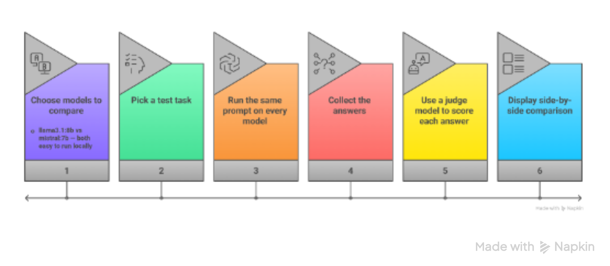

## Chapter-5-Multiple-Models-in-a-Single-Application

## Table of Contents
- [Comparing LLaMA Models: Concepts, Relationships, and Implementation](#comparing-llama-models-concepts-relationships-and-implementation)
- [How We Evaluate Models](#how-we-evaluate-models)
- [How to Run the Evaluation Workflow Yourself](#how-to-run-the-evaluation-workflow-yourself)


---

## Comparing LLaMA Models: Concepts, Relationships, and Implementation

This section helps you fairly compare different LLaMA models so you can choose the right one for your specific project. We focus primarily on the **LLaMA 2** and **LLaMA 3** families from Meta.

### Why Compare LLMs?

LLMs come in multiple sizes and configurations, each designed for different needs. Comparing models helps developers make smart choices based on:

- Speed
- Cost
- Accuracy / Reasoning quality
- Available hardware

#### Simple Rule of Thumb

| Use Case                      | Recommended Model Size      |
|-------------------------------|-----------------------------|
| Simple tasks                  | Small (7B–8B)               |
| Chatbots & daily use          | Medium (13B–34B)            |
| Research & deep reasoning     | Large (70B)                 |
| Judging / evaluation          | Largest available           |

#### Example Models Comparison

| Model              | Parameters | Best For                              |
|--------------------|------------|---------------------------------------|
| Llama-2-7B         | 7B         | Lightweight & fast tasks              |
| Llama-2-13B        | 13B        | Balanced performance                  |
| Llama-2-70B        | 70B        | High-accuracy reasoning               |
| Llama-3-8B         | 8B         | Improved small model                  |
| Llama-3-70B        | 70B        | Advanced reasoning                    |

---

### How Model Size Affects Performance

Larger models generally perform better, but they also demand more resources.

| Characteristic      | Small Model (7B–8B)              | Large Model (70B)                     |
|---------------------|----------------------------------|---------------------------------------|
| Speed               | Fast                             | Slower                                |
| Cost                | Low                              | High                                  |
| Accuracy            | Good for simple tasks            | Much higher                           |
| Reasoning           | Limited                          | Stronger & deeper                     |
| Knowledge           | Narrower                         | Broader                               |
| Hardware Needed     | Runs on normal laptop            | Needs powerful GPU / server           |

**Key Takeaway**:  
**Bigger is usually better** — but only if your hardware and budget can support it. For most everyday tasks and learning, **Llama-3.1-8B** (or its quantized versions) offers the best balance of quality, speed, and resource usage.

**Pro Tip**:  
Always test a smaller model first. If it performs well enough for your use case, there is no need to move to a much larger (and more expensive to run) model.

---

## How We Evaluate Models

To fairly compare different LLaMA models, we test them on the **same tasks** and judge their outputs using five key qualities:

- **Accuracy** — Is the answer factually correct?
- **Completeness** — Does it cover everything important?
- **Clarity** — Is it easy to read and well-structured?
- **Instruction Following** — Did it do exactly what was asked?
- **Conciseness** — Is it short and to the point without unnecessary information?

### Common Tasks Used for Comparison

| Task              | Prompt Technique       | Skill Evaluated           | Why This Technique                     |
|-------------------|------------------------|---------------------------|----------------------------------------|
| Sentiment         | Few-shot               | Pattern recognition       | Teaches specific label format          |
| Summarization     | Instruction prompt     | Comprehension             | Measures abstraction ability           |
| Reasoning         | Chain-of-Thought       | Logical reasoning         | Exposes step-by-step thinking          |
| Evaluation        | Meta-prompting         | Critical analysis         | LLM judges other LLMs                  |
| Comparison        | Structured prompt      | Ranking ability           | Forces objective scoring               |

These tasks reflect real-world use cases such as chatbots, research assistants, and coding tools.

---

### Why Use a Large Model to Judge Other Models?

A bigger model (such as **Llama-3-70B** or **Llama-3.1-70B**) is often used as the **“judge”** because it typically has:

- Better reasoning capabilities
- Stronger language understanding
- More consistent and fair scoring

This approach is known as **model-graded evaluation** and is widely used in 2026.

---

#### Practical Workflow for Comparing Models

1. **Write the same prompt** for every model you want to test.
2. **Run all models** and collect their answers.
3. **Use a large model (or human reviewer)** to score each response based on the five qualities above.
4. **Compare the scores** and decide which model performs best for your specific needs.

---

#### Important Final Note

- It’s **not always about model size**.  
  A well-written prompt can make a **small model outperform** a poorly prompted large model.

However:
- **Fine-tuned models** still win in very specific domains (medical, legal, finance, etc.).
- For **general use**, the combination of **good prompting + right model size** usually delivers the best results.

You now understand how to compare LLaMA models fairly and choose the most suitable one for your projects.

---

## How to Run the Evaluation Workflow Yourself

Here’s the exact step-by-step process you can run on your own computer today using **Ollama**.


<br clear="all"/>


### Real Example Task

**Prompt (same for all models):**
> “Solve this step by step: A store has 120 apples. They sell 40% on Monday and 25% of the remaining on Tuesday. How many apples are left? Think step by step.”

### Complete Evaluation Script

```python
import ollama

# ==================== MODELS TO COMPARE ====================
models = [
    "llama3.1:8b",      # Smaller & faster
    "mistral:7b"        # Alternative small model
]

# ==================== TEST PROMPT ====================
prompt = """Solve this step by step: 
A store has 120 apples. They sell 40% on Monday and 25% of the remaining on Tuesday. 
How many apples are left? Think step by step."""

# ==================== STEP 1: Run all models ====================
responses = {}
for model in models:
    print(f"Running {model}...")
    response = ollama.chat(
        model=model,
        messages=[{"role": "user", "content": prompt}],
        options={"temperature": 0.0}   # deterministic for fair comparison
    )
    responses[model] = response["message"]["content"]

# ==================== STEP 2: Judge the answers ====================
judge_model = "llama3.1:8b"   # Change to 70B if available

judge_prompt = f"""You are an expert evaluator. Compare these two answers to the same math question.

Question: A store has 120 apples. They sell 40% on Monday and 25% of the remaining on Tuesday. How many apples are left?

Answer A (Model 1):
{responses[models[0]]}

Answer B (Model 2):
{responses[models[1]]}

Score each answer from 1-10 on:
- Correctness (mathematical accuracy)
- Clarity (easy to follow)
- Completeness (all steps shown)

Then declare the winner and explain why."""

judge_response = ollama.generate(model=judge_model, prompt=judge_prompt)
evaluation = judge_response["response"]

# ==================== STEP 3: Display Side-by-Side Comparison ====================
print("\n" + "="*60)
print("SIDE-BY-SIDE MODEL COMPARISON")
print("="*60)

for model in models:
    print(f"\n🔹 {model.upper()}")
    print("-" * 40)
    print(responses[model])

print("\n" + "="*60)
print("JUDGE EVALUATION")
print("="*60)
print(evaluation)

```
### Real Example Output (What You’ll See)

**Model 1: llama3.1:8b**
```text
Step 1: 120 apples
Step 2: 40% sold = 48 apples sold
Remaining: 72
Step 3: 25% of 72 = 18 sold
Left: 54
```

**Model 2: mistral:7b**
```text
120 - 40% = 72 left. Then 25% of 72 is 18. So 72-18=54.
```

**Judge’s Verdict**

* Correctness: Both 10/10
* Clarity: llama3.1:8b = 9/10, mistral:7b = 7/10
* Completeness: llama3.1:8b = 9/10

  **Winner: llama3.1:8b – better step-by-step explanation and clearer structure.**


### How to Run This Yourself (5 Minutes)

**1. Make sure Ollama is installed and running.**

**2. Pull the required models:**
```Bash
ollama pull llama3.1:8b
ollama pull mistral:7b
```
**3. Save the code above as `compare_models.py`**
**4. Run it:**
```Bash
python compare_models.py
```
**Want to compare more models?**
Just add them to the `models = [...]` list (e.g., `"deepseek-coder-v2:16b"`).

**Want to test different tasks?**
Simply change the `prompt` variable to any reasoning, summarization, or coding question.

This is the exact workflow used by professional LLM developers in 2026 to decide which model to use in production.

---
> 💡 **Want to see how multiple local LLMs work in a single chatbot?**  
> **[🤖 Open CHATBOT 2 & 3: Multi-Model Research Chatbot with Ollama](../Chapter-10-Chatbot-Evolution/README.md)**


---
**Phase 4 of "All You Need to Know About Prompt Engineering" — Portfolio Project by Mirza (BS AI Student, Karachi)**

**[← Back to Alternative Ways to Run LLaMA Locally](#alternative-ways-to-run-llama-locally)** | **[Next Section →](#)** | **[↑ Back to Top](#chapter-4-local-llms--running-models-on-your-machine-)** | **[Back to Phase 4 Main Page](../README.md)**

